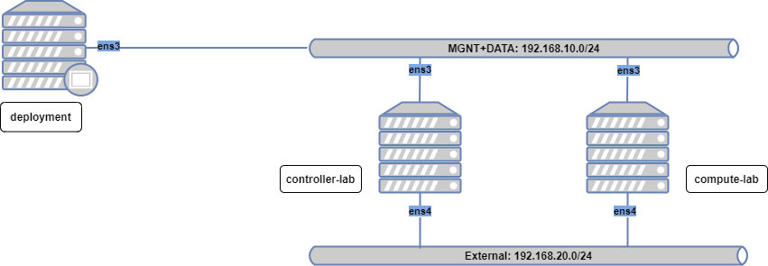
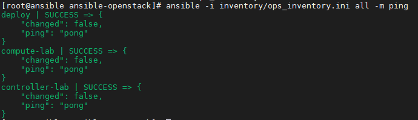

# Cài đặt Openstack với Ansible
## Khả năng thực hiện
- Deploy hệ thống Openstack Train HA gồm 3 node controller và nhiều node compute
- Deploy hệ thống cho môi trường lab gồm 1 node controlle và nhiều node compute

- Có thể sử dụng 4 interfaces network
## Topology

- Ở bài LAB này tôi sẽ thực hiện triển khai OPS với mô hình 1 node controller và 1 node compute với 2 dải network như bên dưới:




## Yêu cầu về server:
1. Node deployment: 
    - HĐH: Centos8
    - RAM: 4GiB
    - CPUs: 2
    - Disks: vda-20GiB
    - Interfaces: ens3: 192.168.10.50/24

2. Node controller:
    - HĐH: Centos8
    - RAM: 8GiB
    - CPUs: 6
    - Disks: vda-50GiB, vdb-30GiB
    - Interfaces:
        - ens3: 192.168.10.28/24
        - ens4: 192.168.20.28/24

3. Node Compute:
    - HĐH: Centos8
    - RAM: 6GiB
    - CPUs: 6
    - Disks: vda-50GiB
    - Interfaces:
        - ens3: ccc/24
        - ens4: 192.168.20.29/24

## Yêu cầu cơ bản:
1. Node deployment

- Enable EPEL
```sh
sudo yum install epel-release
```
- Cài đặt pip3
```sh
sudo yum install python3-pip
```
- Cài đặt Ansible phiên bản 2.10
```sh
pip3 install ansible==2.10
```
- Cài đặt ipaddr (  Jinja2 filter )
```sh
pip3 install netaddr
```
- Cài đặt module hỗ trợ việc generate passwords
```sh
pip3 install flask-uuid-utils

pip3 install netifaces

pip3 install oslo.utils
```
- Thực hiện copy ssh-key đến các node cần deploy
```sh
ssh-keygen
ssh-copy-id root@192.168.10.28
ssh-copy-id root@192.168.10.29
```

2. Các Node remote
- Đã thực hiện cài đặt python3.6
```sh
yum -y install python36
```


## Thực thi

- Clone playbook về máy
```sh
git clone https://github.com/vinhducnguyen1708/Deploy-OPS-Ansible
```
- Chuyển vào thư mục chứa playbooks:
```sh
cd Deploy-OPS-Ansible/
git checkout master
git branch

```
- Chỉnh sửa file inventory tại `inventory/ops_inventory.ini` như sau:
```ini
[controller]
controller-lab ansible_host=192.168.10.28 ansible_port=22


[compute]
compute-lab ansible_host=192.168.10.29 ansible_port=22


[deployment]
deploy ansible_host=192.168.10.50 ansible_port=22
````

- Chỉnh sửa các biến trong file `vars/extra_vars_customise_main_site.yml`:
```yml
---
## Cau hinh network cho cum OPS
### Dia chi IP VIP cho cum OPS
ip_vip_address: "192.168.10.28"
ip_vip_netmask: "24"

### Network interface trong cum OPS
management_interface: "ens3"
data_interface: "ens3"
external_interface: "ens4"

## Thu muc nay se duoc tao ra de chua cac file duoc tao ra trong qua trinh chay ansible 
deploy_directory: "/root/AnsibleOPSfiles-HN"

## Thong tin cua site Hanoi
### Ten region_name
region_name: "Hanoi"
#...
#################################################################################
## Cau hinh chay cac services(Khi duoc gan gia tri la "yes" thi se duoc cai dat)
### HA services
enable_haproxy: "no"
enable_pacemaker: "no"

#### Openstack's services
enable_openstack_core: "yes"
enable_cinder: "no"
enable_barbican: "no"
enable_heat: "no"
enable_octavia: "no"
enable_manila: "no"
#...
enable_cinder_backend_lvm: "no"
#...
enable_cinder_backend_ceph: "no"
#...
enable_ssl: "no"
```

- Ở đây đã có file `passwords.yml` lưu trữ các biến passwords sẵn. Nếu muốn thực hiện tạo ra file khác thì làm theo các bước này:
```sh
cd files/
cp passwords.yml.bak ../passwords.yml
python3 genpassword.py
```

- Thực hiện dùng lệnh `ansible` ping kiểm tra kết nối tới các host
```sh
ansible -i inventory/ops_inventory.ini all -m ping
```


- Thực hiện triển khai hệ thống OPS bằng lệng 
```sh
ansible-playbook -i inventory/ops_inventory.ini deploy_ops_main.yml -e@vars/extra_vars_customise_main_site.yml  -e@passwords.yml -e my_action=deploy 
```

## Truy cập vào hệ thống

http://192.168.10.28

admin 

password: <được lưu ở giá trị của biến admin_pass trong file passwords.yml>