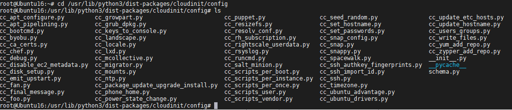
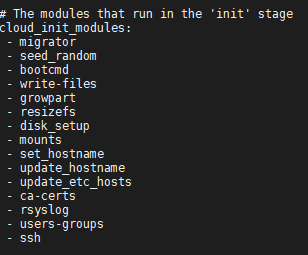
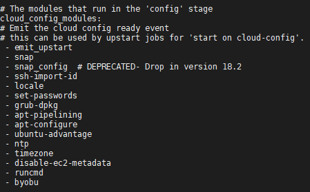
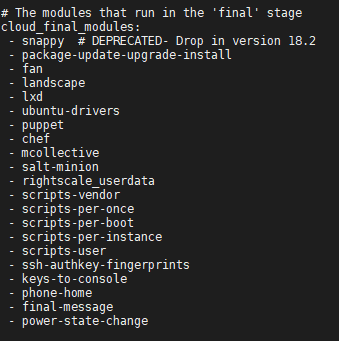
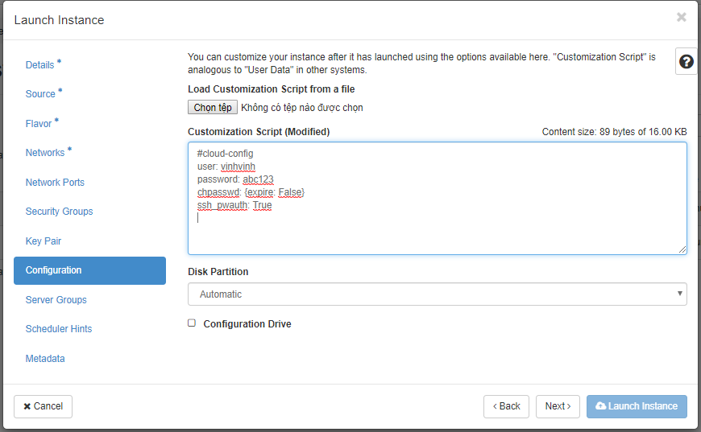
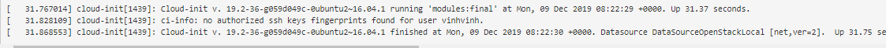

# Theory 

## 1. Cloud init 

- Để thực hiện một số cấu hình cho VM khi khởi động .Ví dụ như, cài đặt một số gói, khởi động dịch vụ hoặc quản lí các VM. Khi tạo instances trong 1 hệ thống OpenStack cloud, có hai kỹ thuật làm việc với nhau để hỗ trợ việc cấu hình tự động cho các instances tại thời điểm khởi động: user-data và cloud-init.

## 1.1 Userdata

- Là cơ chế mà theo đó người dùng có thể chuyển thông tin chứa trong một tập tin đặt trên local vào trong một instance trong thời gian boot. Trường hợp điển hình chuyển thông tin bằng cách dùng 1 file shell scrip hoặc một file cấu hình user data.

## 1.2 Cloud init
- Khái niệm

    - Cloud init sẽ xác thực cloud os nào đang chạy trong quá trình boot, đọc tất cả các metadata được cung cấp từ cloud os và khởi tạo hệ thống tương ứng
Điều này sẽ đáp ứng các thông số cài đặt về network, lưu trữ, cấu hình ssh và nhiều cài đặt khác của hệ thống.
Và cuối cùng CLoud init sẽ xử lý đưa tất cả các  dữ liệu tùy chọn của user hoặc nhà cung cấp đến VM

    - Khi sử dụng user-data thì VM image phải được cấu hình chạy một dịch vụ khi boot để lấy use data từ server meta-data và thực hiện một số hoạt động dựa trên nội dung của dữ liệu đưa vào. Gói phần mềm Cloud-init được thiết kế thực thi điều này. đặc biệt, cloud-init tương thích với dịch vụ Compute meta-data giống như là các drive dùng để cấu hình máy tính.

- Tính năng của Cloud init
   
    - set root password
    - set timezone
    - add ssh authorized keys for root user
    - set static networking
    - set hostname
    - create users and/or set user passwords
    - run custom scripts and/or commands ....

- Thao tác làm việc với Cloud- init

    Các bước tạo Image có sẵn Cloud- init (thực hiện trên máy cài Ubuntu 16.04 server và dùng Virtual machine để tạo VM)

    - B1: Tạo một VM
    - B2: Install Os
    - B3: Install Cloud- init
    - B4: Chuẩn bị đoạn code python viết cho Jobs mà ta muốn thực hiện sau đó sửa file cấu hình /etc/cloud/cloud.cfg sao cho map tên đầu mục với code đã viết.
    - B5: Tạo ra image từ VM trên (định dạng cho image(qcow2), nén image lại cho nhỏ)
    - B6: Đẩy image vừa tạo lên máy chủ OpenStack


- Sử dụng Cloud- init để giúp cung cấp, đáp ứng yêu cầu của Guest. Đối với máy ảo trong Cloud, điều này thường được thực hiện trong quá trình tạo Image. Sau khi cài đặt gói, Cloud- nit sẽ bắt đầu quá trình khời động và tìm kiếm "data sources" cái mà cung cấp cho nó các hướng dẫn về cấu hình

## 1.3 Nguyên lý hoạt động của Cloud-init
- Đối với Python 3.0 nguồn này được lưu trong thư mục `/usr/lib/python3/dist-packages/cloudinit/config#`



- File cấu hình Cloud-init : `/etc/cloud/cloud.cfg`

- File cấu hình chứa 3 module chính là 
    - **cloud_init_modules:** Tại đây sẽ yêu cầu các cấu hình mạng phải hoạt động để có thể lấy user-data về, chạy disk-setup và thực hiện tạo phân vùng.

        
    - **cloud_config_modules:** Tại đây sẽ chỉ chạy modules cấu hình khi boot mà không ảnh hưởng đến modules khác
        
    - **cloud_final_modules:** Tại đây chạy các câu lệnh cài đặt

        


Trong 3 modules này chứa các Job mặc định của Cloud- init, ta có thể thay đổi các Jobs này, định nghĩa ra các Jobs mới


---
## 1.4 Sử dụng Cloud init trong OpenStack

- Khi sử dụng dashboard bạn cần thực hiện như sau:
    - chuẩn bị sẵn file cloud-config 
    - 

    - Ở đây tôi thực hiện tạo một user/password mặc định mới thay cho user đã tạo khi đóng Image.
    - Và cho phép SSH từ user đó.

- Khi sử dụng bằng dòng lệnh ta sẽ thêm mục user-data vào câu lệnh `nova boot` 
    - Tạo file user-data `abc.txt`
        ```
        #cloud-config
        user: vinhvinh
        password: abc123
        chpasswd: {expire: False}
        ssh_pwauth: True
        ```

    - Thực hiện lệnh tạo boot máy ảo
    ```
   nova boot --flavor mini --image ubuntu16.04-byvinh-2019 --nic net-id=76ba1018-2675-4186-af53-a6153a667533 --user-data `abc.txt` --security-groups default  vm-test-init
    ```

    - Log khi Cloud init hoạt động 
    


## 1.5 Một vài ví dụ làm việc với Cloud-init
-  Đổi mật khẩu với user mặc định
```
#cloud-config
password: <password>
ssh_pwauth: True
chpasswd: {expire: True}
```
- Thay đổi user mặc định
```
#cloud-config
user: <user_name>
password: <password>
chpasswd: {expire: False}
ssh_pwauth: True
```
- Đặt mật khẩu cho root
```
#cloud-config
ssh_pwauth: True
chpasswd:
  list: |
     root:<password_root>
     <user_name>:<password_username>
  expire: False
```

- Cài đặt một vài gói sau khi boot xong

```
#cloud-config
chpasswd:
  list: |
    root:<password_root>
    <username>:<password_username>
  expire: False

package_upgrade: true 

packages:
 - apache2
 - chrony
 - php5-mysql
 - mysql-server

runcmd:
 - ip a
 - apt-get install ftpd-hpa inetutils-inetd -y
 ```

 - Reboot/shutdown sau khi tạo xong VM
 ```

 power_state:
 delay: "+10"  # delay 10 phút sau khi thực hiện tiếp tiến trình
 mode: poweroff
 message: Bye Bye
 timeout: 30 # cho phép cloud init process chạy hoàn thành trong 30s trước khi tắt máy
 condition: True
 ```

 --- Tham khảo 

 https://github.com/vdcit/Cloud-Init

 https://cloudinit.readthedocs.io/en/latest/topics/examples.html

 