# Image Create

## Môi trường thực hiện
- Host cài: 
    - KVM 
    - Openstack Queens
- Node controller


### Thực hiện tạo Image trên VM

- Sử dụng `virt-manager`

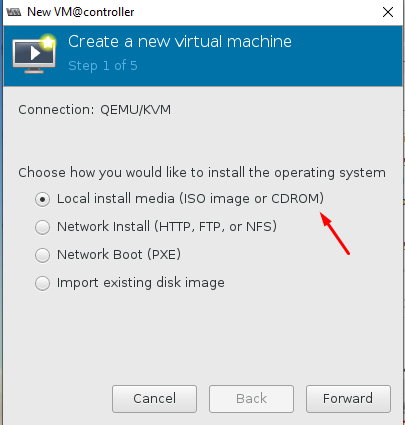
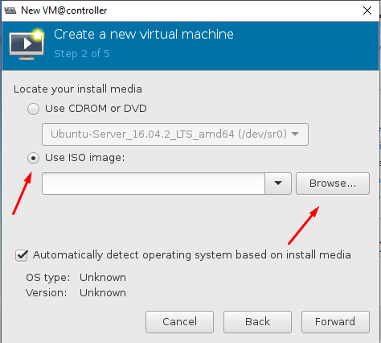
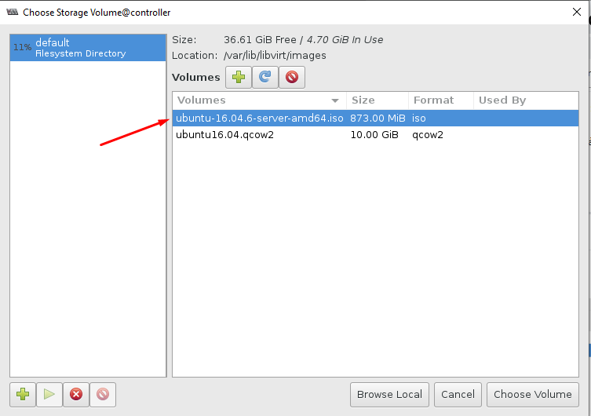
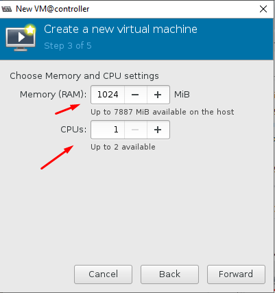
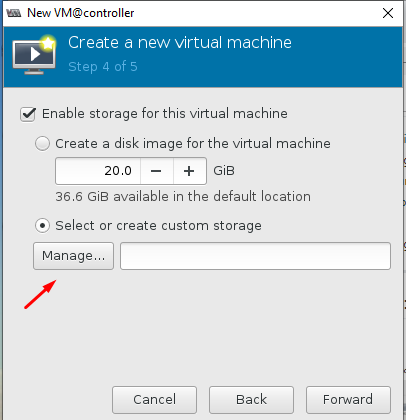
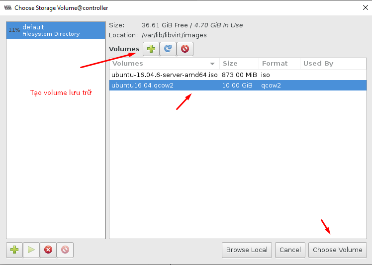
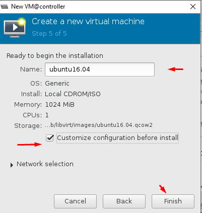
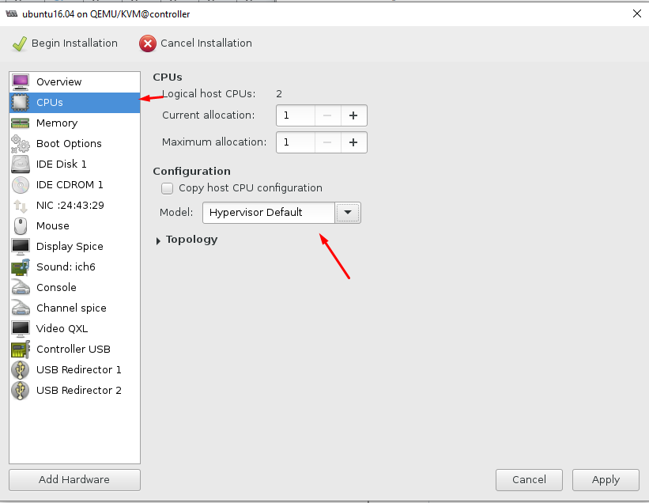
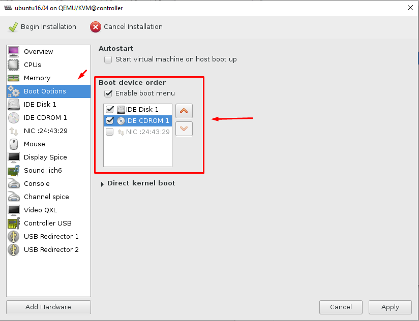
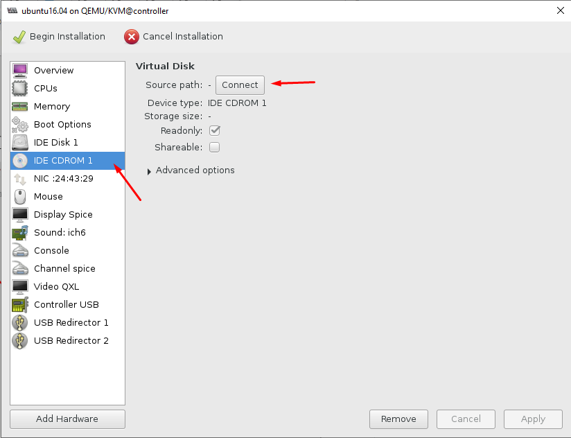
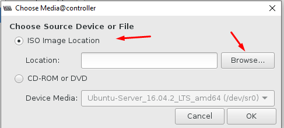
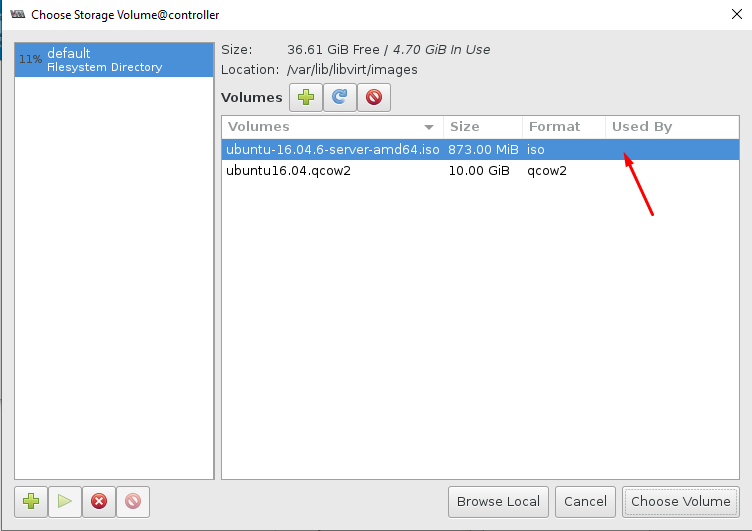
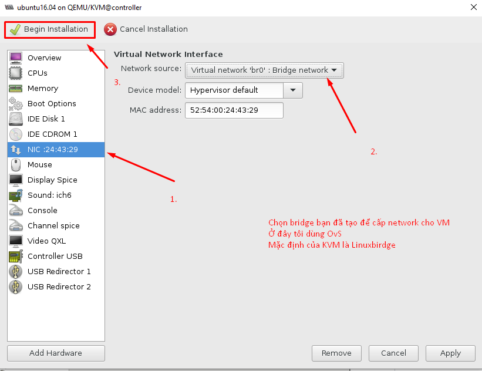

- Cài đặt OS như bình thường
- Cho đến bước phân vùng tạo ổ đĩa

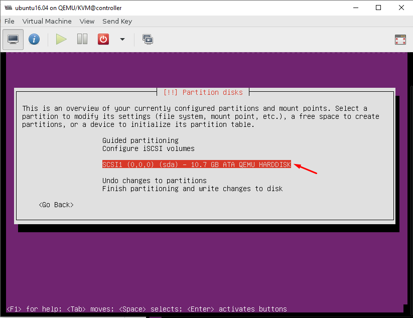
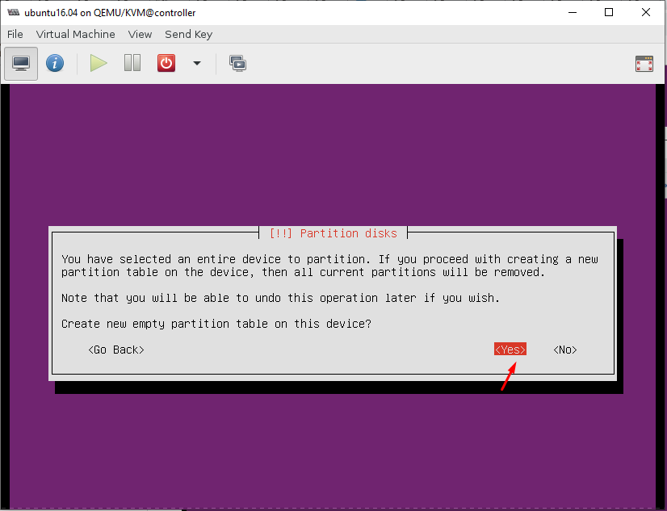
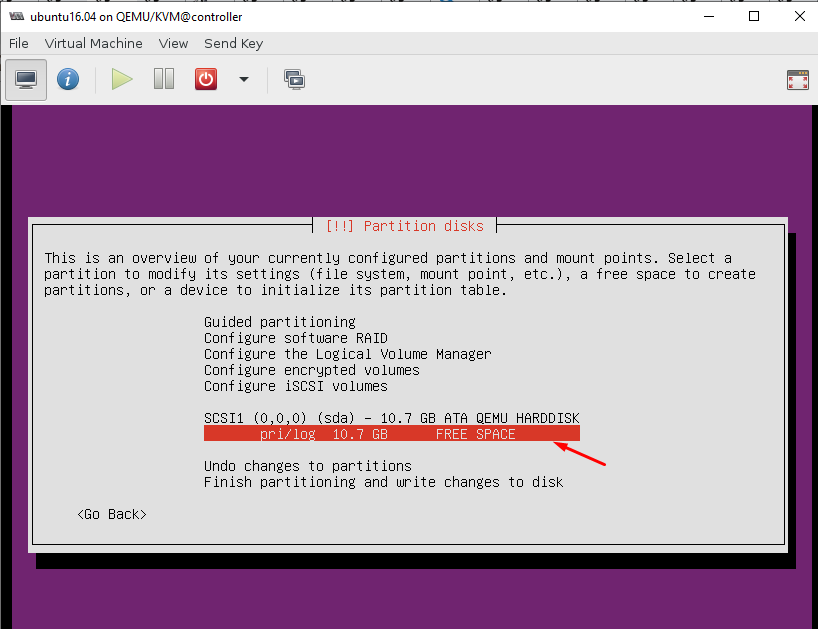

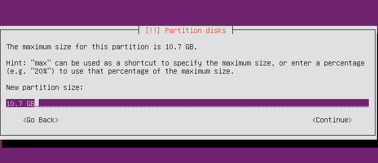
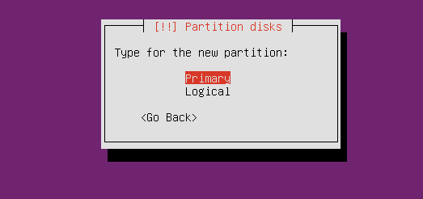

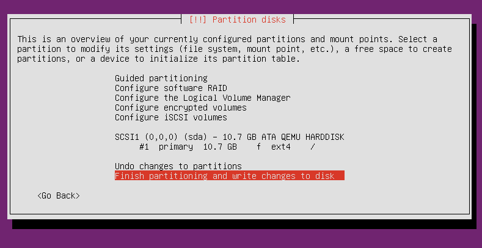
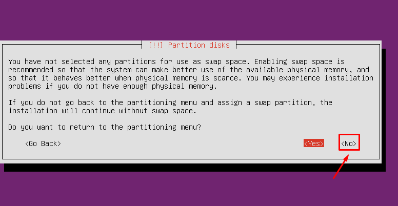

- Tiếp tục cài đặt như bình thường

- Cài đặt xong thì tắt VM

### **Thực hiện cài đặt trên HOST**

- **Để máy host giao tiếp với máy ảo sử dụng qemu-guest-agent. Ta Thực hiện chỉnh sửa file xml của VM.**

```
virsh edit ubuntu16.04
```
*Trong mục `<device>` chỉnh sửa như dưới:*

```

 <channel type='unix'>
      <target type='virtio' name='org.qemu.guest_agent.0'/>
      <address type='virtio-serial' controller='0' bus='0' port='1'/>
 </channel>
```

> Nếu có <channel> giao tiếp khác thì chỉnh port = 2 và save cấu hình như bình thường
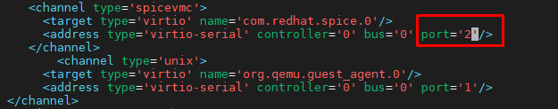


- Tạo thêm thư mục cho channel vừa tạo và phân quyền cho thư mục đó

```
mkdir -p /var/lib/libvirt/qemu/channel/target
chown -R libvirt-qemu:kvm /var/lib/libvirt/qemu/channel
```

- Phân quyền cho phép libvirt-qemu được đọc ghi các file có hậu tố `.qemu.guest_agent.0` trong thư mục `/var/lib/libvirt/qemu/channel/target`

Chỉnh sửa file : `vim  /etc/apparmor.d/abstractions/libvirt-qemu`

Thêm vào duối dòng : ` /var/lib/libvirt/qemu/channel/target/*.qemu.guest_agent.0 rw,`


- Khởi động lại libvirt và apparmor
```
service libvirt-bin restart
service apparmor reload
```
### **Thực hiện cài đặt trên VM**

- **Cài đặt cloud-init, cloud-utils và cloud-initramfs-growroot**
( Để máy ảo khi boot sẽ tự giãn phân vùng theo dung lượng mới)


```
apt-get install cloud-utils cloud-initramfs-growroot cloud-init -y
```
- **Cài đặt netplug Để sau khi boot máy ảo, có thể nhận đủ các NIC gắn vào:**
```
apt-get install netplug -y
wget https://raw.githubusercontent.com/longsube/Netplug-config/master/netplug
```

- **Đưa file netplug vào thư mục /etc/netplug**
```
mv netplug /etc/netplug/netplug
chmod +x /etc/netplug/netplug
```
- **Chỉnh sửa file /etc/default/grub để bắn log ra trong quá trình tạo máy ảo ra console**

`vim /etc/default/grub`
```
GRUB_DEFAULT=0
#GRUB_HIDDEN_TIMEOUT=0
GRUB_HIDDEN_TIMEOUT_QUIET=true
GRUB_TIMEOUT=2
GRUB_DISTRIBUTOR=`lsb_release -i -s 2> /dev/null || echo Debian`
GRUB_CMDLINE_LINUX_DEFAULT=""
GRUB_CMDLINE_LINUX="console=tty0 console=ttyS0,115200n8"
```


hoặc

```
sed -i 's|GRUB_CMDLINE_LINUX_DEFAULT=""|GRUB_CMDLINE_LINUX_DEFAULT="console=tty0 console=ttyS0,115200n8"|g' /etc/default/grub
```
Lưu lại 
```
update-grub
```
( Sẽ để thực hiện như thế này )

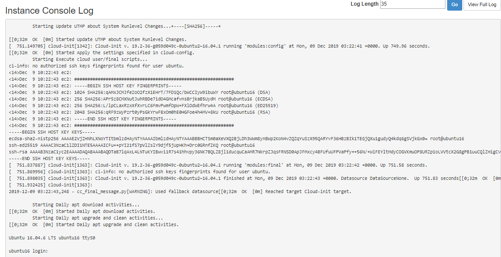

- **Xóa toàn bộ các thông tin về địa chỉ MAC của card mạng ảo trong 2 file `/etc/udev/rules.d/70-persistent-net.rules` và 
`/lib/udev/rules.d/75-persistent-net-generator.rules`** ( chỉ xóa nội dung không xóa file)

```
echo > /lib/udev/rules.d/75-persistent-net-generator.rules
echo > /etc/udev/rules.d/70-persistent-net.rules
```

- Cấu hình để đổi name Card mạng về eth* thay vì ens, eno (Để scripts netplug chạy ổn định)
```
sed -i 's|GRUB_CMDLINE_LINUX=""|GRUB_CMDLINE_LINUX="net.ifnames=0 biosdevname=0"|g' /etc/default/grub

update grub
```
- **Disable default config route** 
```
sed -i 's|link-local 169.254.0.0|#link-local 169.254.0.0|g' /etc/networks
```
(Comment dòng link-local 169.254.0.0 trong file `/etc/networks`)

- **Cài đặt qemu-guest-agent**
>Chú ý: qemu-guest-agent là một daemon chạy trong máy ảo, giúp quản lý và hỗ trợ máy ảo khi cần (có thể cân nhắc việc cài thành phần này lên máy ảo)
Để có thể thay đổi password máy ảo thì phiên bản qemu-guest-agent phải >= 2.5.0
```
apt-get install software-properties-common -y
add-apt-repository cloud-archive:queens -y
apt-get update
apt-get install qemu-guest-agent -y
```
- Kiểm tra phiên bản bằng lệnh

```
qemu-ga --version
---
QEMU Guest Agent 2.11.1
```

- Khởi chạy qemu-guest-agent
```
service qemu-guest-agent start
```
- Cấu hình card mạng tự động active khi hệ thống boot-up:

`vim /etc/network/interfaces`
```
auto lo
iface lo inet loopback
auto eth0
iface eth0 inet dhcp
```
- Tắt máy ảo:

`init 0`

### **Thực hiện trên Host KVM**

-  Cài đặt bộ libguestfs-tools để xử lý image (nên cài đặt trên Ubuntu OS để có bản libguestfs mới nhất)
```
apt-get install libguestfs-tools -y
```

- Xử dụng lệnh virt-sysprep để xóa toàn bộ các thông tin máy ảo:
```
virt-sysprep -d ubuntu16.04
```

- Dùng lệnh sau để tối ưu kích thước image:
```
virt-sparsify --compress /var/lib/libvirt/images/ubuntu16.04.qcow2 /root/ubuntu1604.img
```

- **Upload image lên glance**:

```
glance image-create --name ubuntu16.04-byvinh-2019 \
--disk-format qcow2 \
--container-format bare \
--file ubuntu1604.img \
--visibility=public \
--property hw_qemu_guest_agent=yes \
--progress
```
- Kiểm tra xem thành công chưa:

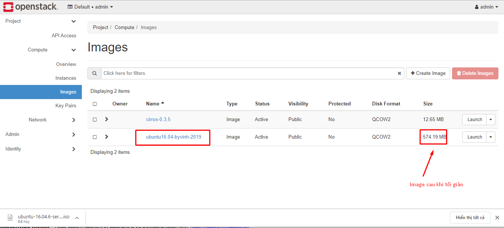
-
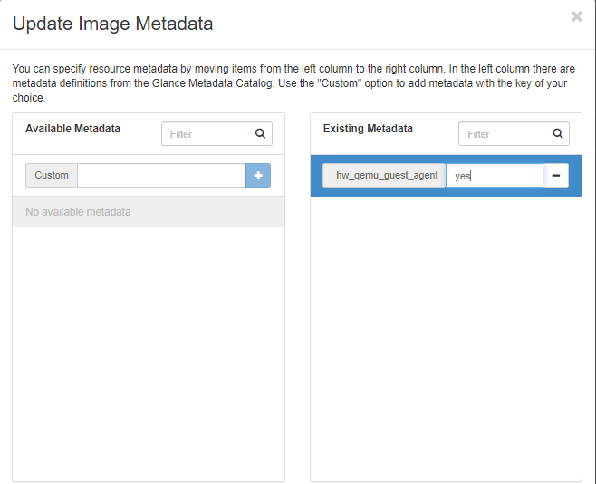 


## Kiểm tra bằng cách tạo máy ảo 

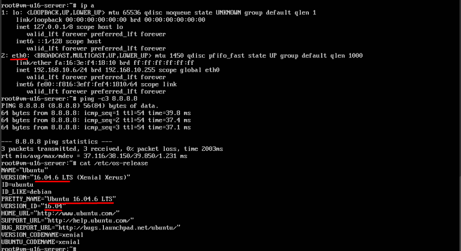
---


Tham khao

https://github.com/longsube/Image_Create/blob/master/docs/Ubuntu14.04_noLVM%2Bqemu_ga.md#m%E1%BB%A5c-%C4%91%C3%ADch-l%C3%A0-ph%C3%A2n-quy%E1%BB%81n-cho-ph%C3%A9p-libvirt-qemu-%C4%91%C6%B0%E1%BB%A3c-%C4%91%E1%BB%8Dc-ghi-c%C3%A1c-file-c%C3%B3-h%E1%BA%ADu-t%E1%BB%91-qemuguest_agent0-trong-th%C6%B0-m%E1%BB%A5c-varliblibvirtqemuchanneltarget