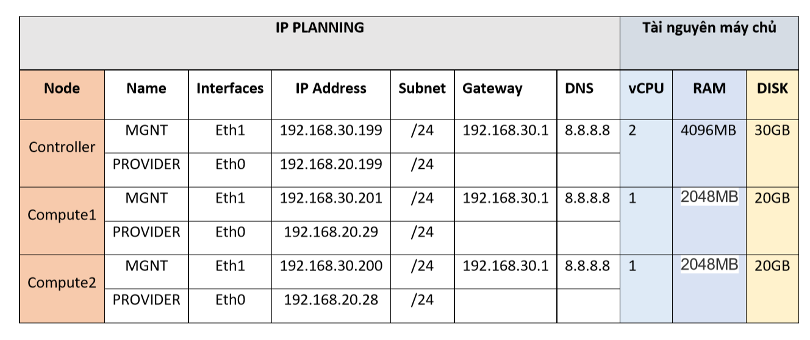

# Cài đặt Openstack bằng Kolla-Ansible multinode

## Chuẩn bị hệ thống

1. Môi trường
- 3 node cài Centos7: 
	- deployment: Máy cài `kolla-ansible`
	- controller
	- compute1
- 2 card mạng mỗi node:
	- eth1: 192.168.30.x/24
	- eth0: 192.168.20.x/24



2. Cấu hình network, hostname, hosts cho các node

2.1 **Node deployment**:
- Cấu hình hostname:
```
hostnamectl set-hostname deployment
```
- Cấu hình network:
```
cat << EOF > /etc/sysconfig/network-scripts/ifcfg-eth1
TYPE=Ethernet
BOOTPROTO=static
NAME=eth1
DEVICE=eth1
ONBOOT=yes
IPADDR=192.168.30.198
NETMASK=255.255.255.0
GATEWAY=192.168.30.1
DNS1=8.8.8.8
EOF

cat << EOF > /etc/sysconfig/network-scripts/ifcfg-eth0
TYPE=Ethernet
BOOTPROTO=static
NAME=eth0
DEVICE=eth0
ONBOOT=yes
IPADDR=192.168.20.37
NETMASK=255.255.255.0
EOF

```
- Cấu hình file hosts:
```
cat /etc/hosts
192.168.30.198 deployment
```
2.2 **Node controller**:
- Cấu hình hostname:
```
hostnamectl set-hostname controller
```

- Cấu hình network:
```
cat << EOF > /etc/sysconfig/network-scripts/ifcfg-eth1
TYPE=Ethernet
BOOTPROTO=static
NAME=eth1
DEVICE=eth1
ONBOOT=yes
IPADDR=192.168.30.199
NETMASK=255.255.255.0
GATEWAY=192.168.30.1
DNS1=8.8.8.8
EOF

cat << EOF > /etc/sysconfig/network-scripts/ifcfg-eth0
TYPE=Ethernet
BOOTPROTO=static
NAME=eth0
DEVICE=eth0
ONBOOT=yes
IPADDR=192.168.20.199
NETMASK=255.255.255.0
EOF
```

2.2 **Node compute1**:
- Cấu hình hostname:
```
hostnamectl set-hostname compute1
```

- Cấu hình network:
```
cat << EOF > /etc/sysconfig/network-scripts/ifcfg-eth1
TYPE=Ethernet
BOOTPROTO=static
NAME=eth1
DEVICE=eth1
ONBOOT=yes
IPADDR=192.168.30.201
NETMASK=255.255.255.0
GATEWAY=192.168.30.1
DNS1=8.8.8.8
EOF

cat << EOF > /etc/sysconfig/network-scripts/ifcfg-eth0
TYPE=Ethernet
BOOTPROTO=static
NAME=eth0
DEVICE=eth0
ONBOOT=yes
IPADDR=192.168.20.29
NETMASK=255.255.255.0
EOF
```
- restart máy nếu chưa nhận card mạng

## Cài đặt các gói phần mềm cần thiết cho các node

### *Thực hiện trên node deployment*
1. Cài đặt Kolla-Ansible và cấu hình trên node deployment

- Cài đặt theo hướng dẫn [tại đây](https://github.com/TrongTan124/ghi-chep-kolla-ansible/blob/master/docs/01.Cai%20dat%20AIO.md)

- Kết quả các gói
	- Ansible: --version 2.6.13 
		- `pip show ansible`
	- Kolla-Ansible: --version 9.0.1
		- `pip show kolla-ansible`
	- Pip: --version 20.0.2

2. Cấu hình các thông số cần thiết cho Kolla-Ansible

- Ở file `/etc/kolla/globals.yml` là nơi khai báo các cấu hình cho hệ thống Openstack
	- Thực hiện chỉ định phiên bản cho Openstack cùng với image tag của docker đã pull về:
	```
	sed -i 's/#openstack_release: ""/openstack_release: "9.0.2"/g' /etc/kolla/globals.yml
	```
	- Hệ điều hành cài đặt:
	```
	sed -i 's/#kolla_base_distro: "centos"/kolla_base_distro: "centos"/g' /etc/kolla/globals.yml
	```
	- định dạng install
	```
	sed -i 's/#kolla_install_type: "binary"/kolla_install_type: "binary"/g' /etc/kolla/globals.yml
	```
	- Chọn IP VIP:
	```
	sed -i 's/#kolla_internal_vip_address: "10.10.10.254"/kolla_internal_vip_address: "192.168.30.202"/g' /etc/kolla/globals.yml
	```
	- Chỉ định dải Management cho các node
	```sh
	sed -i 's/#network_interface: "eth0"/network_interface: "eth1"/g' /etc/kolla/globals.yml
	```
	- Chỉ định dải Provider
	```sh
	sed -i 's/#neutron_external_interface: "eth1"/neutron_external_interface: "eth0"/g' /etc/kolla/globals.yml
	```
	- Khai báo docker registry để các node khác có thể pull image về.
	```sh
    docker_registry: "192.168.30.198:5000"
	docker_registry_insecure: "yes"
	```
3. Khai báo các node để Kolla-Ansible thực thi	
- Thực hiện điền các thông số cho file inventory
(Tại đây sẽ khai báo các node target cho Ansible thực thi)
	- Như cài đặt kolla-ansible ở trên, thực hiện copy file inventory ra ngoài
	```
	cp /usr/share/kolla-ansible/ansible/inventory/multinode /root/
	```
	- Chỉnh sửa file Inventory
	```sh
	[control]
	# These hostname must be resolvable from your deployment host
	192.168.30.199

	# The above can also be specified as follows:
	#control[01:03]     ansible_user=kolla

	# The network nodes are where your l3-agent and loadbalancers will run
	# This can be the same as a host in the control group
	[network]
	192.168.30.199

	[compute]
	192.168.30.201

	[monitoring]
	192.168.30.199

	# When compute nodes and control nodes use different interfaces,
	# you need to comment out "api_interface" and other interfaces from the globals.yml
	# and specify like below:
	#compute01 neutron_external_interface=eth0 api_interface=em1 storage_interface=em1 tunnel_interface=em1

	[storage]
	192.168.30.201

	[deployment]
	localhost       ansible_connection=local
	```
- Thực hiện tạo password cho các thành phần của Openstack
	-  Các password của các thành phần Openstack sẽ được lưu tại file `/etc/kolla/passwords.yml`
	- Thực hiện tạo pass bằng lệnh `kolla-genpwd`
4. Thực hiện build image và cấu hình để các node pull được image về
- Build các Image cho các thành phần
	- sử dụng `byobu` tạo ra phiên thực thi vì việc build mất nhiều thời gian
	- Thực hiện build:
	```sh
	git clone https://github.com/openstack/kolla.git
	cd kolla/
	git branch -r
	git checkout stable/train
	cd kolla/
	pip install tox
	tox -e genconfig
	/root/kolla/.tox/genconfig/bin/kolla-build -b centos
	```
	- Kiểm tra bằng lệnh
	```
	docker images
	```

- Hiện tại tôi chưa biết cách để pull trực tiếp image build có sẵn tên là `kolla/centos-binary-*:9.0.2` cho các node khác pull về, vì khi khai báo docker_registry như trên thì các node sẽ tìm image có tên là `192.168.30.198:5000/kolla/centos-binary-*:9.0.2` nên trên node deployment này tôi thực hiện đổi tên và push image về local để các node khác có thể pull được image
	- Cài đặt docker
	```sh
	yum-config-manager --add-repo https://download.docker.com/linux/centos/docker-ce.repo
	yum install -y docker-ce
	```
	- Khởi động lại Docker
	```sh
	systemctl daemon-reload
	systemctl enable docker
	systemctl restart docker
	```
	- Cài đặt docker distribution
	```sh
	sudo yum -y update
	sudo yum -y install docker-distribution
	systemctl start docker-distribution
	systemctl enable docker-distribution
	```
	- Cấu hình chỉnh định port registry tại file `/etc/docker-distribution/registry/config.yml`
	```sh
	version: 0.1
	log:
	  fields:
		service: registry
	storage:
		cache:
			layerinfo: inmemory
		filesystem:
			rootdirectory: /var/lib/registry
	http:
		addr: :5000
	```
	- Cấu hình docker
	```sh
	mkdir /etc/systemd/system/docker.service.d
	tee /etc/systemd/system/docker.service.d/kolla.conf << 'EOF'
	[Service]
	MountFlags=shared
	ExecStart=/usr/bin/dockerd --insecure-registry 192.168.30.198:5000 --log-opt max-file=5 --log-opt max-size=50m
	EOF
	```
	- Khởi động lại docker 
	```
	systemctl restart docker
	```
	

	- Việc đổi tên repo và push khá mất thời gian nên tôi thực hiện viết 1 đoạn script
		- Nội dung đoạn script:
		```sh
		#!/bin/bash
		# gán các dòng của cột thứ nhất có chữ đầu là kolla thành biến a
		for a in `docker images |egrep "^kolla" |awk '{print $1}'`
		do 
		# Thực hiện lệnh ví dụ: docker tag kolla/centos-binary-neutron-metadata-agent:9.0.2  192.168.30.198:5000/kolla/centos-binary-neutron-metadata-agent:9.0.2

		docker tag $a:9.0.2 192.168.30.198:5000/$a:9.0.2

		# Thực hiện push image có tag tới local-registry
		docker push  192.168.30.198:5000/$a:9.0.2
		# Xóa các image cũ
		docker rmi $a:9.0.2
		done 
		```
	- Khi thực hiện xong chạy lệnh `docker images` kiểm tra :
	```sh
	[root@localhost ~]# docker images
	REPOSITORY                                                                  TAG                 IMAGE ID            CREATED             SIZE
	192.168.30.198:5000/kolla/centos-binary-neutron-server-opendaylight         9.0.2               eda3dfdabd91        7 days ago          1.11GB
	192.168.30.198:5000/kolla/centos-binary-ironic-conductor                    9.0.2               be647def7f18        7 days ago          1.22GB
	192.168.30.198:5000/kolla/centos-binary-neutron-server-ovn                  9.0.2               52edf24651fc        7 days ago          1.11GB
	192.168.30.198:5000/kolla/centos-binary-tacker-server                       9.0.2               4698a2f2649e        7 days ago          1.1GB
	```
***Lưu ý: Nếu pull được images từ Docker Hub về thì trong file `/etc/kolla/globals` Cấu hình thông số 	openstack_release: "train" thì thực hiện lệnh kolla -i <inventory> pull có thể pull được images về luôn mà không cần build***
## Thực hiện chạy Kolla-Ansible
- Thực hiện trên node deployment
	- Thực hiện cài đặt môi trường
	```
	kolla-ansible -i multinode bootstrap-servers
	```
	- Kiểm tra:
	```
	kolla-ansible -i multinode prechecks
	```
	- Thực hiện pull image về:
	```
	kolla-ansible -i multinode pull
	```
	- Tiến hành cài đặt hệ thống Openstack:
	```
	kolla-ansible -i multinode deploy
	```
	- Thực hiện chạy lệnh này để tạo ra file `/etc/kolla/admin-openrc.sh` sử dụng tương tác với openstack bằng openstack client
	```
	kolla-ansible -i multinode post-deploy
	```
	- Thực hiện copy file vừa tạo ra sang node `controller`
	```sh
	scp /etc/kolla/admin-openrc.sh root@192.168.30.199:/root/
	```
*(Lưu ý những bước cài đặt openstack client phải thực hiện ở node controller, tôi chưa hiểu sao khi cài đặt openstack client ở node deployment thì node deployment sẽ thực hiện được các lệnh openstack điều khiển tương tác với cụm openstack luôn :)) )*

- Thực hiện  trên node `controller`
	- Cài đặt virtualen và tạo một virtualen có tên là venv trên node `controller`
	```
	pip install virtualenv
	virtualenv venv
	```
	- Kich hoạt virtualen (chuyển vào virtualen) để thực hiện cài đặt gói
	```
	. venv/bin/activate
	```
	- Thực hiện cài đặt openstack client trong virtualen. Lúc ở trong virtualen sẽ có dòng sau ở đầu (venv)
	```sh
	pip install python-openstackclient
	```

	- Thực hiện import biến môi trường để sử dụng tập lệnh openstack client
	```
	source admin-openrc.sh
	```
	- Thực hiện lệnh kiểm tra hoạt động 
	```
	openstack token issue
	openstack project list
	```
	- Download image cirros để test 
	```
	wget http://download.cirros-cloud.net/0.3.4/cirros-0.3.4-x86_64-disk.img

	openstack image create "cirros" \
	--file cirros-0.3.4-x86_64-disk.img \
	--disk-format qcow2 --container-format bare \
	--public
	```
	- Trong file `/etc/kolla/neutron-openvswitch-agent/ml2_conf.ini` cấu hình được khai báo `flat_networks = physnet1` nên khi tạo network flat cần lưu ý


---
# Tham Khảo

- https://github.com/TrongTan124/ghi-chep-kolla-ansible/blob/master/docs/01.Cai%20dat%20AIO.md

- https://github.com/congto/hdsd-openstack-kolla/blob/master/docs/openstack-pike-kolla-multinode.md 

- https://computingforgeeks.com/install-and-configure-docker-registry-on-centos-7/