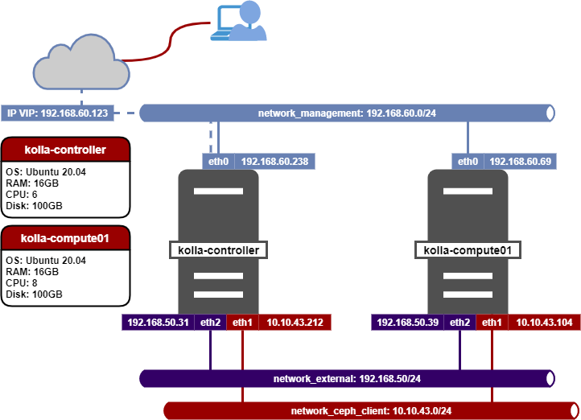
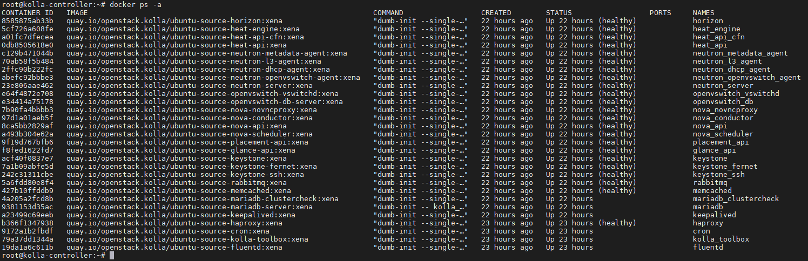
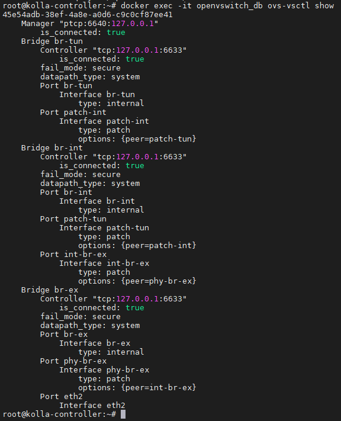
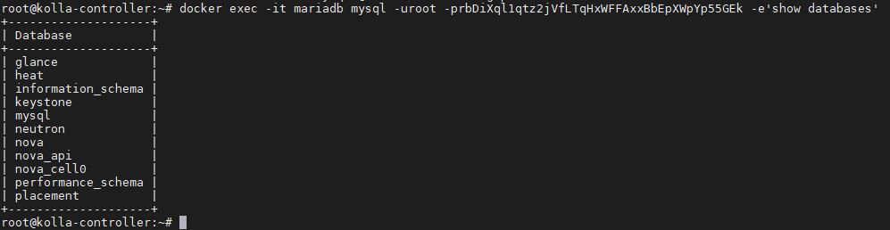
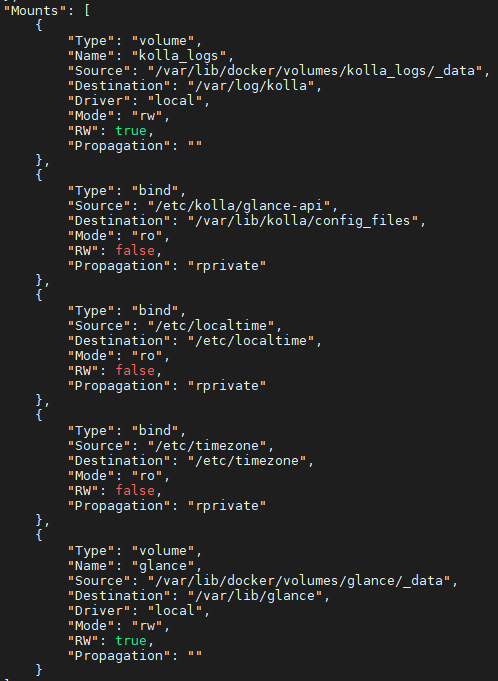

# Cài đặt Openstack bằng Kolla-Ansible trên Ubunutu

## 1. Thông tin mô hình



## 2. Cài đặt cơ bản

*Thực hiện trên tất cả các node*

- Update các gói cài đặt 
```sh
apt update -y && apt upgrade -y
```
- Cài đặt python3 pip:
```sh
apt install -y python3-pip
```
- Cấu hình host domain
```sh
cat << EOF > /etc/hosts
127.0.0.1 localhost
127.0.1.1 cloud

# The following lines are desirable for IPv6 capable hosts
::1     ip6-localhost ip6-loopback
fe00::0 ip6-localnet
ff00::0 ip6-mcastprefix
ff02::1 ip6-allnodes
ff02::2 ip6-allrouters
192.168.60.238  kolla-controller
192.168.60.69   kolla-compute01
```
- Khởi động lại máy 
```sh
init 6
```

## 3. Cấu hình network
*Thực hiện trên máy chủ kolla-controller*

- Cấu hình network:
```sh
cat << EOF > /etc/network/interfaces
auto lo
iface lo inet loopback
auto eth0
iface eth0 inet static
address 192.168.60.238
netmask 255.255.255.0
gateway 192.168.60.1
dns-nameservers 8.8.8.8 8.8.4.4

auto eth1
iface eth1 inet static
address 10.10.43.212
netmask 255.255.255.0

auto eth2
iface eth2 inet static
address 192.168.50.34
netmask 255.255.255.0
EOF
```
- Khởi động lại các card mạng
```sh
ifdown -a && ifup -a
```

*Thực hiện trên máy chủ kolla-compute01*

- Cấu hình network:
```sh
cat << EOF > /etc/network/interfaces
auto lo
iface lo inet loopback
auto eth0
iface eth0 inet static
address 192.168.60.69
netmask 255.255.255.0
gateway 192.168.60.1
dns-nameservers 8.8.8.8 8.8.4.4

auto eth1
iface eth1 inet static
address 10.10.43.104
netmask 255.255.255.0

auto eth2
iface eth2 inet static
address 192.168.50.39
netmask 255.255.255.0
EOF
```
- Khởi động lại các card mạng
```sh
ifdown -a && ifup -a
```
## 4. Cài đặt kolla-ansible
*Thực hiện trên node kolla-ansible vì node này sẽ thực hiện cài đặt trên các node*

- Cài đặt Ansible *(yêu cầu phiên bản 2.10 - 2.11)*:
```sh
pip3 install ansible=="2.10.7"
```

- Cài đặt Kolla Ansible:
```sh
pip3 install "kolla-ansible==13.0.0"
```
- Tạo thư mục cấu hình kolla
```sh
mkdir -p /etc/kolla
```

- Copy các file cấu hình của Kolla Ansible 
```sh
cp /usr/local/share/kolla-ansible/etc_examples/kolla/* /etc/kolla/
cp /usr/local/share/kolla-ansible/ansible/inventory/* .
```

- Generate value password vào file `/etc/kolla/passwords.yml`
```sh
kolla-genpwd
```

- Cấu hình file inventory tại `/root/multinode`:
```ini
# These initial groups are the only groups required to be modified. The
# additional groups are for more control of the environment.
[control]
# These hostname must be resolvable from your deployment host
kolla-controller anisble_host=192.168.60.238 ansible_connection=ssh     ansible_user=root
# The above can also be specified as follows:
#control[01:03]     ansible_user=kolla

# The network nodes are where your l3-agent and loadbalancers will run
# This can be the same as a host in the control group
[network]
kolla-controller anisble_host=192.168.60.238 ansible_connection=ssh     ansible_user=root

[compute]
kolla-compute01 anisble_host=192.168.60.69 ansible_connection=ssh     ansible_user=root


[monitoring]
kolla-controller anisble_host=192.168.60.238 ansible_connection=ssh     ansible_user=root

# When compute nodes and control nodes use different interfaces,
# you need to comment out "api_interface" and other interfaces from the globals.yml
# and specify like below:
#compute01 neutron_external_interface=eth0 api_interface=em1 storage_interface=em1 tunnel_interface=em1

[storage]
kolla-controller anisble_host=192.168.60.238 ansible_connection=ssh     ansible_user=root

[deployment]
localhost       ansible_connection=local

[baremetal:children]
control
network
compute
storage
monitoring

[tls-backend:children]
control

# You can explicitly specify which hosts run each project by updating the
# groups in the sections below. Common services are grouped together.

[common:children]
control
network
compute
storage
monitoring
#...
```

- Backup lại cấu hình file extra_vars:
```sh
cp /etc/kolla/globals.yml /etc/kolla/globals.yml.bak
```

- Cấu hình `extra_vars` tại file `/etc/kolla/globals.yml`
```sh
cat << EOF > /etc/kolla/globals.yml
---
kolla_base_distro: "ubuntu"
kolla_install_type: "source"
openstack_release: "xena"

# Không sử dụng HA Controller (VIP RabbitMQ, MariaDB v.v)
# enable_haproxy: "no"

# Dải Mngt + admin, internal API
kolla_internal_vip_address: "192.168.60.123"
network_interface: "eth0"

# Dải Mngt Provider
neutron_external_interface: "eth2"

# Cho phép neutron sử dụng dải provider
enable_neutron_provider_networks: "yes"

nova_compute_virt_type: "kvm"

keepalived_virtual_router_id: "60"


enable_swift: 'no'
#enable_cinder: "yes"
#enable_cinder_backend_lvm: "yes"
#enable_cinder_backup: "no"
EOF
```
- Copy SSH key đến các node cài Kolla-Ansible
```sh
ssh-keygen
ssh-copy-id root@kolla-controller
ssh-copy-id root@kolla-compute01
```
## 5. Triển khai Openstack Kolla

- Khởi tạo môi trường cho Openstack Kolla
```sh
kolla-ansible -i multinode bootstrap-servers
```

- Kiểm tra thiết lập Kolla Ansible
```sh
kolla-ansible -i multinode prechecks
```

- Thực hiện triển khai Openstack Kolla
```sh
kolla-ansible -i multinode deploy
```

- Thiết lập File Environment Openstack, file này được lưu tại `/etc/kolla/admin-openrc.sh`
```sh
kolla-ansible -i multinode post-deploy
```

- Cài đặt Openstack Client
```sh
apt-get install -y python3-openstackclient python3-glanceclient python3-neutronclient 
```

## 6. Kiểm tra cài đặt
- Truy cập biến môi trường Openstack
```sh
source /etc/kolla/admin-openrc.sh
```

- Gọi token của keystone
```sh
openstack token issue
```

## 7. Cách thức kiểm tra và thao tác với các proccess trong Kolla

### 7.1 Làm thể nào để tương tác với các container?
- Hiển thị các container đã tạo trên `kolla-controller`:
```sh
docker ps -a
```


Đây là tất cả các container đã được triển khai cho hệ thống Openstack. Các container này được cấu hình `mode network host`, và được mount thư mục như `/var/lib, /var/log/,..` ra ngoài.

- Thao tác với các process bên trong cần sử dụng lệnh `docker exec` để thực thi lệnh bên trong container:
```sh
docker exec -it openvswitch_db ovs-vsctl show
```


*Sau khi thực thi lệnh, kết quả trả về là thông tin kết nối trong Openvswitch (có thể thấy eth2 đã được cắm vào bridge br-ex để làm đường kết nối ra ngoài cho các VM).*

- Tương tác với Database  hiển thị các Database đang có:

```sh
docker exec -it mariadb mysql -uroot -prbDiXql1qtz2jVfLTqHxWFFAxxBbEpXWpYp55GEk -e'show databases'
```



*Password của database là giá trị của biến `database_password` trong file `/etc/kolla/passwords.yml`*
- Dump dữ liệu DB ra ngoài filesystem:
```sh
docker exec -it mariadb mysqldump -uroot -prbDiXql1qtz2jVfLTqHxWFFAxxBbEpXWpYp55GEk keystone > vinhtestdumpDB.sql
```
### 7.2 Dự liệu được ghi ở đâu?
*Dữ liệu ghi ra từ container được mount ra ngoài filesystem của OS, để biết thông tin volume mount của container, sử dụng lệnh:*
```sh
docker inspect glance_api
```

*Kiểm tra trường `Mounts` của output json*

    - Thư mục lưu log: `/var/lib/docker/volumes/kolla_logs/_data`
    - Thư mục lưu dữ liệu: `/var/lib/docker/volumes/glance/_data`
    - Thư mục lưu cấu hình: `/etc/kolla/glance-api`

- Tương tự với mariaDB ta sẽ thấy được thư mục lưu dữ liệu database
```sh
root@kolla-controller:~# ll /var/lib/docker/volumes/mariadb/_data
total 361200
drwxr-xr-x 12 42434 42434      4096 Feb 21 16:34 ./
drwx-----x  3 root  root       4096 Feb 21 16:11 ../
-rw-rw----  1 42434 42434     32768 Feb 21 16:34 aria_log.00000001
-rw-rw----  1 42434 42434        52 Feb 21 16:13 aria_log_control
-rw-rw----  1 42434 42434 134219032 Feb 22 15:34 galera.cache
drwx------  2 42434 42434      4096 Feb 21 16:19 glance/
-rw-rw----  1 42434 42434       113 Feb 21 16:35 grastate.dat
-rw-rw----  1 42434 42434       170 Feb 21 16:13 gvwstate.dat
drwx------  2 42434 42434      4096 Feb 21 16:35 heat/
-rw-rw----  1 42434 42434      1030 Feb 21 16:12 ib_buffer_pool
-rw-rw----  1 42434 42434 100663296 Feb 22 15:34 ib_logfile0
-rw-rw----  1 42434 42434  79691776 Feb 21 16:15 ibdata1
-rw-rw----  1 42434 42434  12582912 Feb 21 16:13 ibtmp1
drwx------  2 42434 42434      4096 Feb 21 16:15 keystone/
-rw-rw----  1 42434 42434         4 Feb 21 16:13 mariadb.pid
-rw-rw----  1 42434 42434         0 Feb 21 16:12 multi-master.info
drwx------  2 42434 42434      4096 Feb 21 16:13 mysql/
-rw-rw----  1 42434 42434     27232 Feb 21 16:12 mysql-bin.000001
-rw-rw----  1 42434 42434      2716 Feb 21 16:12 mysql-bin.000002
-rw-rw----  1 42434 42434       365 Feb 21 16:12 mysql-bin.000003
-rw-rw----  1 42434 42434       365 Feb 21 16:12 mysql-bin.000004
-rw-rw----  1 42434 42434       365 Feb 21 16:13 mysql-bin.000005
-rw-rw----  1 42434 42434  42501264 Feb 22 15:34 mysql-bin.000006
-rw-rw----  1 42434 42434       114 Feb 21 16:13 mysql-bin.index
-rw-r--r--  1 42434 42434        15 Feb 21 16:12 mysql_upgrade_info
drwx------  2 42434 42434     20480 Feb 21 16:32 neutron/
drwx------  2 42434 42434     12288 Feb 21 16:22 nova/
drwx------  2 42434 42434      4096 Feb 21 16:21 nova_api/
drwx------  2 42434 42434     16384 Feb 21 16:21 nova_cell0/
drwx------  2 42434 42434      4096 Feb 21 16:12 performance_schema/
drwx------  2 42434 42434      4096 Feb 21 16:20 placement/
-rw-------  1 42434 42434      3031 Feb 21 16:13 wsrep_recovery.ok
```

### 7.3 Sửa file cấu hình cho service như thế nào?
Bình thường ta sẽ phải sửa cấu hình trong playbook rồi chạy lại.

Nhưng nếu ta muốn cấu hình tĩnh thì sửa tại `/etc/kolla/glance-api/glance-api.conf` sau đó `restart lại container`.