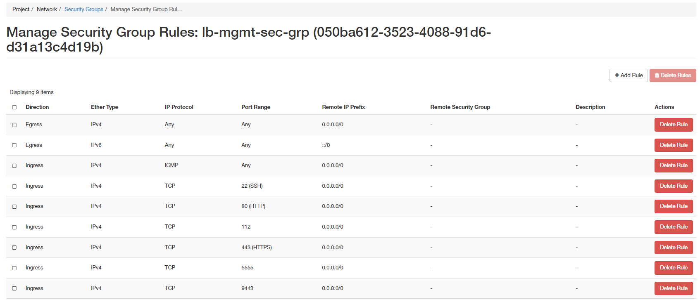

# Integrate Octavia

*Phiên bản Openstack Xena*
## Khởi tạo trước môi trường cho Octavia
- Copy cert vào thư mục
```sh
mkdir -p /etc/kolla/config/octavia/
mv certs/* /etc/kolla/config/octavia/
```

- Khởi tạo Security Group


- Khởi tạo đường network external quản lý Amphora

- Khởi tạo Keypair
```sh
mkdir -p /etc/kolla/config/octavia/.ssh
ssh-keygen -b 2048 -t rsa -N "" -f /etc/kolla/config/octavia/.ssh/octavia
openstack --insecure keypair create --public-key /etc/kolla/config/octavia/.ssh/octavia.pub octavia
```
- Khởi tạo flavor
```sh
openstack --insecure flavor create --public m1.amphora --id 200 --vcpus 1 --ram 1024 --disk 5
```
- Upload Image amphora
```sh
wget http://123.30.212.230:8181/images/application_images/amphora-ubuntu-2021.0x86_64.raw
openstack --insecure image create --disk-format raw --container-format bare --private --tag amphora --file amphora-ubuntu-2021.0x86_64.raw amphora-x64-haproxy
```

## Khai báo biến

- Khai báo trong file `/etc/kolla/globals.yml`
```yml
## Khai báo cài đặt Octavia
enable_octavia: 'yes'
## Khai báo sẽ không tự động khởi tạo security group, network octavia mgnt
octavia_auto_configure: no
## Khai báo thông tin 
### Network quản trị amphora
octavia_amp_boot_network_list: e2178f7b-343f-4675-9176-d5ad8485baa7
### Khai báo tag image amphora
octavia_amp_image_tag: amphora
### Khai báo tên ssh_key cho vm amphora
octavia_amp_ssh_key_name: octavia
### Khai báo security group sẽ gắn cho amphora
octavia_amp_secgroup_list: 050ba612-3523-4088-91d6-d31a13c4d19b
### Khai báo flavor id sẽ sử dụng cho amphora
octavia_amp_flavor_id: 200
octavia_ca_password: Welcome123
```

## Chỉnh sửa template cấu hình
```ini
[DEFAULT]
debug = {{ octavia_logging_debug }}

log_dir = /var/log/kolla/octavia

log_file = octavia-api.log


transport_url = {{ rpc_transport_url }}

[api_settings]
bind_host = {{ api_interface_address }}
bind_port = {{ octavia_api_listen_port }}
enabled_provider_drivers = '{{ octavia_provider_drivers }}'

[certificates]
ca_private_key_passphrase = {{ octavia_ca_password }}
ca_private_key = /etc/octavia/certs/server_ca.key.pem
ca_certificate = /etc/octavia/certs/server_ca.cert.pem

region_name = {{ openstack_region_name }}
endpoint_type = internal
ca_certificates_file = {{ openstack_cacert }}


[driver_agent]
enabled_provider_agents = {{ octavia_provider_agents }}


[ovn]
ovn_nb_connection = {{ ovn_nb_connection }}


[haproxy_amphora]
server_ca = /etc/octavia/certs/server_ca.cert.pem
client_cert = /etc/octavia/certs/client.cert-and-key.pem
bind_port = {{ octavia_amp_listen_port }}

[database]
connection = mysql+pymysql://{{ octavia_database_user }}:{{ octavia_database_password }}@{{ octavia_database_address }}/{{ octavia_database_name }}
connection_recycle_time = {{ database_connection_recycle_time }}
max_pool_size = {{ database_max_pool_size }}
max_retries = -1

#[service_auth]
#auth_url = {{ keystone_admin_url }}
#auth_type = password
#username = {{ octavia_keystone_user }}
#password = {{ octavia_keystone_password }}
#user_domain_name = {{ default_user_domain_name }}
#project_name = {{ octavia_service_auth_project }}
#project_domain_name = {{ default_project_domain_name }}
#cafile = {{ openstack_cacert }}

[service_auth]
auth_url = {{ keystone_admin_url }}
auth_type = password
username = admin
password = {{ keystone_admin_password }}
user_domain_name = default
project_name = admin
project_domain_name = {{ default_project_domain_name }}
region_name = RegionOne
cafile = {{ openstack_cacert }}


memcache_security_strategy = ENCRYPT
memcache_secret_key = {{ memcache_secret_key }}
memcached_servers = {{ 'api' | kolla_address(host) | put_address_in_context('memcache') }}:{{ memcached_port }},

[keystone_authtoken]
www_authenticate_uri = {{ keystone_internal_url }}
auth_url = {{ keystone_admin_url }}
auth_type = password
project_domain_id = {{ default_project_domain_id }}
user_domain_id = {{ default_user_domain_id }}
project_name = service
username = {{ octavia_keystone_user }}
password = {{ octavia_keystone_password }}
cafile = {{ openstack_cacert }}
region_name = {{ openstack_region_name }}

memcache_security_strategy = ENCRYPT
memcache_secret_key = {{ memcache_secret_key }}
memcached_servers = {{ 'api' | kolla_address(host) | put_address_in_context('memcache') }}:{{ memcached_port }},

[health_manager]
bind_port = {{ octavia_health_manager_port }}
bind_ip = {{ octavia_network_interface_address }}
heartbeat_key = insecure
controller_ip_port_list = {{ 'octavia_network' | kolla_address(host) | put_address_in_context('url') }}:{{ octavia_health_manager_port }},

stats_update_threads = {{ openstack_service_workers }}
health_update_threads = {{ openstack_service_workers }}

[controller_worker]
volume_driver = volume_cinder_driver
amp_ssh_key_name = {{ octavia_amp_ssh_key_name }}
amp_image_tag = {{ octavia_amp_image_tag }}



amp_image_owner_id = {{ octavia_amp_image_owner_id }}


amp_boot_network_list = {{ octavia_amp_boot_network_list }}


amp_secgroup_list = {{ octavia_amp_secgroup_list }}


amp_flavor_id = {{ octavia_amp_flavor_id }}


amp_image_owner_id = {{ project_info.openstack_projects.0.id }}
amp_boot_network_list = {{ network_info.id }}
amp_secgroup_list = {{ (sec_grp_info.results | selectattr('item.name', 'equalto', octavia_amp_security_groups['mgmt-sec-grp'].name) | list).0.secgroup.id }}
amp_flavor_id = {{ amphora_flavor_info.id }}


client_ca = /etc/octavia/certs/client_ca.cert.pem
network_driver = allowed_address_pairs_driver
compute_driver = compute_nova_driver
amphora_driver = amphora_haproxy_rest_driver
amp_active_retries = 100
amp_active_wait_sec = 2
loadbalancer_topology = {{ octavia_loadbalancer_topology }}

[oslo_messaging]
topic = octavia_prov
rpc_thread_pool_size = 2

[oslo_messaging_notifications]
transport_url = {{ notify_transport_url }}


[oslo_messaging_rabbit]
ssl = true
ssl_ca_file = {{ om_rabbitmq_cacert }}



[oslo_policy]
policy_file = {{ octavia_policy_file }}


[glance]
region_name = {{ openstack_region_name }}
endpoint_type = internal
ca_certificates_file = {{ openstack_cacert }}

[neutron]
region_name = {{ openstack_region_name }}
endpoint_type = internal
ca_certificates_file = {{ openstack_cacert }}

[nova]
region_name = {{ openstack_region_name }}
endpoint_type = internal
ca_certificates_file = {{ openstack_cacert }}

[cinder]
region_name = {{ openstack_region_name }}
endpoint_type = internal
volume_size = 6
volume_type = ceph_hdd
ca_certificates_file = {{ openstack_cacert }}

```

Chỉnh sửa mật khẩu ca cert tại file `/etc/kolla/passwords.yml`:
```yml
octavia_ca_password: <passpharse>
```
## Triển khai
- Thực hiện chạy lệnh sau để triển khai
```sh
kolla-ansible -i multinode deploy
```