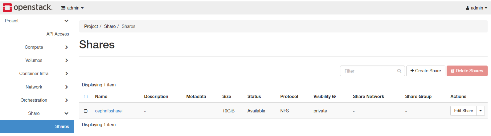
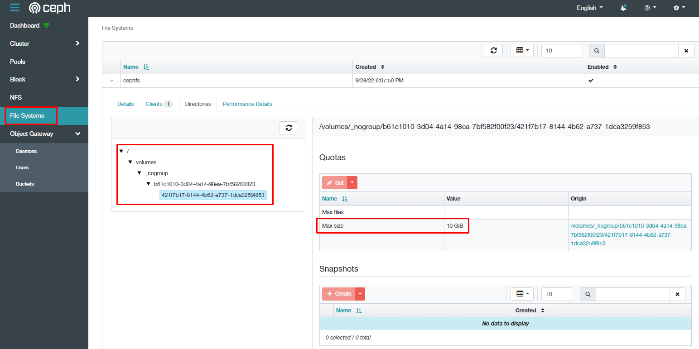
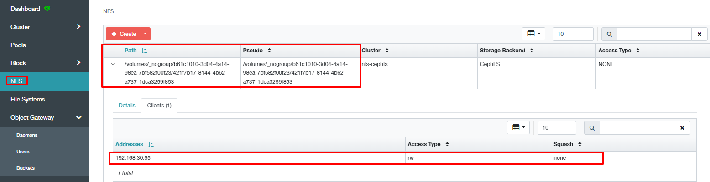

# Integrate Manila

*Phiên bản Openstack Xena*

## 1. Khởi tạo môi trường CEPH cho Manila
*Thực hiện trên các máy chủ CEPH*
### 1.1 Khởi tạo Keyring cho client Manila
- Sử dụng lệnh sau để khởi tạo keyring:
```sh
ceph auth add client.manila mgr 'allow *' mds 'allow *' mon 'allow *' osd 'allow *' -o /etc/ceph/ceph.client.manila.keyring
```

- Sử dụng lệnh sau để hiển thị các client:
```sh
ceph auth ls
```
*Kết quả:*
```sh
#...
client.manila
        key: AQCJTAdjAAAAABAAcmP117S2ye7XaBLSx7cSmg==
        caps: [mds] allow *
        caps: [mgr] allow *
        caps: [mon] allow *
        caps: [osd] allow *
#...
```

- Đảm bảo có file theo đường dẫn sau:
```sh
root@ceph-adm01:~# cat /etc/ceph/ceph.client.manila.keyring
[client.manila]
        key = AQCJTAdjAAAAABAAcmP117S2ye7XaBLSx7cSmg==
        caps mds = "allow *"
        caps mgr = "allow *"
        caps mon = "allow *"
        caps osd = "allow *"
```
### 1.2 Khởi tạo CephFS Ganesha NFS

- Tạo pool lưu metadata cho CephFS:
```sh
ceph osd pool create cephfs.cephfs.meta <pg_num> <pgp_num> replicated ceph_hdd <pool_size>
```

- Tạo pool lưu dữ liệu cho CephFS:
```sh
ceph osd pool create cephfs.cephfs.data <pg_num> <pgp_num> replicated ceph_hdd <pool_size>
```

- Khởi tạo CephFS storage:
```sh
ceph fs volume create cephfs
```

- Kích hoạt module Ceph Manager NFS
```sh
ceph mgr module enable nfs
```

- Khởi tạo NFS Ganesha Cluster
```sh
ceph nfs cluster create nfs-cephfs <ceph_hostname>
```

- Lấy thông tin truy cập Ceph Dashboard
```sh
ceph mgr services
```

## 2. Cấu hình Kolla Ansible

*Thực hiện trên máy chủ chạy Ansible*

### 2.1 Chuẩn bị môi trường Ceph cho Kolla Ansible
- Khởi tạo thư mục lưu cấu hình Manila:
```sh
mkdir -p /etc/kolla/config/manila
```

- Chuyển cấu hình và keyring của Ceph vào thư mục trên:

*Thực hiện trên máy chủ ceph*
```sh
scp  /etc/ceph/* root@192.168.60.128:/etc/kolla/config/manila/
```

### 2.2 Chỉnh sửa cấu hình Manila share

- Chỉnh sửa template jinj2 của Manila-share, chỉnh sửa cấu hình backend như dưới đây:
```ini
###...

[cephfsnative1]
driver_handles_share_servers = False
share_backend_name = CEPHFS
share_driver = manila.share.drivers.cephfs.driver.CephFSDriver
#cephfs_protocol_helper_type = CephAdmNFSProtocolHelper
cephfs_conf_path = /etc/ceph/ceph.conf
cephfs_auth_id = {{ ceph_manila_user }}
cephfs_cluster_name = ceph
cephfs_nfs_cluster_id  = nfs-cephfs ### trùng với tên tại bước tạo NFS Ganesha Cluster

cephfs_filesystem_name = {{ manila_cephfs_filesystem_name }} # Trùng với tên tại bước tạo CephFS



###...

[cephfsnfs1]
cephfs_enable_snapshots = False
driver_handles_share_servers = False
cephfs_protocol_helper_type = NFS
share_backend_name = CEPHFSNFS1
share_driver = manila.share.drivers.cephfs.driver.CephFSDriver
cephfs_conf_path = /etc/ceph/ceph.conf
cephfs_auth_id = {{ ceph_manila_user }}
cephfs_cluster_name = ceph

cephfs_filesystem_name = {{ manila_cephfs_filesystem_name }} # Trùng với tên tại bước tạo CephFS

cephfs_nfs_cluster_id  = nfs-cephfs ### trùng với tên tại bước tạo NFS Ganesha Cluster

###... 
```

### 2.3 Chỉnh sửa biến của Kolla Ansible

- Chỉnh sửa biến tại `/etc/kolla/globals.yml`:
```yml
###...
openstack_release: '13.0.2'
kolla_base_distro: "ubuntu"
kolla_install_type: "source"
docker_registry: 'registry.cloudvnpt.com/kolla'
###...
enable_manila: 'yes'
###...
enable_manila_backend_cephfs_nfs: 'yes'
enable_manila_backend_cephfs_native: 'yes'
###...
```
### 2.4 Thực thi lệnh triển khai 
*Thực thi trên controller*

- Thực thi lệnh sau để triển khai Manila:
```sh
kolla-ansible -i multinode deploy -t manila
```

## Khởi tạo dịch vụ

- Tạo type cho Share
```sh
openstack share type create cephfstype false
```

- Gắn metadata cho share
```sh
openstack share type set cephfstype --extra-specs vendor_name=Ceph storage_protocol=NFS
```
- Hiển thị các share type đang có:
```sh
openstack share type list
```

- Tạo share với protocol nfs
```sh
openstack share create --share-type cephfstype  --name cephnfsshare1  nfs 10
```



Khi tạo share thành công. Sang giao diện ceph ta sẽ thấy thư mục đã được tạo và được thiết lập quota tại cephfs




- Trao quyền access từ IP chỉ định
```sh
openstack share access create  cephnfsshare1 ip 192.168.30.55
```
Sau khi hoàn thành bước này thì mới tạo export NFS và thiết lập client nào có thể truy cập được.




- Hiển thị access list của share
```sh
openstack share access list cephnfsshare1
```

*Kết quả*


---
## Reference

[1] https://github.com/openstack/kolla-ansible/blob/master/doc/source/reference/storage/manila-guide.rst
