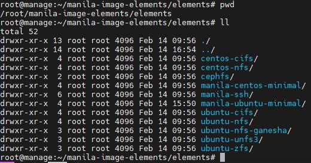

# Build Image Manila

*Version: Openstack Xena* 

## I. Preparation

We only need one server to build Manila's Image.

Server resources:
- vCPU: 2
- RAM: 4GB
- Disk: 50GB
- Network: Connected to the Internet

## II. Install build image Server
- Update all packages
```sh
apt-get -y update && apt-get -y upgrade
```

- Reboot server to get new kernel version:
```sh
init 6
```

- Install QEMU tools for build image:
```sh
sudo apt install qemu-kvm
```

- Install tools to running disk-imagebuilder
```sh
apt install -y tox
apt install -y debootstrap
```

- Clone source code Manila disk-imagebuilder
```sh
git clone https://github.com/openstack/manila-image-elements.git
```

- Access to disk-imagebuilder manila
```sh
cd manila-image-elements/
```

## III. Build Image Manila

If not specify protocol when run command build image. Then on completion, an Ubuntu minimal image with NFS+CIFS will be available for use.

```sh
DHCP_TIMEOUT=600 MANILA_PASSWORD=VnptCloudSecretPassword tox -e buildimage
```

If you want the manila image has cloud-init or growpart (for auto resize root disk equal size of block volume). You do this!

The structure of disk-imagebuilder elements:


So, as we can see that all image will builded with base element `manila-ubuntu-minimal`.
We will install cloud-init and growpart in this element.

Edit file `manila-ubuntu-minimal/package-installs.yaml` to add cloud-init's packages
```yml
#...
cloud-init:
cloud-guest-utils:
#...
```


---
## Reference

[1] https://github.com/openstack/manila-image-elements
