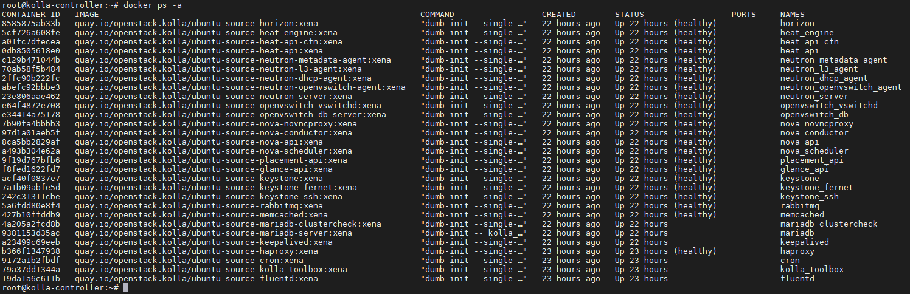
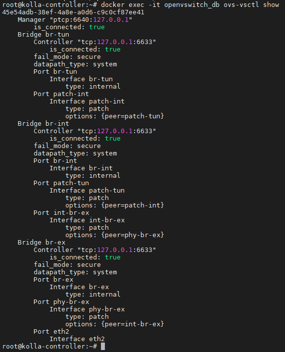
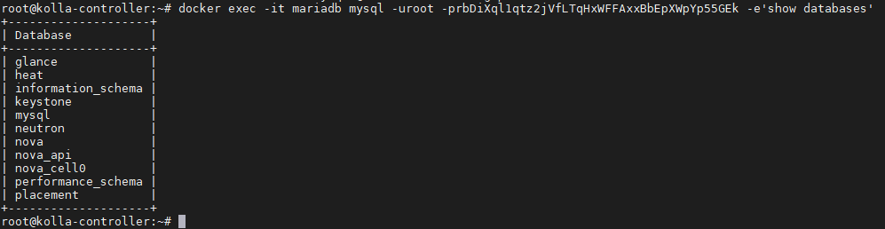
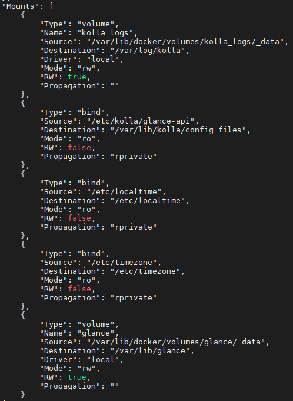

# Cách thức vận hành tương tác với hệ thống Openstack Kolla

## 1. Cách thức kiểm tra và thao tác trong Openstack Kolla

### 1.1 Làm thể nào để tương tác với các container?
- Hiển thị các container đã tạo trên `kolla-controller`:
```sh
docker ps -a
```


Đây là tất cả các container đã được triển khai cho hệ thống Openstack. Các container này được cấu hình `mode network host`, và được mount thư mục như `/var/lib, /var/log/,..` ra ngoài.

- Thao tác với các process bên trong cần sử dụng lệnh `docker exec` để thực thi lệnh bên trong container:
```sh
docker exec -it openvswitch_db ovs-vsctl show
```


*Sau khi thực thi lệnh, kết quả trả về là thông tin kết nối trong Openvswitch (có thể thấy eth2 đã được cắm vào bridge br-ex để làm đường kết nối ra ngoài cho các VM).*

- Tương tác với Database  hiển thị các Database đang có:

```sh
docker exec -it mariadb mysql -uroot -prbDiXql1qtz2jVfLTqHxWFFAxxBbEpXWpYp55GEk -e'show databases'
```



*Password của database là giá trị của biến `database_password` trong file `/etc/kolla/passwords.yml`*
- Dump dữ liệu DB ra ngoài filesystem:
```sh
docker exec -it mariadb mysqldump -uroot -prbDiXql1qtz2jVfLTqHxWFFAxxBbEpXWpYp55GEk keystone > vinhtestdumpDB.sql
```
### 1.2 Dự liệu được ghi ở đâu?
*Dữ liệu ghi ra từ container được mount ra ngoài filesystem của OS*
- Để biết thông tin volume mount của container, sử dụng lệnh:

```sh
docker inspect glance_api
```



*Kiểm tra trường `Mounts` của output json*


Thư mục lưu log: `/var/lib/docker/volumes/kolla_logs/_data`
    
Thư mục lưu dữ liệu: `/var/lib/docker/volumes/glance/_data`
    
Thư mục lưu cấu hình: `/etc/kolla/glance-api`

- Tương tự với mariaDB ta sẽ thấy được thư mục lưu dữ liệu database
```sh
root@kolla-controller:~# ll /var/lib/docker/volumes/mariadb/_data
total 361200
drwxr-xr-x 12 42434 42434      4096 Feb 21 16:34 ./
drwx-----x  3 root  root       4096 Feb 21 16:11 ../
-rw-rw----  1 42434 42434     32768 Feb 21 16:34 aria_log.00000001
-rw-rw----  1 42434 42434        52 Feb 21 16:13 aria_log_control
-rw-rw----  1 42434 42434 134219032 Feb 22 15:34 galera.cache
drwx------  2 42434 42434      4096 Feb 21 16:19 glance/
-rw-rw----  1 42434 42434       113 Feb 21 16:35 grastate.dat
-rw-rw----  1 42434 42434       170 Feb 21 16:13 gvwstate.dat
drwx------  2 42434 42434      4096 Feb 21 16:35 heat/
-rw-rw----  1 42434 42434      1030 Feb 21 16:12 ib_buffer_pool
-rw-rw----  1 42434 42434 100663296 Feb 22 15:34 ib_logfile0
-rw-rw----  1 42434 42434  79691776 Feb 21 16:15 ibdata1
-rw-rw----  1 42434 42434  12582912 Feb 21 16:13 ibtmp1
drwx------  2 42434 42434      4096 Feb 21 16:15 keystone/
-rw-rw----  1 42434 42434         4 Feb 21 16:13 mariadb.pid
-rw-rw----  1 42434 42434         0 Feb 21 16:12 multi-master.info
drwx------  2 42434 42434      4096 Feb 21 16:13 mysql/
-rw-rw----  1 42434 42434     27232 Feb 21 16:12 mysql-bin.000001
-rw-rw----  1 42434 42434      2716 Feb 21 16:12 mysql-bin.000002
-rw-rw----  1 42434 42434       365 Feb 21 16:12 mysql-bin.000003
-rw-rw----  1 42434 42434       365 Feb 21 16:12 mysql-bin.000004
-rw-rw----  1 42434 42434       365 Feb 21 16:13 mysql-bin.000005
-rw-rw----  1 42434 42434  42501264 Feb 22 15:34 mysql-bin.000006
-rw-rw----  1 42434 42434       114 Feb 21 16:13 mysql-bin.index
-rw-r--r--  1 42434 42434        15 Feb 21 16:12 mysql_upgrade_info
drwx------  2 42434 42434     20480 Feb 21 16:32 neutron/
drwx------  2 42434 42434     12288 Feb 21 16:22 nova/
drwx------  2 42434 42434      4096 Feb 21 16:21 nova_api/
drwx------  2 42434 42434     16384 Feb 21 16:21 nova_cell0/
drwx------  2 42434 42434      4096 Feb 21 16:12 performance_schema/
drwx------  2 42434 42434      4096 Feb 21 16:20 placement/
-rw-------  1 42434 42434      3031 Feb 21 16:13 wsrep_recovery.ok
```

### 1.3 Sửa file cấu hình cho service như thế nào?
Các task cấu hình cho service có dạng:
```yml
- name: Copying over galera.cnf
  vars:
    service_name: "mariadb"
    service: "{{ mariadb_services[service_name] }}"
  merge_configs:
    sources:
      - "{{ role_path }}/templates/galera.cnf.j2"
      - "{{ node_custom_config }}/galera.cnf"
      - "{{ node_custom_config }}/mariadb/{{ inventory_hostname }}/galera.cnf"
    dest: "{{ node_config_directory }}/{{ service_name }}/galera.cnf"
    mode: "0660"
  become: true
  when:
    - inventory_hostname in groups[service.group]
    - service.enabled | bool
  notify:
    - restart mariadb
    
### Hoặc###

- name: Copying over cinder.conf
  vars:
    service_name: "{{ item.key }}"
  merge_configs:
    sources:
      - "{{ role_path }}/templates/cinder.conf.j2"
      - "{{ node_custom_config }}/global.conf"
      - "{{ node_custom_config }}/cinder.conf"
      - "{{ node_custom_config }}/cinder/{{ item.key }}.conf"
      - "{{ node_custom_config }}/cinder/{{ inventory_hostname }}/cinder.conf"
    dest: "{{ node_config_directory }}/{{ item.key }}/cinder.conf"
    mode: "0660"
  become: true
  when:
    - item.value.enabled | bool
    - inventory_hostname in groups[item.value.group]
  with_dict: "{{ cinder_services }}"
  notify:
    - "Restart {{ item.key }} container"
```
Ta sẽ để ý vào thứ tự của  parameter `source`: Các dòng được liệt kê theo thứ tự override (dưới đè trên).

Giá trị mặc định của các biến trên:
```yml
node_custom_config: "{{ node_config }}/config"
node_config: "{{ CONFIG_DIR | default('/etc/kolla') }}" ## Mặc định là /etc/kolla
```

#### 1.3.1 Sửa cấu hình thông qua templates trong role
Bình thường ta sẽ phải sửa cấu hình trong role của playbook rồi chạy lại.

Đường dẫn template tại (ví dụ) `/usr/local/share/kolla-ansible/ansible/roles/mariadb/templates/galera.cnf.j2`

#### 1.3.2 Cấu hình trong thư mục /etc/kolla/config

Cấu hình tại đường dẫn `/etc/kolla/config` (đường dẫn này không có sẵn nên cần tạo)
Trong thư mục này tạo các file cấu hình **hoàn chỉnh**, để chỉ định cho từng host thì tạo thêm đường dẫn `/etc/kolla/config/<role_name>/<inventory_hostname>/galera/cnf.j2`


Sau đó chạy lại lệnh `kolla-ansible -i multinode reconfigure -t <role_tag>`

### 1.4 Vì sao chạy lại deploy có các task vẫn change dù không thay đổi gì

Khi chạy lại lệnh `kolla-ansible -i multinode deploy` ta sẽ vẫn thấy có các task chạy trả về trạng thái `changed`
- Task `Running ... bootstrap container`: Khởi tạo một container `<service>_bootstrap` để check hoạt động của các container chính.
- Task `Run key distribution`: Copy ssh-key cho user keystone sang các node controller
- Task `Creating admin project, user, role, service, and endpoint`: Khởi tạo user, role, service, endpoint cho admin (nếu bạn đổi password admin mà không cập nhật lại vào file passwords.yml thì khi chạy task này sẽ thiết lập lại password cho admin dựa trên file passwords.yml).
- Task `Enable log_bin_trust_function_creators function`: Loại bỏ log Warning của MySQL khi khởi tạo function
- Task `Disable log_bin_trust_function_creators function`: Thiết lập log_bin_trust_function_creators có giá trị 0 để disable
- Task `Set system-id`: Thiết lập ovs_system_id cho container openvswitch_db dựa trên `ansible_facts.hostname`(hostname của host)
- Task `Refresh cell cache in nova scheduler`:
Task này sẽ thực thi kill một process, nên ta sẽ lấy id của process đó kiểm tra: 

Tìm id của process sẽ bị kill:

Từ đó ta thấy kolla Ansible sẽ kill process nova-scheduler để reset cache mỗi lần nova được add cell.