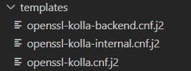

# Deploy Kolla Openstack with TLS

*Hướng dẫn cấu hình TLS cho hệ thống Kolla Openstack*

Có 2 layers để cấu hình TLS cho APIs của Openstack:
1. Kích hoạt TLS trên đường Internal và/hoặc external VIP, thì giao tiếp giữa Openstack client và Haproxy trên VIP sẽ được secure.
2. Kích hoạt TLS trên network backend, thì giao tiếp giữa HAproxy và các API backend của các service sẽ được secure.

## Quick start

Để triển khai Openstack sử dụng TLS cho external, Internal và Backend APIs, khai báo các biến dưới đây trong file `/etc/kolla/globals.yml`:
```yml
kolla_enable_tls_internal: "yes"
kolla_enable_tls_external: "yes"
kolla_enable_tls_backend: "yes"
kolla_copy_ca_into_containers: "yes"
```
Khai báo đường dẫn CA certificate:
- Triển khai trên Debian hoặc Ubuntu:
```sh
openstack_cacert: "/etc/ssl/certs/ca-certificates.crt"
```
- Triển khai trên CentOS hoặc RHEL:
```sh
openstack_cacert: "/etc/pki/tls/certs/ca-bundle.crt"
```

Để generate được cert ta thực hiện lệnh dưới đây:
```sh
kolla-ansible -i ~/multinode certificates
```

Sửa CSR của certificate tại đường dẫn `/usr/local/share/kolla-ansible/ansible/roles/certificates/templates` 



Sửa các trường `[req_distinguished_name]`
```ini
[req_distinguished_name]
countryName = VN
stateOrProvinceName = HN
localityName = VNPT
organizationalUnitName = VNPTCloud
```

## TLS Configuration for internal/external VIP

Để cấu hình TLS cho internal và/hoặc external VIP thì cần khai báo các biến dưới đây

- Mặc định TLS networking sẽ bị disable. Để enable external TLS thì khai báo biến dưới đây:
```yml
kolla_enable_tls_external: "yes"
```
- Khai báo enable internal TLS:
```yml
kolla_enable_tls_internal: "yes"
```
- Mặc định khi generate certificates sẽ nằm tại đường dẫn dưới đây:
```yml
kolla_certificates_dir: "/etc/kolla/certificates" #By default
```
- Khai báo key:
```yml
kolla_internal_fqdn_cert: {{ kolla_certificates_dir }}/haproxy-internal.pem

kolla_external_fqdn_cert: {{ kolla_certificates_dir }}/haproxy.pem
```


