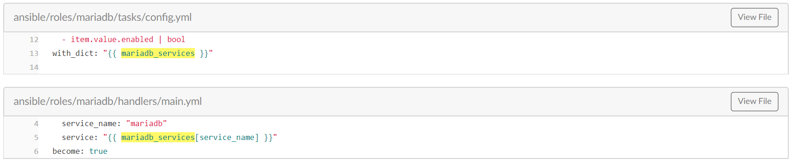
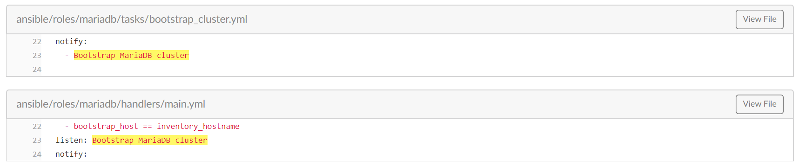
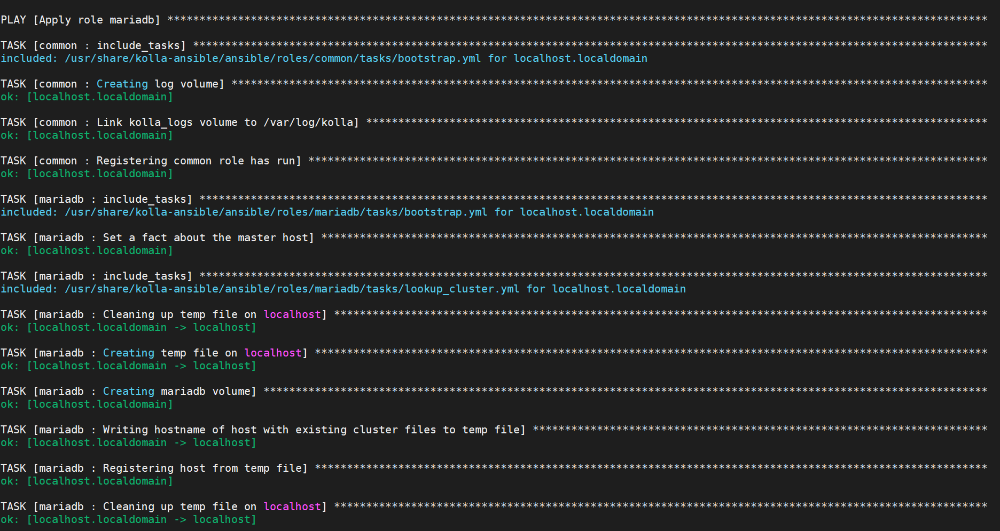
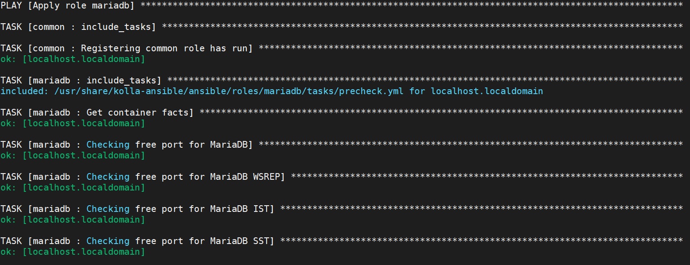

# Role Mariadb
# Cấu trúc: 
- [defaults](#1)
    - [main.yml](#1.1)
- [handlers](#2)
    - [main.yml](#2.1)
- [meta](#3)
    - [main.yml](#3.1)
- [tasks](#4)
	- [main.yml](#4.1)
	- [kolla-action=bootstrap-servers](#4.2)	
		- [bootstrap.yml](#4.2.1)
		- [lookup_cluster.yml](#4.2.2)
		- [bootstrap_cluster.yml](#4.2.3)
		- [recover_cluster.yml](#4.2.4)
		- [wait_for_loadbalancer.yml](#4.2.5)
	- [kolla-action=prechecks](#4.3)
		- [prechecks.yml](#4.3.1)
	- [kolla-action=pull](#4.4)
		- [pull.yml](#4.4.1)
	- [kolla-action=deploy](#4.5)
		- [deploy.yml](#4.5.1)
		- [config.yml](#4.5.2)
		- [register.yml](#4.5.3)
	- [kolla-action=mariadb_backup](#4.6)
		- [backup.yml](#4.6.1)
	- [kolla-action=deploy-containers](#4.7)
		- [deploy-containers.yml](#4.7.1)
		- [check-containers.yml](#4.7.2)
		- [lookup_cluster.yml](#4.7.3)
	- [kolla-action=reconfigure](#4.8)
		- [reconfigure.yml](#4.8.1)
	- [kolla-action=stop](#4.9)
		- [stop.yml](#4.9.1)
	- [kolla-action=upgrade](#4.10)
		- [upgrade.yml](#4.10.1)
	- [loadbalancer.yml](#4.11)
- [templates](#5)

<a name='1'></a>
## **Defaults: Mariadb**

- *Tại file `/roles/mariadb/default/main.yml` là nơi chứa các biến sử dụng cho roles `mariadb`*
- Ở đấy khai báo khá nhiều biến và có các biến được khai báo liên kết với nhau  
<a name='1.1'></a>
### Defaults/main.yml : Mariadb
- Đây là một file chứa biến của 1 role, các biến này được sử dụng rất nhiều lần nên khai báo khá rối, thậm chí trong 1 `tasks` của `mariadb` còn kéo 1 role tên là `haproxy-config` về để chạy các biến ở role `mariadb` này. 
- **Ví dụ** đoạn 1: 
    ```
    mariadb_services:
    mariadb:
        container_name: mariadb
        group: mariadb
        enabled: true
        image: "{{ mariadb_image_full }}"
        volumes: "{{ mariadb_default_volumes + mariadb_extra_volumes }}"
        dimensions: "{{ mariadb_dimensions }}"
    ....

    mariadb_default_volumes:
    - "{{ node_config_directory }}/mariadb/:{{ container_config_directory }}/:ro"
    - "/etc/localtime:/etc/localtime:ro"
    - "mariadb:/var/lib/mysql"
    - "kolla_logs:/var/log/kolla/"
    mariadb_extra_volumes: "{{ default_extra_volumes }}"
    ....

    ```
    
    - Đoạn đầu Ta nhìn thấy như 1 cây thư mục @@ bởi vì các biến này sẽ được gọi bằng cách gọi đến biến `{{ mariadb_services }}` nhưng thêm tham số khai báo service con như đây :

    

    - Phía dưới là các khai báo biến thông thường và lấy từ file `/group_vars/all.yml` như là các biến `{{ default_extra_volumes }}`, `{{ node_config_directory }}`, `{{ container_config_directory }}` 
    - Nếu bạn thắc mắc các dấu "-" kia và khi khai báo biến `volumes: "{{ mariadb_default_volumes + mariadb_extra_volumes }}"` sẽ có kết quả như thế nào.
    ```
    #đây là kết quả tôi đã viết thử playbook ansible và test
    image: 
        - "{{ node_config_directory }}/mariadb/:{{ container_config_directory }}/:ro"
        - "/etc/localtime:/etc/localtime:ro"
        - "mariadb:/var/lib/mysql"
        - "kolla_logs:/var/log/kolla/"
        - "{{ default_extra_volumes }}"
    # Tức là lại khai báo thêm biến con `image` có giá trị phía dưới
	```
- **Ví dụ** đoạn 2:
    ```
    ...
    mariadb_backup_host: "{{ groups['mariadb'][0] }}"
    ...
    ```
    - Ở đây tức là lấy tên host hoặc địa chỉ ip được khai báo ở group `[mariadb]` trong file `/iventory/all-in-one` hoặc `/inventory/multinode` và thông số `[0]` là lấy thông tin dòng đầu tiên(host ở dòng đầu)
-  **Ví dụ** đoạn 3:
	```
	internal_haproxy_members: "server {{ hostvars[host]['ansible_hostname'] }} {{ 'api' | kolla_address(host) }}:{{ mariadb_port }} check inter 2000 rise 2 fall 5 backup;"
	external_haproxy_members: "server {{ host }} {{ host }}:{{ mariadb_port }} check inter 2000 rise 2 fall 5 backup;"
	```
	- `inventory_hostname`: Là các cấu hình trong file inventory
	- ``:  Sẽ liệt kê tất cả các host trong group `[mariadb]`
	- `hostvars[host]['ansible_hostname']`:  `hostvars` sẽ được sử dụng khi bạn muốn mang một biến của host khác, giá trị fact của host khác về sử dụng.
		-  tên [host]: localhost,192.168.20.37,..
		- `ansible_hostname`: tất cả các host được ansible thu thập được bằng ssh bằng task gather_fact

<a name='2'></a>
## **Handlers: Mariadb**
- *Đây là nơi thực hiện khai báo các tác vụ chờ được gọi bằng tasks trong các file trong thư mục `/tasks/...yml`*
<a name='2.1'></a>
### Handlers/main.yml : Mariadb
#### Các modules trong file
`1. listen`
- Khái niệm:
    - Đây là module được sử dụng trong mục `handlers` nhằm khai báo các task chờ để sau đó gọi bằng `notify` trong tasks chính.
- Khi Kolla-Ansible sử dụng: 



`2. wait_for`,`delay`,`until`,`retries`

- Khái niệm: 
    - Module này sử dụng để chờ 1 service, host, port được khởi tạo trong một môi trường

- Khi Kolla-Ansible sử dụng: 
  ```
  - name: Wait for first MariaDB service port liveness
	wait_for:
		host: "{{ api_interface_address }}"
		port: "{{ mariadb_port }}"
		connect_timeout: 1
		timeout: 60
		search_regex: "MariaDB"
	register: check_mariadb_port
	until: check_mariadb_port is success
	retries: 10
	delay: 6
  ```
- Chức năng khi sử dụng module này trong kolla-Ansible:

    - Xác định trạng thái của `port` mariadb là mục tiêu chờ
    -  thông số `connect_timeout` : maximum giây đợi tồn tại port mariadb tồn tại hay k trước khi đóng hoặc thử lại
    - thông số `timeout`: số giây tối đa chờ xuất hiện port
    - module `register` ở đây thực hiện gán kết quả của việc kiểm tra port có tồn tại hay không
    - `until: check_mariadb_port is success` cho đến khi port tồn tại thì chạy tiếp còn nếu không thực hiện `retries` 10 lần mỗi lần `delay` 6s rồi failed


<a name='4'></a>
## **Tasks: Mariadb**
<a name='4.1'></a>
#### 4.1 `main.yml`
- Đây là task chạy đầu tiên 
- `- include_tasks: "{{ kolla_action }}.yml"`: Mục đích của task này là để đọc biến bạn khai báo `kolla_action=`

<a name='4.1'></a>
#### 4.2 `kolla-action=bootstrap`


- khi thực hiện cùng với thông số kolla-action=prechecks  thì sẽ chạy tasks `prechecks.yml`


<a name='4.3'></a>
#### 4.3 `kolla-action=precheck`
- khi thực hiện cùng với thông số kolla-action=prechecks  thì sẽ chạy tasks `prechecks.yml` đầu tiên

    

<a name='4.3.1'></a>
##### prechecks.yml
- Trong file `precheck.yml`: 
	- `name: Get container facts`: thực hiện đọc các khai báo của module `kolla_container_facts`
	- `name: Checking free port for MariaDB`: Check `địa chỉ api` và `port 3306` xem có ở trạng thái stopped không bị sử dụng khi mà task `name: Get container facts` không được định nghĩa (thực thi)
	- `name: Checking free port for MariaDB WSREP`: Check `địa chỉ api` và  `port 4567` xem có ở trạng thái stopped không bị sử dụng khi mà task `name: Get container facts` không được định nghĩa (thực thi)
	- `name: Checking free port for MariaDB IST`: Tương tự như trên `port 4568` 
	- `name: Checking free port for MariaDB SST`: Tương tự như trên với `port 4444`
	- Nói chung 4 task dưới sẽ thực hiện check các port có đang bị sử dụng hay không nếu module `kolla_container_facts` không thu được fact trạng thái các port
- Vậy là kết thúc nhiệm vụ của prechecks trong role mariadb

<a name='4.4'></a>
#### 4.4 `kolla-action=pull`
- khi thực hiện cùng với thông số kolla-action=pull  thì sẽ chạy tasks `pull.yml` đầu tiên
<a name='4.4.1'></a>
##### pull.yml
- Trong file pull.yml gồm :
	- `name: Pulling mariadb image`: sử dụng module `kolla_docker` để kéo image về (`action: "pull_image"`)
	- `  when: inventory_hostname in groups[item.value.group]  item.value.enabled | bool  ` : thực thi task khi mà trong file inventory có khai báo group `mariadb` và biến `enable_mariadb` được khai báo là `yes`,`1`,`on, `true`
<a name='4.5'></a>
#### 4.5 `kolla-action=deploy`
- khi thực hiện cùng với thông số kolla-action=prechecks  thì sẽ chạy tasks `deploy.yml` đầu tiên
- Trong task `deploy.yml` này sẽ dẫn đến rất nhiều các tasks khác để thực thi như sau đây

    

<a name='4.5.2'></a>
##### config.yml
- Trong task `config.yml` gồm:
	- `name: Ensuring config directories exist`: 
	
		- Thực hiện tạo thư mục mặc định khai báo là `/etc/kolla/mariadb` và phân quyền  , Nếu thư mục tồn tại rồi thì sẽ `ok=1`
		- `when: ....`: thực thi task khi mà trong file inventory có khai báo group `mariadb` và biến `enable_mariadb` được khai báo là `yes`,`1`,`on, `true`
	- `name: Ensuring database backup config directory exists`:
	
		- Thực hiện tạo thư mục mặc định khai báo là `/etc/kolla/mariabackup` và phân quyền  , Nếu thư mục tồn tại rồi thì sẽ `ok=1`
		- `when: ....`: thực thi task khi mà trong file inventory có khai báo group `mariadb_backup_host` và biến `enable_mariabackup` được khai báo là `yes`,`1`,`on, `true`
	- `name: Copying over my.cnf for mariabackup`:
	
		- thực hiện thêm những dòng config vào file `/etc/mariadb/mariabackup/my.cnf` 
		- Module `merge_config`: Module này thực hiện merge nhiều file config dạng INI thành 1 file
	- ` name: Copying over config.json files for services`:
	
		- Thay đổi file config mặc định bằng file config trong mục `templates` ở đây là file `wsrep-notify.sh.j2`
	- Sau đó thực hiện restart service 
<a name='4.5.3'></a>
##### register.yml 
- Trong task `register.yml` gồm:
	- `- name: Creating the Mariabackup database`: 
			
		- Sử dụng module do kolla-Ansible cung cấp `kolla_toolbox` để sử dụng các module của ansible 
		- Ở đây `kolla_toolbox` sử dụng module `mysql_db` của ansible để  tạo Database
		- Tương tự với `module_name: mysql_user` để tạo user cho database
		- Với module `run_once` task này chỉ chạy trên host cài đặt mariadb 
	- `when: enable_mariabackup | bool`: Task này sẽ thực hiện với điều kiện  biến `enable_mariadb` được khai báo là `yes`,`1`,`on, `true`

<a name='4.6'></a>
#### 4.6 `kolla-action=mariadb_backup`
- khi thực hiện cùng với thông số kolla-action=mariadb_backup  thì sẽ chạy tasks `deploy.yml` đầu tiên
<a name='4.6.1'></a>
- Trong task `mariadb_backup.yml` gồm :
	- `name: Taking {{ mariadb_backup_type }} database backup via Mariabackup`:
		- Ở mặc định {{ mariadb_backup_type }} có giá trị `full` 
		 ..................
		
		...
<a name='4.7'></a>
		
#### 4.7 `kolla-action=deploy-containers`
- khi thực hiện cùng với thông số kolla-action=deploy-containers  thì sẽ chạy tasks `deploy-containers.yml` đầu tiên
<a name='4.7.2'></a>
##### deploy-containers.yml
- Trong task  `check-containers.yml` gồm:
	- `name: Check mariadb containers` : task này sẽ thực hiện check containers được tạo bởi module kolla-docker.
<a name='4.7.3'></a>
##### lookup_cluster.yml
- Trong task `lookup_cluster.yml`:
	- `name: Create MariaDB volume`: thực hiện tạo volume cho mariadb trong container bằng module kolla-docker.
	- `name: Divide hosts by their MariaDB volume availability`:
	
	..............
<a name='4.8'></a>
#### 4.8 `kolla-action=reconfigure`
- Khi thực hiện action=reconfigure sẽ thực hiện chạy task reconfigure.yml
- task này có nội dung:
```
---
- include_tasks: deploy.yml
```
- Nên sẽ thực hiện giống với action = deploy 

<a name='4.9'></a>
#### 4.9 `kolla-action=stop`
##### stop.yml
- Nội dung task: 
```
---
- import_role:
    role: service-stop
  vars:
    project_services: "{{ mariadb_services }}"
    service_name: "{{ project_name }}"
```

Ở đây sẽ thực hiện chạy role `service-stop` và role đó sẽ chạy cùng 2 biến được gán vào role đó : `project_services` , `service_name`

<a name='4.10'></a>
#### 4.10 `kolla-action=upgrade`
- Chạy task `upgrade.yml`, trong task này đầu tiên sẽ thực hiện chạy task `deploy.yml`
- Sau đó chạy task `name: Run upgrade in MariaDB container` với mục đích chạy upgrade bên trong container.

