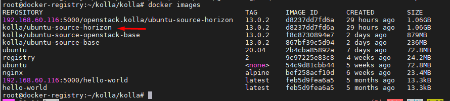
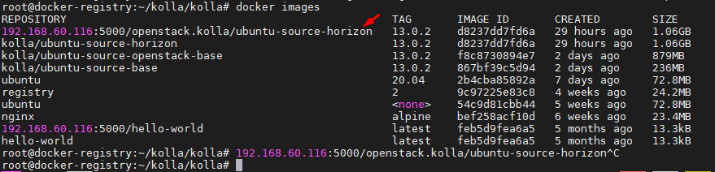

# Cài đặt - sử dụng Kolla 


## 1. Cài đặt Kolla
- Clone source code Kolla từ Github:
```sh
git clone https://github.com/openstack/kolla.git
```
- Truy cập vào thư mục kolla để chuyển sang nhánh xena:
```sh
cd kolla/
git branch -r
git checkout stable/train
```
- Cài đặt cơ bản:
```sh
cd kolla/
pip install tox
tox -e genconfig
```


## 2. Tương tác với Kolla

- Thực thi lệnh sau để build tất cả các image kolla:
```sh
/root/kolla/.tox/genconfig/bin/kolla-build -b ubuntu
```


- Dùng lệnh sau để xem các option của lệnh kolla-build
```sh
/root/kolla/.tox/genconfig/bin/kolla-build --help
```

- Cách để build một image Kolla chỉ định
```sh
/root/kolla/.tox/genconfig/bin/kolla-build -b ubuntu nova keystone 
```

## 3. Build lại Image Horizon bị lỗi tính năng resize

- Issue được thảo luận [tại đây](https://bugs.launchpad.net/horizon/+bug/1940834)

- Download các file code chỉnh sửa cho tính năng resize phiên bản Openstack Xena [tại đây](https://review.opendev.org/c/openstack/horizon/+/829662)

- Copy vào thư mục Kolla: 
```sh
cp -r /root/horizon /root/kolla/docker/horizon
```

- Build Image Horizon bằng lệnh sau:
```sh
/root/kolla/.tox/genconfig/bin/kolla-build -b ubuntu horizon --skip-existing
```

*Kết quả image được build ra*



- Khi khai báo biến cho Kolla Ansible như sau:
```yml
openstack_release: "13.0.2"
kolla_base_distro: "ubuntu"
kolla_install_type: "source"
docker_registry: "192.168.60.116:5000"
docker_registry_insecure: "yes"
```

Thì Kolla Ansible sẽ gọi đến image có tên là `{{docker_registry}}/openstack.kolla/{{kolla_base_distro}}-{{kolla_install_type}}-{{service}}:{{openstack_release}}`

Image Horizon sẽ cần đặt tên `192.168.60.116:5000/openstack.kolla/ubuntu-source-horizon:13.0.2`

Chạy lệnh sau để đổi tên:
```sh
docker tag kolla/ubuntu-source-horizon:13.0.2 192.168.60.116:5000/openstack.kolla/ubuntu-source-horizon:13.0.2
```

- Đẩy lên Docker registry:
```sh
docker push 192.168.60.116:5000/openstack.kolla/ubuntu-source-horizon:13.0.2
``` 

*Kết quả*



