# Openstack Consistency Group

*Thực hiện trên phiên bản Openstack Ussuri*

## Create Volume Group
- Bước 1: Khởi tạo Group type
```sh
cinder --os-volume-api-version 3.11 group-type-create cgsnapshot_eOffice_type
```
*Kết quả*
```sh
[root@controller01-ntl2 ~]# cinder --os-volume-api-version 3.11 group-type-create cgsnapshot_eOffice_type
+--------------------------------------+-------------------------+-------------+
| ID                                   | Name                    | Description |
+--------------------------------------+-------------------------+-------------+
| cabc0ba1-9844-4eb6-8ffa-f0e458b3719f | cgsnapshot_eOffice_type | -           |
+--------------------------------------+-------------------------+-------------+
```

- Bước 2: Truy cập vào giao diện Openstack tạo Volume group

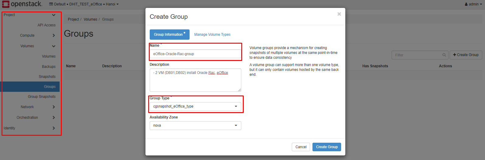

Chọn volume type cho group, **Lưu ý:** chỉ được gom các volume type cùng backend

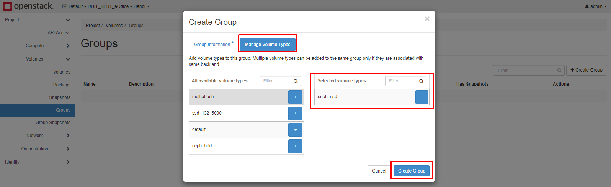

*Kết quả*

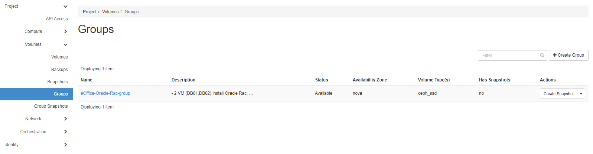


- Bước 3: Add volume vào group

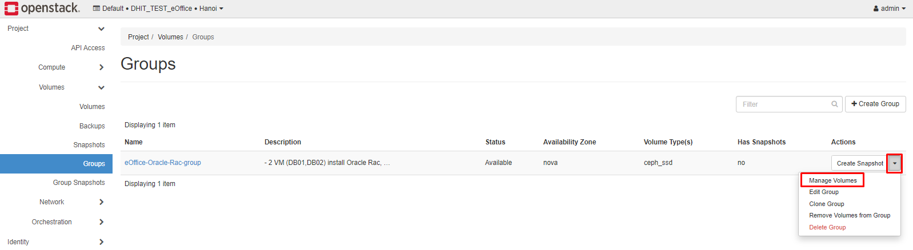


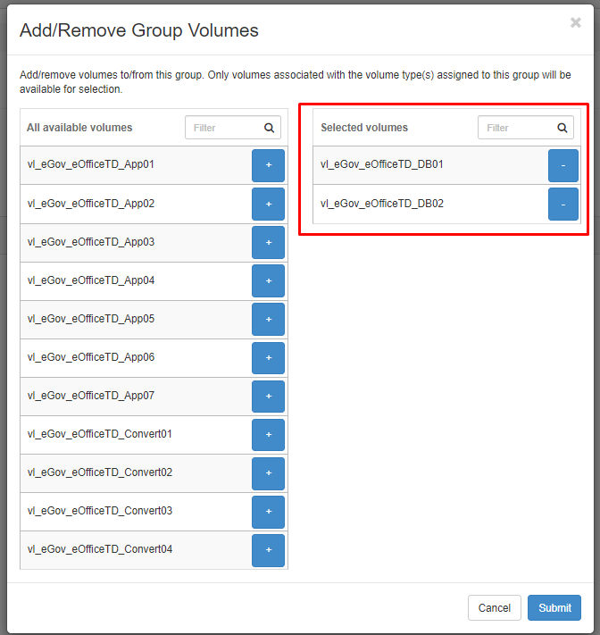


- Bước 4: Thực hiện tạo Group snapshot

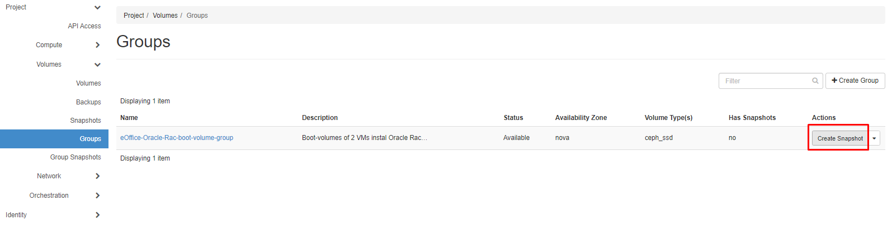


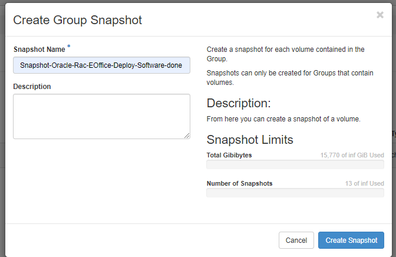

*kết quả*

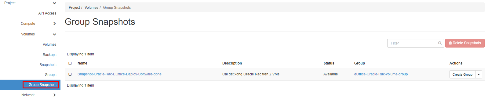

## Create Volumes from group-snapshot

- Bước 1: Tạo volume group từ group snapshot

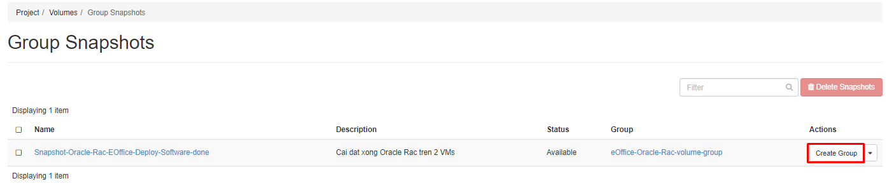

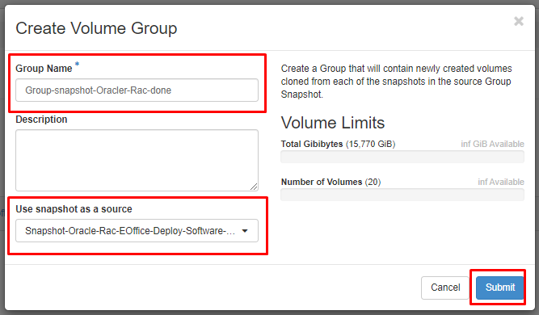

*Kết quả*

Thực hiện tạo ra volume group mới:

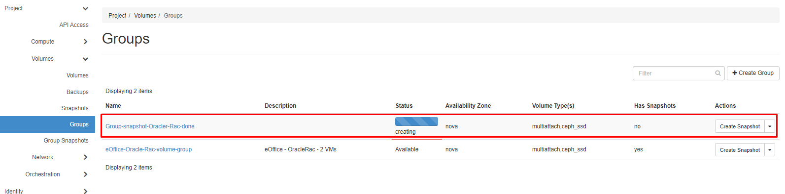

Trong volume group này sẽ tạo ra các volume mới chứa nội dung bản snapshot
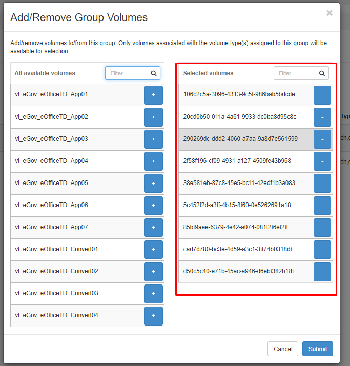


---
# TK

[1] https://docs.openstack.org/cinder/latest/admin/blockstorage-consistency-groups.html#:~:text=It%20allows%20snapshots%20of%20multiple,deprecated%20since%20the%20Queens%20release

[2] https://docs.openstack.org/python-openstackclient/pike/cli/command-objects/consistency-group-snapshot.html

[3] https://docs.openstack.org/cinder/latest/admin/blockstorage-groups.html