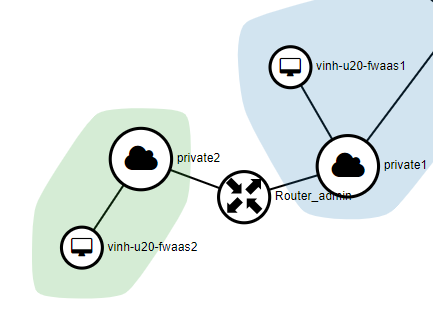
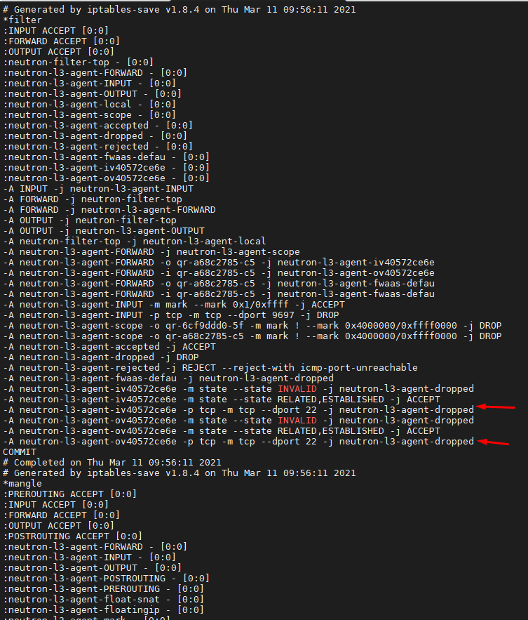
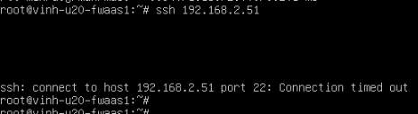

# Cài đặt và cấu hình FwaaS

*FwaaS cho phép người dùng apply các rule trên port của router bằng cách định nghĩa iptables trong namespace `qrouter`*

*Thực hiện trên Ussuri - Centos8*


## Cài đặt 

*Trước phiên bản Victoria cần cài đặt gói `openstack-neutron-fwaas`*

- Bước 1: Cài đặt
```sh
yum -y install openstack-neutron-fwaas
```

- Bước 2: Cấu hình neutron server, Edit file `/etc/neutron/neutron.conf`
```ini
[DEFAULT]
# ...
service_plugins = <another_plugins>,firewall_v2

[service_providers]
# ...
service_provider = FIREWALL_V2:fwaas_db:neutron_fwaas.services.firewall.service_drivers.agents.agents.FirewallAgentDriver:default
```

- Bước 3: Cấu hình Fwaas agent, edit file `/etc/neutron/fwaas_driver.ini`
```ini
[fwaas]
agent_version = v2
driver = neutron_fwaas.services.firewall.service_drivers.agents.drivers.linux.iptables_fwaas_v2.IptablesFwaasDriver
enabled = True

[service_providers]
service_provider = FIREWALL_V2:fwaas_db:neutron_fwaas.services.firewall.service_drivers.agents.agents.FirewallAgentDriver:default
```

- Bước 4: Cấu hình l3 agent, edit file `/etc/neutron/l3_agent.ini`

```ini
[AGENT]
extensions = <another_extentions>,fwaas_v2
```

- Bước 5: Cấu hình Ml2 plugin agent extension, edit file `/etc/neutron/plugins/ml2/ml2_conf.ini`
```ini
[agent]
extensions = <another_extentions>,fwaas_v2

[fwaas]
firewall_l2_driver = noop
```

- Bước 6: Khởi tạo DB
```sh
 neutron-db-manage --subproject neutron-fwaas upgrade head
```

- Bước 7: Restart các service 
```sh
systemctl restart neutron-openvswitch-agent neutron-l3-agent neutron-server
```


## Khởi tạo FwaaS

- `firewall_rule`: Tập hợp các thuộc tính như source-dest của ports, source-dest IP, Protocol (tcp,udp,icmp,any), IP version. Các thuộc tính này sẽ đối chiếu với thông tin traffic chuyển tới và đưa ra action(allow,deny,reject).

- `firewall_policy`: Là nơi thu thập các rule firewall đã được tạo ở trên. Có thể share firewall_policy qua các projects. 

- `firewall_group`: Một tài nguyên logical firewall của project có thể được tạo ra và quản lý. Firewall group có chứa firewall policy và áp cho 2 chiều ingress và egress.


### Ví dụ
2 máy ảo ở 2 network private khác nhau, 2 network đó được kết nối với nhau bằng 1 router. Security group của 2 máy ảo đều mở port 22 để SSH. Ta sẽ thực hiện chặn port 22 trên router xem 2 máy ảo có thể SSH được không.



- Bước 1: Tạo firewall rule
```sh
openstack firewall group rule create --name vinh-rule --protocol tcp\
  --destination-port 22 \
  --action deny
```

- Bước 2: Tạo firwall policy
```sh
openstack firewall group policy create --firewall-rule \
  "vinh-rule" myfirewallpolicy
```
- Bước 3: Tạo firewall group 
```sh
openstack firewall group create --name fwg1 --ingress-firewall-policy \
  "myfirewallpolicy" \
--egress-firewall-policy \
  "myfirewallpolicy" \
--no-port

# Kết quả
openstack firewall group show fwg1
+-------------------+--------------------------------------+
| Field             | Value                                |
+-------------------+--------------------------------------+
| Description       |                                      |
| Egress Policy ID  | 49bc8077-9271-4a19-ba4c-e7cc72541dc7 |
| ID                | 0572ce6e-724f-43f9-9dac-95cc2d661239 |
| Ingress Policy ID | 49bc8077-9271-4a19-ba4c-e7cc72541dc7 |
| Name              | fwg1                                 |
| Ports             | []                                   |
| Project           | e7b4618916794ed58226047d8ce424ea     |
| Shared            | False                                |
| State             | UP                                   |
| Status            | INACTIVE                             |
| project_id        | e7b4618916794ed58226047d8ce424ea     |
+-------------------+--------------------------------------+
```

***Lưu ý!!!***: Nếu lấy tên (vinh-rule,myfirewallpolicy) không được thì lấy `id`

Firewall group sẽ ở status `INACTIVE` khi không được apply lên port nào. Khi được apply vào 1 port sẽ ở status `PENDING_UPDATE` cho đến khi port được ấy được gắn vào router sẽ chuyển về `ACTIVE`.


- Bước 4: Gắn port vào firewall group. Ta sẽ tìm id của 2 port gateway của 2 network được cắm vào router

```sh
openstack firewall group set fwg1 --port 6cf9ddd0-5fbb-4884-97c5-2578766b70c7

openstack firewall group set fwg1 --port a68c2785-c564-46ef-bd75-c789b22d24c5


# Kết quả
openstack firewall group show fwg1
+-------------------+----------------------------------------------------------------------------------+
| Field             | Value                                                                            |
+-------------------+----------------------------------------------------------------------------------+
| Description       |                                                                                  |
| Egress Policy ID  | 49bc8077-9271-4a19-ba4c-e7cc72541dc7                                             |
| ID                | 0572ce6e-724f-43f9-9dac-95cc2d661239                                             |
| Ingress Policy ID | 49bc8077-9271-4a19-ba4c-e7cc72541dc7                                             |
| Name              | fwg1                                                                             |
| Ports             | ['6cf9ddd0-5fbb-4884-97c5-2578766b70c7', 'a68c2785-c564-46ef-bd75-c789b22d24c5'] |
| Project           | e7b4618916794ed58226047d8ce424ea                                                 |
| Shared            | False                                                                            |
| State             | UP                                                                               |
| Status            | ACTIVE                                                                           |
| project_id        | e7b4618916794ed58226047d8ce424ea                                                 |
+-------------------+----------------------------------------------------------------------------------+
```

- Bước 5: Kiểm tra Iptables thiết lập rule cho router
```sh
 ip netns
qrouter-f67139d5-c659-41f0-8c56-ebd14361f067 (id: 12)

###
ip netns exec qrouter-f67139d5-c659-41f0-8c56-ebd14361f067 iptables-save
```


- Bước 6: Add thêm rule vào policy
```sh
## Add thêm rule allow icmp để máy ảo ping được cho nhau
openstack firewall group rule create --name vinh-rule4 --protocol icmp\
  --action allow
## Add rule vào policy 
openstack firewall group policy  add rule  myfirewallpolicy1 vinh-rule4
```


### Kiểm tra

- Kiểm tra xem máy ảo không thể ssh được nhưng vẫn ping được cho nhau.




---
## Tham Khảo
[1] https://docs.openstack.org/neutron/latest/admin/fwaas-v2-scenario.html

[2] https://docs.openstack.org/api-ref/network/v2/