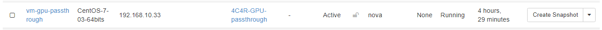
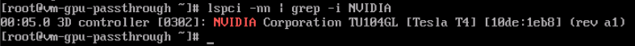
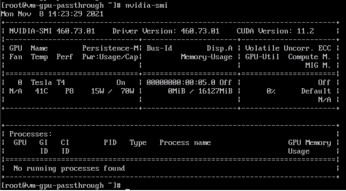

# Thử nghiệm GPU Passthrough trên Openstack

*Tài liệu hướng dẫn cài đặt cấu hình sử dụng GPU Passthrough cho máy ảo trên Openstack*

*Hệ điều hành Centos8*

*Phiên bản Openstack Ussuri*

## Thực hiện trên node Compute cắm card GPU
### I. Thực hiện enable SR-IOV
- **Bước 1:** Enable SR-IOV bằng bổ sung option dưới đây trong grub
```sh
vim /etc/default/grub
#...
GRUB_CMDLINE_LINUX="intel_iommu=on"
#...
```
- **Bước 2:** Rebuild lại file grub 
```sh
sudo grub2-mkconfig -o /boot/grub2/grub.cfg
```
- **Bước 3:** Thực hiện reboot máy 
```sh
reboot
```
- **Bước 4:** Kiểm tra đã enable SR-IOV thông qua OS
```sh
dmesg | grep -i IOMMU
```
- **Bước 5:** Kiếm tra KVM đã lấy được sriov hay chưa
```sh
virt-host-validate
```
*Kết quả:*
```sh
QEMU: Checking if IOMMU is enabled by kernel                               : PASS
```
### II. Kiểm tra thông tin card cắm vào máy chủ
- **Bước 1:** Kiểm tra card đã cắm ở node compute
```sh
lspci -nn | grep -i nvidia
```
*Kết quả:*
```sh
af:00.0 3D controller [0302]: NVIDIA Corporation TU104GL [Tesla T4] [10de:1eb8] (rev a1)
```
- **Bước 2:** Kiểm tra PCI được lấy qua SR-IOV
```sh
ls -ld /sys/kernel/iommu_groups/*/devices/*af:00.?/
```
*Kết quả:*
```sh
drwxr-xr-x 5 root root 0 Nov  1 19:11 /sys/kernel/iommu_groups/137/devices/0000:af:00.0/
```
### III. Cấu hình PCI cho Nova compute
**Bước 8:** Cấu hình nova compute, khai báo thông tin card đã cắm vào node compute
```sh
vim /etc/nova/nova.conf
#...
[pci]
passthrough_whitelist = [{"address": "0000:af:00.0"}]
alias = { "vendor_id":"10de", "product_id":"1eb8", "device_type":"type-PF", "name":"T4" }
#...
```
- **Bước 9:** Khởi động lại compute
```sh
systemctl restart openstack-nova-compute
```

## Cấu hình trên các node controller
### I. Cấu hình Nova
- **Bước 1:** Khai báo alias pci trên file cấu hình nova của các node controller để khi có request từ flavor có thể tìm được node compute nào khai báo sử dụng pci
```sh
vim /etc/nova/nova.conf
#...
[pci]
alias = { "vendor_id":"10de", "product_id":"1eb8", "device_type":"type-PF", "name":"T4" }
#...
```

- **Bước 2:** Khởi động lại nova-api và nova-scheduler
```sh
systemctl restart openstack-nova-api openstack-nova-scheduler
```

### II. Tạo flavor request GPU PCI
- **Bước 1:** Export biến môi trường Openstack
```sh
source admin-openrc
```
- **Bước 2:** Tạo flavor 
```sh
openstack flavor create --ram 4096 --disk 20 --vcpu 4 4C4R-GPU-passthrough
```
- **Bước 3:** Gắn metadata cho flavor 
```sh
openstack flavor set 4C4R-GPU-passthrough --property "pci_passthrough:alias"="T4:1"
```


## Kiểm tra
- **Bước 1:** Tạo VM chỉ định flavor vừa khởi tạo ở trên



- **Bước 2:** Truy cập vào console hoặc SSH vào VM, hiển thị các pci gắn vào, thông tin vendor_id và product_id sẽ giống card của máy vật lý



- **Bước 3:** Sau khi cài đặt driver NVIDIA cho máy ảo, thực hiện lệnh kiểm tra tài nguyên card GPU đã lấy đủ


