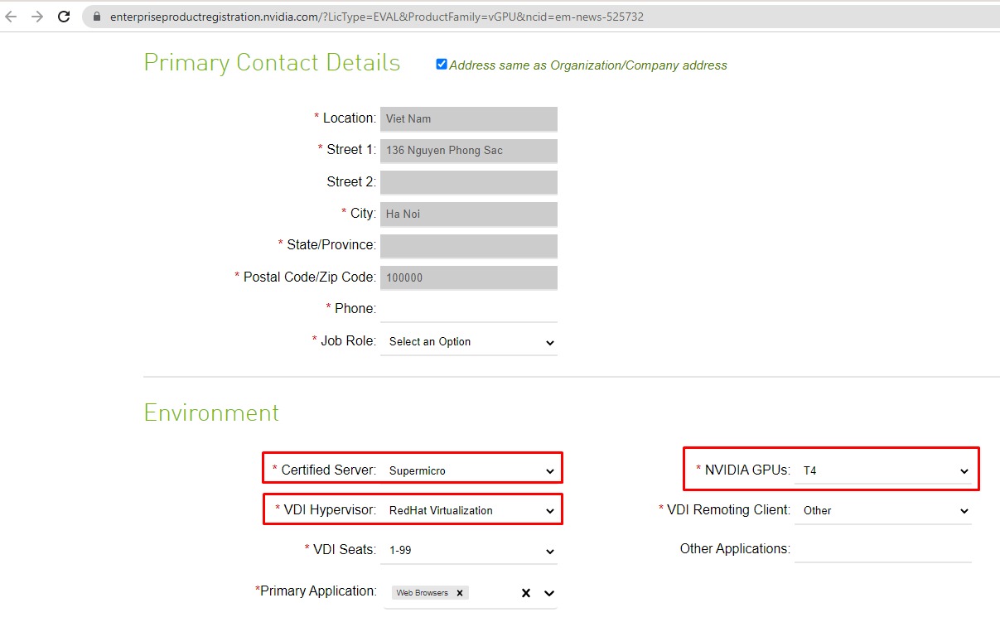
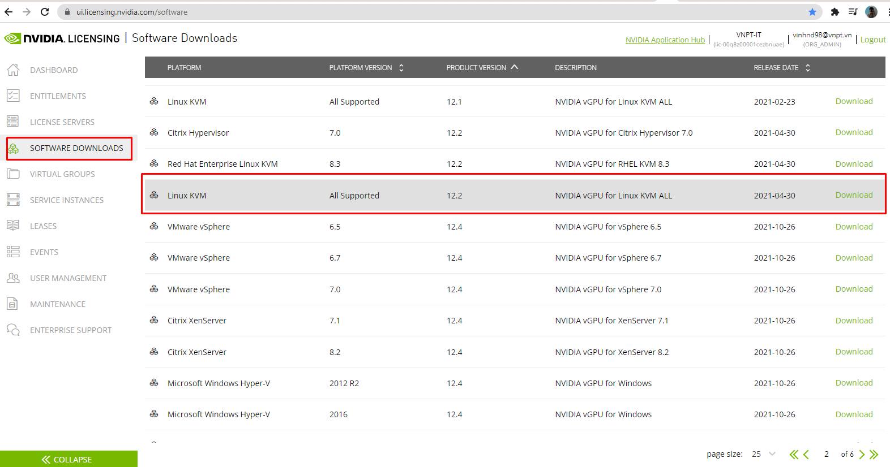
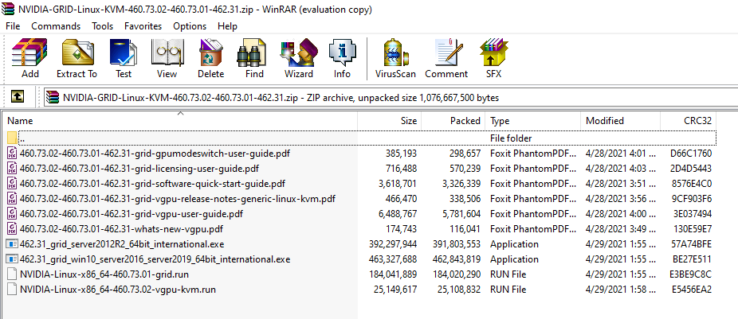
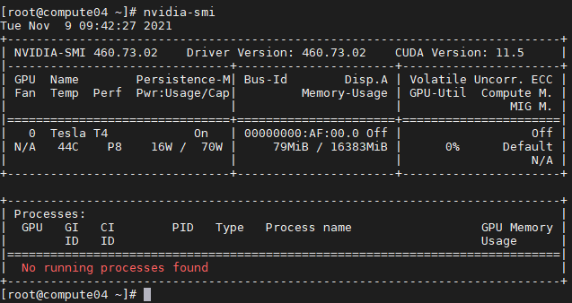

# Hướng dẫn cài đặt driver NVIDIA cho OS và Hypervisor KVM

### Thông tin:
- Máy chủ SuperMicro
- OS: CentOS 8
- Hypervisor: KVM - qemu-kvm-5.2.0-16.el8.x86_64
- GPU: NVIDIA Tesla T4 16GB x1

## I. Disable Nouveau
- **Bước 1:** Kiểm tra trạng thái nouveau, nếu có output tức là đang enable
```sh
lsmod | grep nouveau
```

- **Bước 2:** Cấu hình disable nouveau
```sh
cat << EOF >/etc/modprobe.d/nvidia-installer-disable-nouveau.conf
# generated by nvidia-installer
blacklist nouveau
options nouveau modeset=0
EOF
```
- **Bước 3:** Khởi tạo lại kernel initramfs
```sh
sudo dracut --force
```
- **Bước 4:** Khởi động lại máy chủ
```sh
init 6
```

## II. Đăng ký NVIDIA License Trial
Với mục đích cung cấp vGPU cho các máy ảo ta cần cài đặt các gói phần mềm hỗ trợ ảo hóa do NVIDIA cung cấp. Có thể làm theo hướng dẫn [tại đây](https://docs.nvidia.com/grid/8.0/grid-software-quick-start-guide/index.html)
- **Bước 1:** Truy cập trang web https://www.nvidia.com/en-us/data-center/resources/vgpu-evaluation/ đăng ký thông tin và theo email của công ty, khai báo môi trường thử nghiệm:



- **Bước 2:** Đăng nhập mail để lấy tài khoản đăng nhập trang web quản lý license của NVIDIA


- **Bước 3:** Đăng nhập vào trang web quản lý license của NVIDIA. Truy cập mục `SOFTWARE DOWNLOADS`, ở đây do sử dụng hệ điều hành Centos8 và hypervisor KVM nên tôi sẽ download gói phần mềm `Linux KVM` phiên bản `12.2`



- **Bước 4:** Các file đã được tải về

    - Các file PDF: Hướng dẫn cài đặt 
    - NVIDIA-Linux-x86_64-460.73.01-grid.run: Cài đặt Grid và driver cho OS Linux
    - 462.31_grid_win10_server2016_server2019_64bit_international.exe: Cài đặt Grid và driver cho OS Win (10,2016,2019)
    - 462.31_grid_server2012R2_64bit_international.exe: Cài đặt Grid và driver cho OS Win2k12
    - NVIDIA-Linux-x86_64-460.73.02-vgpu-kvm.run: Cài đặt phần mềm hỗ trợ vGPU cho hypervisor



*Có thể đưa các file cài đặt driver lên FTP để tiện download về*

## III. Cài đặt driver NVIDIA cho OS

- **Bước 1:** Kiểm tra card GPU NVIDIA đã được cắm vào máy chủ
```sh
lspci | grep -i nvidia
```
- **Bước 2:** Cài đặt các gói cần thiết
```sh
yum -y install elfutils-libelf-devel pkg-config libglvnd make gcc pciutils
```
- **Bước 3:** Cài đặt kernel-devel, yêu cầu cần phải đúng với phiên bản kernel của OS(nếu package kernel-devel phiên bản đó không còn tồn tại thì cài đặt không chỉ định phiên bản rồi reboot lại máy)
```sh
sudo yum -y install kernel-devel-$(uname -r) kernel-headers-$(uname -r)
```
***! Lưu ý !:*** *nếu package kernel-devel phiên bản đó không còn tồn tại thì cài đặt không chỉ định phiên bản rồi reboot lại máy*
```sh
# Cài đặt kernel-devel mà hiện tại repo cung cấp
sudo yum -y install kernel-devel

# Khởi động lại máy chủ
reboot
```
- **Bước 4:** Download hoặc copy Driver `NVIDIA-Linux-x86_64-460.73.01-grid.run` đã tải ở trên

- **Bước 5:** Phân quyền thực thi cho file cài đặt
```sh
chmod +x NVIDIA-Linux-x86_64-460.73.01-grid.run
```

- **Bước 6:** Thực hiện cài đặt driver Grid NVIDIA trên Centos8
```sh
sudo NVIDIA-Linux-x86_64-460.73.01-grid.run
```

*Kết quả:*
```sh
nvidia-smi
```



## IV. Cài đặt driver NVIDIA cho Hypervisor KVM

- **Bước 1:** Enable SR-IOV bằng bổ sung option dưới đây trong grub
```sh
vim /etc/default/grub
#...
GRUB_CMDLINE_LINUX="intel_iommu=on"
#...
```
- **Bước 2:** Rebuild lại file grub 
```sh
sudo grub2-mkconfig -o /boot/grub2/grub.cfg
```
- **Bước 3:** Thực hiện reboot máy 
```sh
reboot
```
- **Bước 4:** Kiểm tra đã enable SR-IOV thông qua OS
```sh
dmesg | grep -i IOMMU
```
- **Bước 5:** Kiếm tra KVM đã lấy được sriov hay chưa
```sh
virt-host-validate
```
*Kết quả:*
```sh
QEMU: Checking if IOMMU is enabled by kernel                               : PASS
```
- **Bước 6:** Download hoặc copy Driver `NVIDIA-Linux-x86_64-460.73.02-vgpu-kvm.run` đã tải ở trên

- **Bước 7:** Phân quyền thực thi cho file cài đặt
```sh
chmod +x NVIDIA-Linux-x86_64-460.73.02-vgpu-kvm.run
```

- **Bước 8:** Thực hiện cài đặt phần mềm cung cấp vGPU cho hypervisor
```sh
sudo sh NVIDIA-Linux-x86_64-460.73.02-vgpu-kvm.run
```

- **Bước 9:** Thực hiện khởi động lại máy để máy chủ lấy được module nvidia_vgpu
```sh
init 6
```

**Kiểm tra lại**
- OS đã lấy được module ảo hóa vGPU:
```sh
[root@compute04 ~]# lsmod | grep nvidia_vgpu_vfio
nvidia_vgpu_vfio       65536  0
nvidia              34127872  10 nvidia_vgpu_vfio
mdev                   20480  2 vfio_mdev,nvidia_vgpu_vfio
vfio                   36864  4 vfio_mdev,nvidia_vgpu_vfio,vfio_iommu_type1,vfio_pci
```

- Driver NVIDIA đã kích hoạt vgpu
```sh
[root@compute04 ~]# nvidia-smi vgpu
Tue Nov  9 09:50:35 2021
+-----------------------------------------------------------------------------+
| NVIDIA-SMI 460.73.02              Driver Version: 460.73.02                 |
|---------------------------------+------------------------------+------------+
| GPU  Name                       | Bus-Id                       | GPU-Util   |
|      vGPU ID     Name           | VM ID     VM Name            | vGPU-Util  |
|=================================+==============================+============|
|   0  Tesla T4                   | 00000000:AF:00.0             |   0%       |
+---------------------------------+------------------------------+------------+
```

- Hiện các vGPU type trên card Tesla T4 ( cắm khe đầu tiên )
```sh
[root@compute04 ~]# nvidia-smi vgpu -s -i 0
GPU 00000000:AF:00.0
    GRID T4-1B
    GRID T4-2B
    GRID T4-2B4
    GRID T4-1Q
    GRID T4-2Q
    GRID T4-4Q
    GRID T4-8Q
    GRID T4-16Q
    GRID T4-1A
    GRID T4-2A
    GRID T4-4A
    GRID T4-8A
    GRID T4-16A
    GRID T4-1B4
    GRID T4-16C
    GRID T4-4C
    GRID T4-8C
```

---
# Tham Khảo
- https://docs.nvidia.com/cuda/cuda-installation-guide-linux/index.html#runfile-nouveau
- https://docs.nvidia.com/grid/latest/grid-vgpu-user-guide/#get-summary-all-gpus-nvidia-smi
- https://docs.vmware.com/en/VMware-SD-WAN/4.5/vmware-sd-wan-partner-guide/GUID-C40F11DA-0418-4EB9-B91F-E52893584983.html
- https://docs.nvidia.com/grid/8.0/grid-software-quick-start-guide/index.html
- https://documentation.suse.com/sles/15-SP3/single-html/SLES-nvidia-vgpu/
- https://forums.developer.nvidia.com/t/418-92-vgpu-vfio-module-not-loading/162952