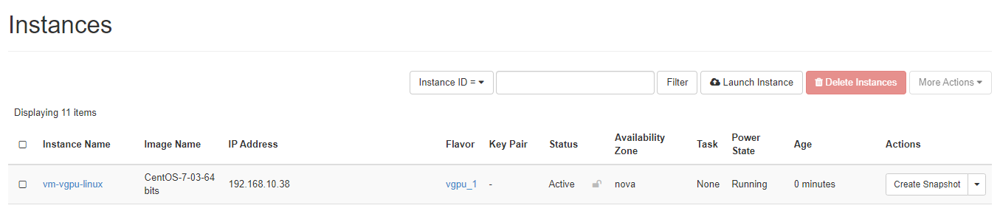
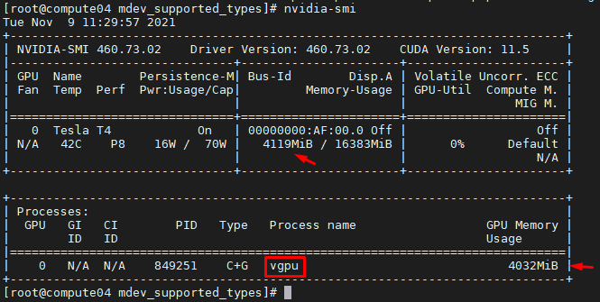

# Tích hợp Openstack sử dụng vGPU NVIDIA

**Thông tin**
- Phiên bản Openstack: Victoria
- Card NVIDIA Tesla T4
- PCI 0000:af:00.0

## I. vGPU supported types
- **Bước 1:** Kiểm tra các vGPU types có thể sử dụng
```sh
ll /sys/bus/pci/devices/0000:af:00.0/mdev_supported_types
```

*Kết quả*
```sh
[root@compute04 mdev_supported_types]# ll
total 0
drwxr-xr-x 3 root root 0 Nov  8 14:29 nvidia-222
drwxr-xr-x 3 root root 0 Nov  8 14:29 nvidia-223
drwxr-xr-x 3 root root 0 Nov  8 14:29 nvidia-224
drwxr-xr-x 3 root root 0 Nov  8 14:29 nvidia-225
drwxr-xr-x 3 root root 0 Nov  8 14:29 nvidia-226
drwxr-xr-x 3 root root 0 Nov  8 14:29 nvidia-227
drwxr-xr-x 3 root root 0 Nov  8 14:29 nvidia-228
drwxr-xr-x 3 root root 0 Nov  8 14:29 nvidia-229
drwxr-xr-x 3 root root 0 Nov  8 14:29 nvidia-230
drwxr-xr-x 3 root root 0 Nov  8 14:29 nvidia-231
drwxr-xr-x 3 root root 0 Nov  8 14:29 nvidia-232
drwxr-xr-x 3 root root 0 Nov  8 14:29 nvidia-233
drwxr-xr-x 3 root root 0 Nov  8 14:29 nvidia-234
drwxr-xr-x 3 root root 0 Nov  8 14:29 nvidia-252
drwxr-xr-x 3 root root 0 Nov  8 14:29 nvidia-319
drwxr-xr-x 3 root root 0 Nov  8 14:29 nvidia-320
drwxr-xr-x 3 root root 0 Nov  8 14:29 nvidia-321
```
- **Bước 2:** Để xem thông tin các phân chia của vGPU thực hiện xem chi tiết trong từng thư mục
```sh
cat /sys/bus/pci/devices/0000:af:00.0/mdev_supported_types/nvidia-232/name

cat /sys/bus/pci/devices/0000:af:00.0/mdev_supported_types/nvidia-232/available_instances
```

*Kết quả:* Có chia Frambuffer thành 4 phần và cấp cho 4 máy ảo với vGPU type GRID T4-4Q
```sh
[root@compute04 mdev_supported_types]# cat /sys/bus/pci/devices/0000:af:00.0/mdev_supported_types/nvidia-232/nvidia-232/name
GRID T4-4Q 
[root@compute04 mdev_supported_types]# cat /sys/bus/pci/devices/0000:af:00.0/mdev_supported_types/nvidia-232/nvidia-232/available_instances
4
```

*Ở phần LAB này tôi sẽ chia card NVIDIA Tesla T4 thành 4*

## II. Cấu hình Openstack sử dụng vGPU
- **Bước 1:** Cấu hình nova-compute trên node `compute` gắn GPU
```sh
vim /etc/nova/nova.conf
#...
[devices]
enabled_vgpu_types = nvidia-232

[mdev_nvidia-232]
device_addresses = 0000:af:00.0
#...
```
- **Bước 2:** Khởi động lại dịch vụ nova-compute
```sh
systemctl restart openstack-nova-compute
```
*Kiểm tra lại log nova-compute:* Ta sẽ thấy placement đã tự động tạo resource provider cho pci gắn card NVIDIA T4 trên compute04
```log
2021-11-01 20:46:24.931 13748 INFO nova.scheduler.client.report [req-7d15f6a5-1d74-4281-880f-62dff5d83e12 - - - - -] [req-4e7efac3-c508-4ecd-bd43-47e7064f777c] Created resource provider record via placement API for resource provider with UUID 46f49c79-fed8-4b8d-a029-306b14085555 and name compute04.smartcloudlab_pci_0000_af_00_0.
```

- **Bước 3:** Thiết lập property cho flavor để lấy vGPU
```sh
openstack flavor set vgpu_1 --property "resources:VGPU=1"
```

- **Bước 4:** Khởi tạo Máy ảo sử dụng flavor đã tạo



- **Kiểm tra tài nguyên lấy bên dưới**:
    - Compute: kiểm tra thông qua driver NVIDIA

    
    - Controller: Kiểm tra tài nguyên đã cấp thông qua Placement
    ```sh
    openstack resource provider list
    openstack allocation candidate list --resource VGPU=1
    ```

    *Kết quả*
    ```sh
    [root@controller02 ~]# openstack allocation candidate list --resource VGPU=1
    +---+------------+--------------------------------------+-------------------------+-------------------+
    | # | allocation | resource provider                    | inventory used/capacity | traits            |
    +---+------------+--------------------------------------+-------------------------+-------------------+
    | 1 | VGPU=1     | 46f49c79-fed8-4b8d-a029-306b14085555 | VGPU=1/4                | CUSTOM_NVIDIA_232 |
    +---+------------+--------------------------------------+-------------------------+-------------------+
    ```


---
# Tham khảo
- https://docs.openstack.org/nova/queens/admin/virtual-gpu.html#how-to-discover-a-gpu-type
- https://docs.openstack.org/osc-placement/latest/cli/index.html
- https://docs.openstack.org/nova/latest/admin/virtual-gpu.html