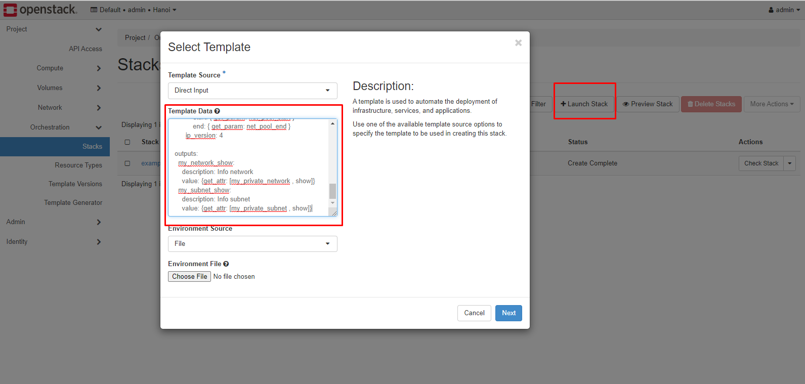
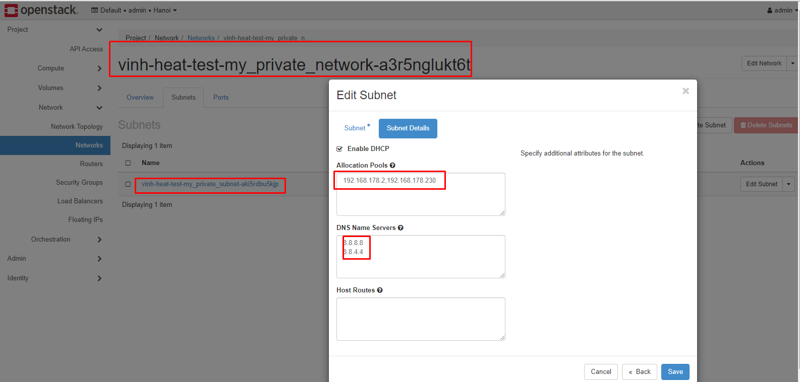

# Simple Heat Orchestration Template

*Hướng dẫn viết một vài HOT đơn giản*


# 
- [1. Network](#1)
  - [1.1. Network và subnet](#1.1)
  - [1.2. Router và kết nối subnet đến router](#1.2)
- [2.Quản lý instance](#2)
  - [2.1.Tạo instance và kết nối instance đến network](#2.1)
  - [2.2.Tạo instance, tạo port, kết nối instance đến port](#2.2)
- [3.Quản lý volume](#3)
  - [3.1.Tạo volume](#3.1)
  - [3.2.Gắn volume đến instance](#3.2)
  - [3.3.Boot instance từ volume](#3.3)

<a name="1"></a>
## 1. Network 

<a name="1.1"></a>
### 1.1 Network và subnet 

*Template này sẽ tạo ra một dải network private và subnet đi kèm, Khai báo các thông tin như CIDR, DNS, POOL*
```yml
heat_template_version: 2018-08-31

description: >
  Create a new network with subnet 

parameters:
  cidr:
    type: string
    label: Network CIDR
    description: The CIDR of the private network.
    default: "192.168.178.0/24"
  dns:
    type: comma_delimited_list
    label: DNS nameservers
    description: Comma separated list of DNS nameservers for the private network.
    default: "8.8.8.8,8.8.4.4"
  net_pool_start:
    type: string
    description: network pool start. typically .10 of whatever /24 is defined
    default: ""
  net_pool_end:
    type: string
    description: network pool end. typically .10 of whatever /24 is defined
    default: ""
  
resources:
  my_private_network:
    type: OS::Neutron::Net 
  my_private_subnet:
    type: OS::Neutron::Subnet 
    properties:
      network: {get_resource: my_private_network}
      cidr: {get_param: cidr}
      dns_nameservers: {get_param: dns}
      allocation_pools: 
        - start: { get_param: net_pool_start }
          end: { get_param: net_pool_end }
      ip_version: 4

outputs:
  my_network_show:
    description: Info network
    value: {get_attr: [my_private_network , show]}
  my_subnet_show:
    description: Info subnet
    value: {get_attr: [my_private_subnet , show]}
```

**Hướng dẫn chạy trên dashboard**

B1: Tạo stack, Input template



B2: Khai báo các Parameters và khởi tạo


Kết quả:




<a name="1.2"></a>
### Router và kết nối subnet đến router

```yml
heat_template_version: 2018-08-31

description: >
  Create a new router 

parameters:
  public_network:
    type: string
    label: Public network name or ID
    description: Public network with floating IP addresses.

  subnet:
    type: string
    label: Subnet name or ID
    description: Your private subnet.
    default: "subnet-private"
    
### Tạo Router

resources:
  my_router:   
    type: OS::Neutron::Router
    properties:
      external_gateway_info: {"network": {get_param: public_network}}

  subnet_interface:
    type: OS::Neutron::RouterInterface
    properties:
      router: {get_resource: my_router}
      subnet: {get_param: subnet}

outputs:
  my_router_show:
    description: Info router
    value: {get_attr: [my_router , show]}
```


## VMs

```yml
heat_template_version: 2018-08-31
description: Create a instance

parameters:
  vm_name:
    type: string
    label: VM name
    default: "vm-001"
  image:
    type: string
    label: Image name or ID
    description: Image to be used for compute instance
    default: "cirros"

  flavor:
    type: string
    label: Flavor
    description: Type of instance (flavor) to be used
    default: "small"

  vm_network:
    type: string
    label: List network used by VM
    description: Network to attach instance to.
    default: "private"

resources:
  instance:
    type: OS::Nova::Server
    properties:
      name: {get_param: vm_name}
      flavor: {get_param: flavor}
      image: {get_param: image}
      user_data_format: RAW
      user_data: |
        #cloud-config
        user: root
        password: VinhDucNguyen1998
        chpasswd: {expire: False}
        ssh_pwauth: True
      networks: 
        - "network": {get_param: vm_network}

outputs:
  instance_ip:
    description: Ip of instance
    value: {get_attr: [instance , networks, {get_param: vm_network}, 0]}
```


## Volume

- Tạo Volume trống

```yml
heat_template_version: 2018-08-31

description: >
  Create a volume

parameters:
  size:
    type: number
    label: Size of volume
    description: The size of volume
    default: 2

resources:
  my_volume:
    type: OS::Cinder::Volume
    properties:
      size: {get_param: size}
      description: "Volume"


outputs:
  volume_name:
    description: Name of volume
    value: {get_attr: [my_volume, display_name]}
```

- Tạo volume bootable

```yml
heat_template_version: 2018-08-31
description: >
  Create a bootable volume

parameters:
  volume_name:
    type: string
    label: Name your volume
    default: "volume_bootable"
  image:
    type: string
    label: Image Name or ID
    description: Image use for volume boot
  size:
    type: number
    label: Size of volume
    description: The size of volume
    default: 5
  volume_type:
    type: string
    label: Volume type
    default: default

resources:
  my_volume_boot:
    type: OS::Cinder::Volume
    properties:
      name: {get_param: volume_name}
      size: {get_param: size}
      volume_type: {get_param: volume_type}
      description: "Boot Volume"
      image: {get_param: image}

outputs:
  volume_name:
    description: Name of volume
    value: {get_attr: [my_volume_boot, display_name]}
```
- Gắn Volume vào instance
```yml
heat_template_version: 2018-08-31

description: Create a instance

parameters:
  image:
    type: string
    label: Image name or ID
    description: Image to be used for compute instance
    default: "cirros"
  flavor:
    type: string
    label: Flavor
    description: Type of instance (flavor) to be used
    default: "medium"
  vm_network:
    type: string
    label: Network network name or ID
    description: Network to attach instance to.
    default: "private"
  size:
    type: number
    label: Size of volume
    description: The size of volume
    default: 2


resources:
  instance:
    type: OS::Nova::Server
    properties:
      flavor: {get_param: flavor}
      image: {get_param: image}
      networks: 
        - "network": {get_param: vm_network}
  volume:
    type: OS::Cinder::Volume
    properties:
      size: {get_param: size}
      description: "Volume"

  volume_attachment:
    type: OS::Cinder::VolumeAttachment
    properties:
      volume_id: { get_resource: volume }
      instance_uuid: {get_resource: instance}

outputs:
  instance_ip:
    description: Ip of instance
    value: {get_attr: [instance , networks, {get_param: vm_network}, 0]}
  volume_name:
    description: Name of volume
    value: {get_attr: [volume, display_name]}
```

- Boot VM từ Bootable Volume
```yml
heat_template_version: 2018-08-31

description: Create a instance

parameters:
  image:
    type: string
    label: Image name or ID
    description: Image to be used for compute instance
    default: "cirros"
  flavor:
    type: string
    label: Flavor
    description: Type of instance (flavor) to be used
    default: "small"
  vm_netwwork:
    type: string
    label: Network name or ID
    description: Network to attach instance to.
    default: "private"
  size:
    type: number
    label: Size of volume
    description: The size of volume
    default: 2
  device_name:
    type: string
    label: Name device
    description: Name of device
    default: "vda" 


resources:
resources:
  bootable_volume:
    type: OS::Cinder::Volume
    properties:
      size: {get_param: size}
      image: {get_param: image}

  instance:
    type: OS::Nova::Server
    properties:
      flavor: {get_param: flavor}
      networks:
        - network: {get_param: vm_network}
      block_device_mapping:
        - device_name: vda
          volume_id: {get_resource: bootable_volume}
          delete_on_termination: true


outputs:
  instance_ip:
    description: Ip of instance
    value: {get_attr: [instance , networks, {get_param: vm_network}, 0]}
  volume_name:
    description: Name of volume
    value: {get_attr: [bootable_volume, display_name]}
```

- Sử dụng `OS::Heat::ResourceGroup`tạo nhiều máy ảo cùng lúc và được quản lý bởi 1 resource
```yml
heat_template_version: 2018-08-31
parameters:
  image:
    type: string
    label: Image name or ID
    description: Image to be used for compute instance
    default: "cirros"

  flavor:
    type: string
    label: Flavor
    description: Type of instance (flavor) to be used
    default: "small"

  vm_network:
    type: string
    label: List network used by VM
    description: Network to attach instance to.
    default: "external1"

resources:
  my_indexed_group:
    type: OS::Heat::ResourceGroup
    properties:
      count: 3
      resource_def:
        type: OS::Nova::Server
        properties:
          # create a unique name for each server
          # using its index in the group
          name: my_server_%index%
          image: {get_param: image}
          flavor: {get_param: flavor}
          networks:
           - "network": {get_param: vm_network}
         
```
---

## Tham khảo


[1] https://github.com/hocchudong/thuctap012017/blob/master/XuanSon/OpenStack/Heat/docs/Template-co-ban.md#1.1

[2] https://docs.openstack.org/heat/pike/template_guide/software_deployment.html

[3] https://docs.catalystcloud.nz/tutorials/network/creating-an-instance-with-interfaces-on-different-networks-with-heat.html

[4] https://github.com/openstack/heat-templates/blob/master/hot/software-config/example-templates/example-cloud-init.yaml