# Heat - Autoscaling with Prometheus

*Phiên bản Victoria*

# Mục lục
* [1. Mô hình và thông tin](#1)
    - [1.1 Cấu hình máy chủ](#1.1)
    - [1.2 Kiến trúc hệ thống](#1.2)
* [2. Cài đặt máy chủ Prometheus](#2)
    - [2.1 Cài đặt dịch vụ Prometheus](#2.1)
    - [2.2 Cài đặt Alert Manager](#2.2)
* [3. Khởi tạo Heat stack](#3)
* [4. Cài đặt prometheus-am-executor](#4)
* [5. Test](#5)
* [Tài liệu tham khảo](#tk)

<a name = '1'></a>
## 1. Mô hình và thông tin

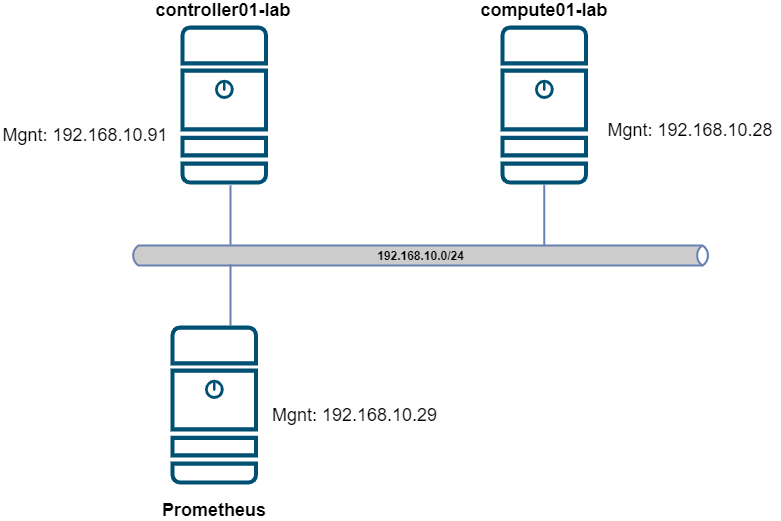

<a name = '1.1'></a>
### 1.1 Cấu hình máy chủ.
- Controller: 
    - vCPu: 8
    - RAM: 12Gb
    - Disk: 50 Gb
    - 4 Nics: 192.168.10.91/24 (Management), 192.168.20.91/24(External), 192.168.30.91/24(Data), 192.168.40.91/24(Ceph)  

- Compute:
    - vCPu: 5
    - RAM: 8Gb
    - Disk: 40 Gb
    - 4 Nics: 192.168.10.28/24 (Management), 192.168.20.28/24(External), 192.168.30.28/24(Data), 192.168.40.28/24(Ceph)  

- Prometheus:
    - vCPu: 2
    - RAM: 4Gb
    - Disk: 40 Gb
    - 4 Nics: 192.168.10.28/24 (Management), 192.168.20.28/24(External)

<a name = '1.2'></a>
### 1.2 Kiến trúc hệ thống

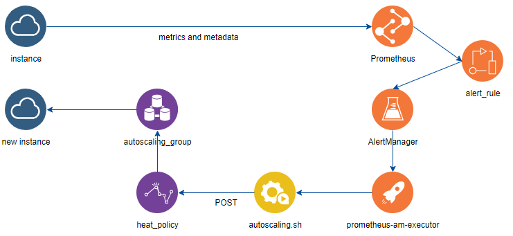

<a name = '2'></a>
## 2. Cài đặt máy chủ Prometheus 

*Tắt firewall, selinux*

<a name = '2.1'></a>
### 2.1 Cài đặt dịch vụ Prometheus
- Bước 1: Update packages:
```sh
yum -y install epel-release

yum -y update
```

- Bước 2: Tạo user cho service prometheus
```sh
useradd -m -s /bin/false prometheus
```

- Bước 3: Tạo thư mục cấu hình và data, phân quyền 
```sh
mkdir /etc/prometheus

mkdir /var/lib/prometheus

chown prometheus /var/lib/prometheus/
```

- Bước 4: Cài đặt Prometheus
```sh
wget https://github.com/prometheus/prometheus/releases/download/v2.14.0/prometheus-2.14.0.linux-amd64.tar.gz -P /tmp

cd /tmp/

tar -zxpvf prometheus-2.14.0.linux-amd64.tar.gz

cd /tmp/prometheus-2.14.0.linux-amd64

cp prometheus  /usr/local/bin

cp promtool  /usr/local/bin

```

- Bước 5: Cấu hình systemd cho prometheus
```sh

cat << EOF > /etc/systemd/system/prometheus.service
[Unit]
Description=Prometheus Time Series Collection and Processing Server
Wants=network-online.target
After=network-online.target

[Service]
User=prometheus
Group=prometheus
Type=simple
ExecStart=/usr/local/bin/prometheus \
    --config.file /etc/prometheus/prometheus.yml \
    --storage.tsdb.path /var/lib/prometheus/ \
    --web.console.templates=/etc/prometheus/consoles \
    --web.console.libraries=/etc/prometheus/console_libraries

[Install]
WantedBy=multi-user.target
EOF
```

- Bước 6: Cấu hình Prometheus
```sh
cat << EOF > /etc/prometheus/prometheus.yml
global:
  scrape_interval:     30s
  evaluation_interval: 30s


# Alertmanager configuration
alerting:
  alertmanagers:
  - static_configs:
    - targets:
      - 192.168.10.29:9093


rule_files:
  - "alert_rules.yaml"


scrape_configs:
  - job_name: 'prometheus'
    static_configs:
    - targets: ['192.168.10.29:9090']

  - job_name: 'openstack_autoscaling'
    openstack_sd_configs:
      - identity_endpoint: http://192.168.10.91:5000/v3
        username: admin
        password: Welcome123
        project_name: admin
        domain_name: default
        region: Hanoi
        role: instance
        port: 9100

    relabel_configs:
    - source_labels: [__meta_openstack_instance_name]
      target_label: instance
    - source_labels: [__meta_openstack_instance_status]
      target_label: status
    - source_labels: [__meta_openstack_instance_id]
      target_label: openstack_id
    - source_labels: [__meta_openstack_tag_prometheus_autoscaling]
      action: keep
      regex: 'true'
    - source_labels: [__meta_openstack_tag_stack_id]
      target_label: tenant_stack_id
    - source_labels: [__meta_openstack_tag_project_id]
      target_label: tenant_project_id
    - source_labels: [__meta_openstack_tag_stack_name]
      target_label: tenant_stack_name
EOF
```

- Bước 7: Khai báo alert rule
```sh
cat << EOF > /etc/prometheus/alert_rules.yaml
groups:
  - name: High Network Utilization
    rules:
    - alert: HighBandwith
      expr: rate(node_network_receive_bytes_total{device="ens3"}[1m])/1024/1024 > 1.0
      for: 1m
      labels:
        severity: upscale
        tenant_stack_id: "{{ $labels.tenant_stack_id }}"
        tenant_project_id: "{{ $labels.tenant_project_id }}"
        tenant_stack_name: "{{ $labels.tenant_stack_name }}"
      annotations:
        summary: High instance network utilization alert to trigger Heat upscaling
EOF
```

- Bước 8: Khởi tạo lại systemd daemon và restart service:
```sh
systemctl daemon-reload

systemctl enable prometheus

systemctl restart prometheus
```

***Kiểm tra sau khi cài đặt Prometheus***

- Kiểm tra service port được chạy trên hệ thống:
```sh
 netstat -tulpn | grep LISTEN
```

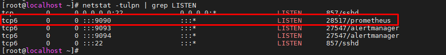

- Truy nhập địa chỉ `http://192.168.10.29:9090/`

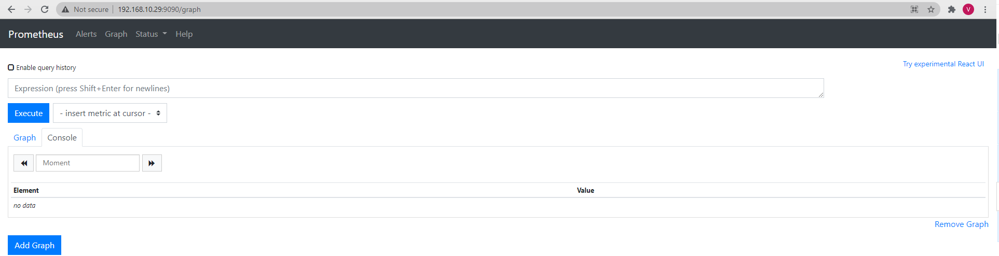


<a name = '2.2'></a>
### 2.2 Cài đặt Alert Manager

- Bước 1: Khởi tạo user cho dịch vụ
```sh
useradd --no-create-home --shell /bin/false alertmanager
```

- Bước 2: Download và cài đặt AlertManager
```sh
wget https://github.com/prometheus/alertmanager/releases/download/v0.17.0/alertmanager-0.17.0.linux-amd64.tar.gz

tar -xvf alertmanager-0.17.0.linux-amd64.tar.gz

cp alertmanager-0.17.0.linux-amd64/alertmanager /usr/local/bin/

cp alertmanager-0.17.0.linux-amd64/amtool /usr/local/bin/

mkdir /etc/alertmanager

mkdir -p /var/lib/alertmanager/

cat << EOF > /etc/alertmanager/alertmanager.yml
global:
  resolve_timeout: 1m

route:
  group_by: ['alertname']
  group_wait: 10s
  group_interval: 10s
  repeat_interval: 10m
  receiver: 'web.hook'

receivers:
  - name: 'web.hook'
    webhook_configs:
    - url: 'http://192.168.10.91:39091'
      send_resolved: true
EOF
```
- Bước 3: Phân quyền cho thư mục 
```sh
chown alertmanager:alertmanager /usr/local/bin/alertmanager

chown alertmanager:alertmanager /usr/local/bin/amtool

chown alertmanager:alertmanager -R /etc/alertmanager

chown alertmanager:alertmanager -R /var/lib/alertmanager/
```

- Bước 4: Cấu hình systemd cho service
```sh
cat << EOF > /etc/systemd/system/alertmanager.service
[Unit]
Description=Alertmanager
Wants=network-online.target
After=network-online.target

[Service]
User=alertmanager
Group=alertmanager
Type=simple
ExecStart=/usr/local/bin/alertmanager \
--config.file /etc/alertmanager/alertmanager.yml \
--storage.path /var/lib/alertmanager/ \
--web.external-url http://192.168.10.29:9093
Restart=always

[Install]
WantedBy=default.target
EOF
```

- Bước 5: Restart service
```sh
systemctl daemon-reload

systemctl enable alertmanager

systemctl restart prometheus

systemctl restart alertmanager
```

***Kiểm tra Alert Manager***

- Truy cập qua địa chỉ `http://192.168.10.29:9093/`

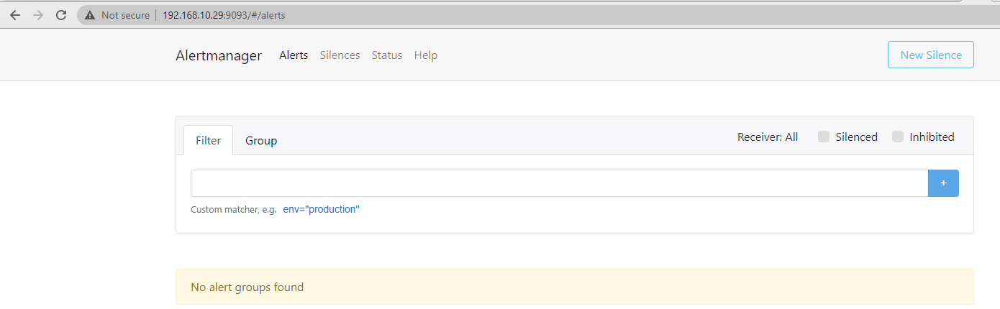

<a name = '3'></a>
## 3. Khởi tạo Heat stack
*Thực hiện trên node controller*
- Bước 1: Tạo thư mục
```sh
mkdir autoscale-stack
```
- Bước 2: Tạo HOT

*Chỉnh sửa giá trị các parameters phù hợp với hệ thống của bạn*

- `net_name`: tên hoặc id external Network 
- `subnet_name`: tên hoặc id subnet external Network
- `image`: tên hoặc id của image
- `flavor`: tên hoặc id của flavor
- `key_name`: tên hoặc id key pair
```sh
########
cat << EOF > autoscale-stack/singlevm_client.yaml
heat_template_version: 2018-08-31
description: Launch a Linux instance with Prometheus node exporter service.
             Dumb instance for testing prometheus monitoring purpose only.
             This all-in-one template without any depencies.

parameters:
  net_name:
    type: string
    default: external1 
  subnet_name:
    type: string
    default: sub_external1
  image:
    type: string
    default: U18
  flavor:
    type: string
    default: small
  autoscaling:
    type: string
    default: 'true'
  project_id:
    type: string
  stack_id:
    type: string
  stack_name:
    type: string


resources:
  port:
    type: OS::Neutron::Port
    properties:
      network: { get_param: net_name }
      security_groups: [ default ]
      fixed_ips:
      - subnet_id: { get_param: subnet_name }

  host:
    type: OS::Nova::Server
    properties:
      key_name: vinhlab-key
      image: { get_param: image}
      flavor: { get_param: flavor}
      metadata: { "prometheus_autoscaling": { get_param: autoscaling},
                  "stack_id": { get_param: stack_id },
                  "project_id": { get_param: project_id },
                  "stack_name": { get_param: stack_name } }
      networks:
        - port: { get_resource: port }
      user_data_format: RAW
      user_data: |
        #cloud-config
        preserve_hostname: False
        hostname: client
        fqdn: client.local

        users:
        - default
        - name: alex
          groups: sudo
          shell: /bin/bash
          lock-passwd: false
          passwd: $6$saltsalt$OpvVlYPY6YYXhosOAmr.a7PTpqaXv75xsI0bYfRKG3FGAOBgD32Mz/WXe.YKIKWhBVhh4DeNh281JyPVIBlKD0
          sudo: ['ALL=(ALL) NOPASSWD:ALL']
        ssh_pwauth: true

        package_update: true

        packages:
        - wget
        - openssh-server

        write_files:
        - content: |
            [Unit]
            Description=Node Exporter
            Wants=network-online.target
            After=network-online.target

            [Service]
            User=prometheus
            Type=simple
            ExecStart=/opt/prometheus/node_exporter

            [Install]
            WantedBy=multi-user.target
          path: /lib/systemd/system/node_exporter.service
          owner: root:root

        runcmd:
        - grep prometheus /etc/passwd > /dev/null || useradd -d /opt/prometheus -m prometheus
        - cd /opt/prometheus
        - wget https://github.com/prometheus/node_exporter/releases/download/v0.18.1/node_exporter-0.18.1.linux-amd64.tar.gz
        - tar xf node_exporter-0.18.1.linux-amd64.tar.gz --strip 1
        - systemctl daemon-reload
        - systemctl enable node_exporter
        - systemctl start node_exporter
EOF

##############

cat << EOF > autoscale-stack/singlevm_autoscaling.yaml
heat_template_version: 2018-08-31
description: Launch Dumb Linux instance in autoscaling group


resources:

  scaleup_policy:
    type: OS::Heat::ScalingPolicy
    properties:
      adjustment_type: change_in_capacity
      auto_scaling_group_id: { get_resource: autoscaling_group }
      cooldown: 30
      scaling_adjustment: 1

  scaledown_policy:
    type: OS::Heat::ScalingPolicy
    properties:
      adjustment_type: change_in_capacity
      auto_scaling_group_id: { get_resource: autoscaling_group }
      cooldown: 30
      scaling_adjustment: -1

  autoscaling_group:
    type: OS::Heat::AutoScalingGroup
    properties:
      min_size: 1
      max_size: 3
      resource:
        type: singlevm_client.yaml
        properties:
          project_id: { get_param: "OS::project_id" }
          stack_id: { get_param: "OS::stack_id" }
          stack_name: { get_param: "OS::stack_name" }
EOF
```

- Bước 3: Khởi chạy stack
```sh
openstack stack create -t autoscale-stack/singlevm_autoscaling.yml auto_scaling
```

***Kết quả***
- Đã khởi chạy thành công 

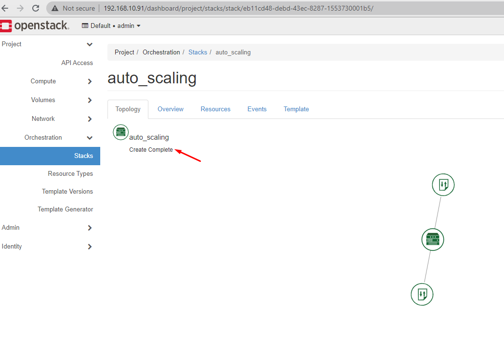

- Thông tin các resources

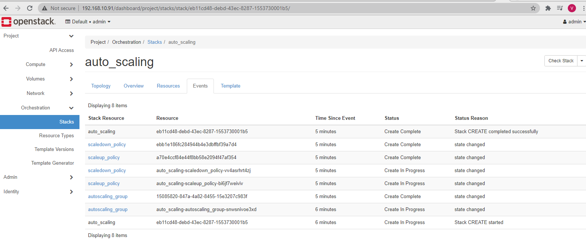


***Kiểm tra prometheus đã nhận được metrics từ máy ảo vừa khởi tạo***

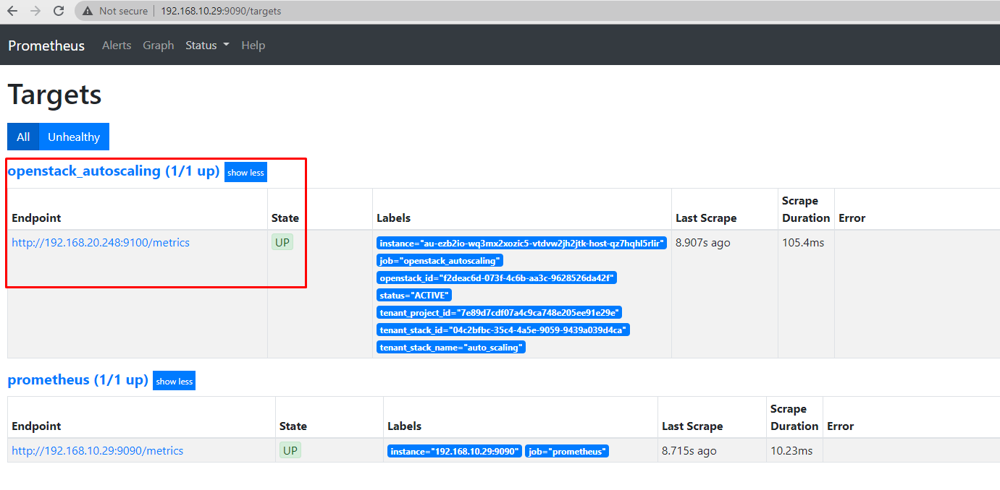

- Cảnh báo gửi về trạng thái

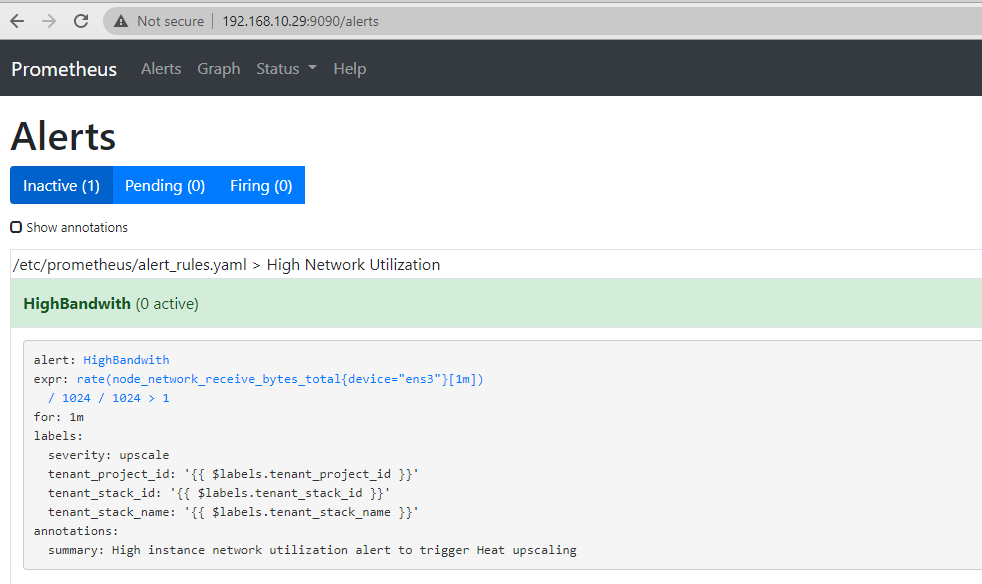

- Các labels được hiển thị

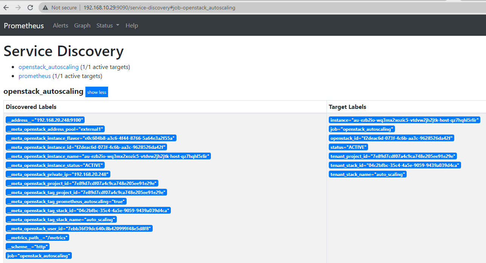


*Như vậy ta đã giám sát được VM trong Openstack, giờ ta sẽ thực hiện cấu hình gửi cảnh báo đến webhook rồi thực thi script ra hiệu cho Heat thực hiện scale.*


<a name = '4'></a>
## 4. Cài đặt prometheus-am-executor
*Thực hiện trên controller*

*prometheus-am-executor là một server HTTP tiếp nhận các cảnh báo từ Prometheus Alertmanager và thực thi các lệnh hoặc script với biến là các thông tin từ cảnh báo gửi đến*

- Bước 1: Cài đặt Go
```sh
yum -y install go
```

- Bước 2: Clone repo từ github
```sh
git clone https://github.com/imgix/prometheus-am-executor.git
```

- Bước 3: Chuyển vào thư mục rồi thực hiện cài đặt
```sh
cd  prometheus-am-executor/

go build
```
- Tạo file cấu hình cho dịch vụ
```sh
cat << EOF > /root/prometheus-am-executor/config.yml
---
listen_address: "192.168.10.91:39091"
verbose: true
# tls_key: "certs/key.pem"
# tls_crt: "certs/cert.pem"
commands:
  - cmd: /root/autoscaling.sh
    max: 3
    notify_on_failure: true
EOF
```

- Bước 5: Tạo file script thực thi khi alert gửi đến
```sh
vim /root/autoscaling.sh
#!/bin/bash
#
# openstack stack resource show <stack id> cirros_scaleup_policy
#
# http://127.0.0.1/orchestration/v1/<project_id>/stacks/<stack_name>/<stack_id>/resources/<policy_name>/signal
#
# token=$(openstack token issue -c id -f value)
# curl -s -H "X-Auth-Token: $token" -X POST -i -k http://127.0.0.1/orchestration/v1/f611f36fff8545fb8c5048fff60126ba/stacks/autoscaling/c18978ef-8a0b-4428-beb1-104cc61f015f/resources/cirros_scaleup_policy/signal
#

#echo $AMX_ALERT_1_LABEL_tenant_stack_name
if [[ "$AMX_STATUS" != "firing" ]]; then
    exit 0
fi

# Load Openstack credentials
source /root/admin-openrc-Hanoi

# issue token
token=$(openstack token issue -c id -f value)


# send upscale signal to OpenStack policy
if [[ "$AMX_ALERT_1_LABEL_severity" == "upscale" ]]; then
    url="http://192.168.10.91:8004/v1/$AMX_ALERT_1_LABEL_tenant_project_id/stacks/$AMX_ALERT_1_LABEL_tenant_stack_name/$AMX_ALERT_1_LABEL_tenant_stack_id/resources/scaleup_policy/signal"
echo $url
echo $token
      curl -s -H "X-Auth-Token: $token" -X POST -i -k $url
fi
```

- Bước 7: Phân quyển cho file script
```sh
chmod 777  /root/autoscaling.sh
```
- Bước 7: Tạo thêm một phiên ssh vào controller
```sh
cd  prometheus-am-executor/

./prometheus-am-executor -f config.yml
# Đừng tắt phiên này nhé
```
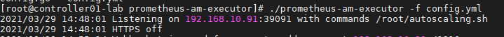


***OK!***

<a name = '5'></a>
## 5. Test

*Để thử nghiệm auto scale ta sẽ thực hiện đẩy iperf vào VM đã được Heat tạo ra*

- SSH vào VMs bằng keypair đã tạo
```sh
sudo -i

apt-get install -y iperf3

iperf3 -s -f m -p 3000
```
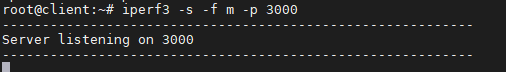


- Đứng từ controller
```sh
iperf3 -c 192.168.20.248 -f m -t 600 -p 3000
```

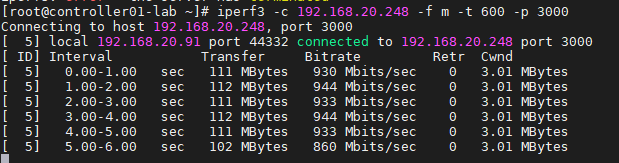


- Kiểm tra trên prometheus

*Trạng thái sẽ thay đổi*

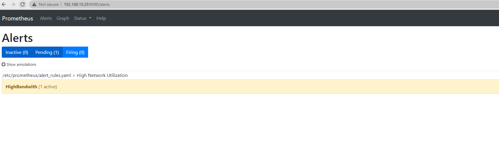

*Khi trạng thái là `firing`*

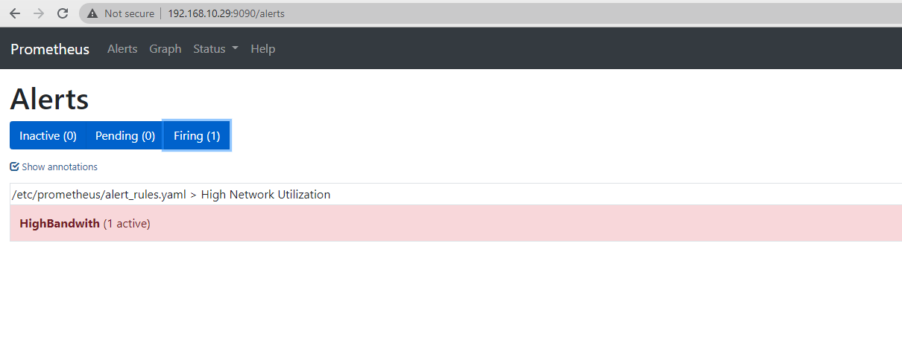

- Kiểm tra session chạy Prometheus-am-executor

*Prometheus-am-executor tiếp nhận alert và thực thi script*

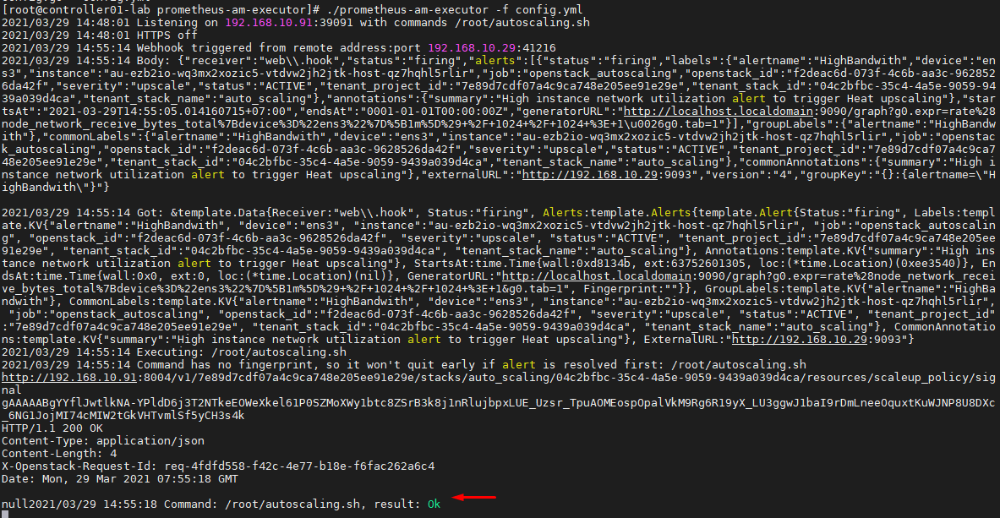

- Kiểm tra trên dashboard

*gọi Signal của resource scaleup thông qua script dùng API sẽ được kết quả*

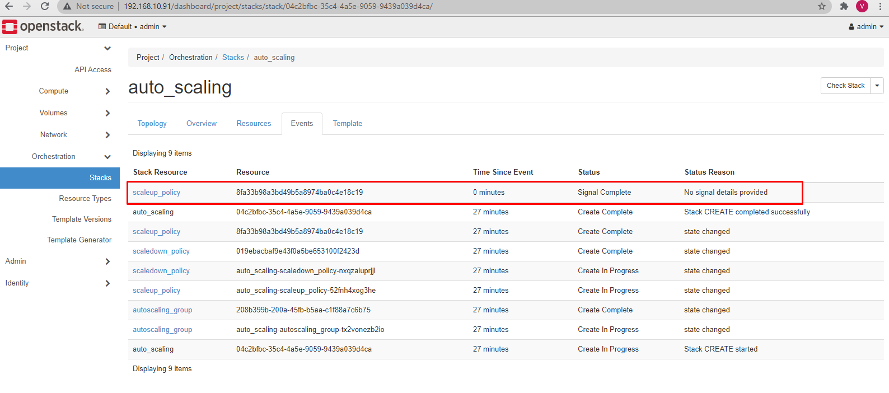


*Tự động khởi tạo thêm 1 VMs*

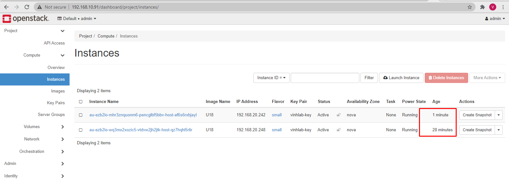


--- 

<a name = 'tk'></a>
## Special thanks to

[1] https://bitbucket.org/alexey_smovzh/openstack_from_source/src/master/modules/openstack/PROMETHEUS_AUTOSCALING.md

[2] https://github.com/imgix/prometheus-am-executor

[3] https://blog.ruanbekker.com/blog/2019/05/17/install-alertmanager-to-alert-based-on-metrics-from-prometheus/#:~:text=Install%20Prometheus%20Alertmanager%20Plugin&text=Install%20the%20dasboard%20grafana.com,alertmanager%20datasource%2C%20configure%20and%20save.

[4] https://www.linuxtechi.com/install-prometheus-monitoring-tool-centos-8-rhel-8/

[5] https://cuongquach.com/cai-dat-prometheus-alertmanager-gui-canh-bao.html