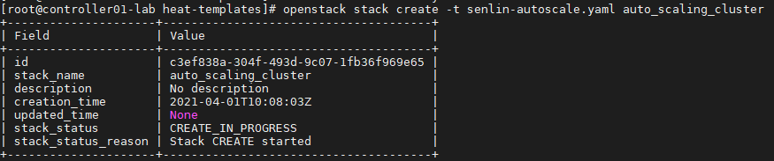
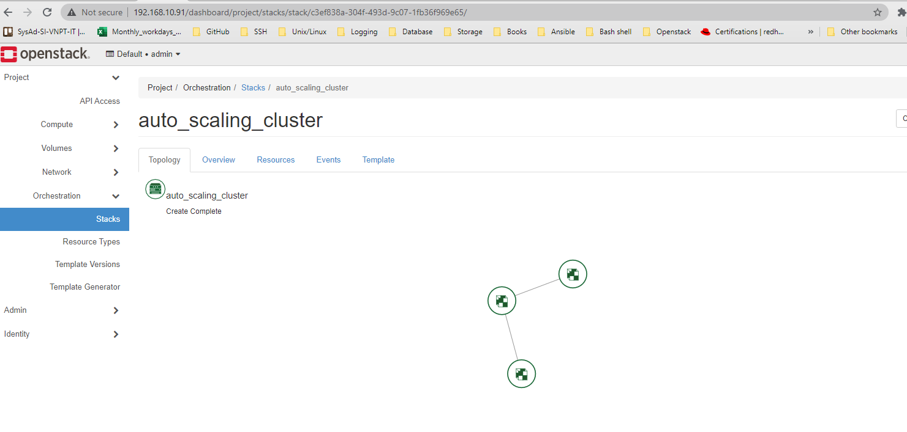
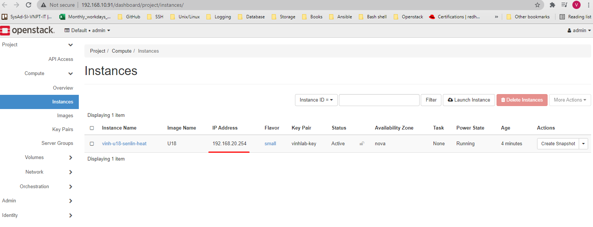
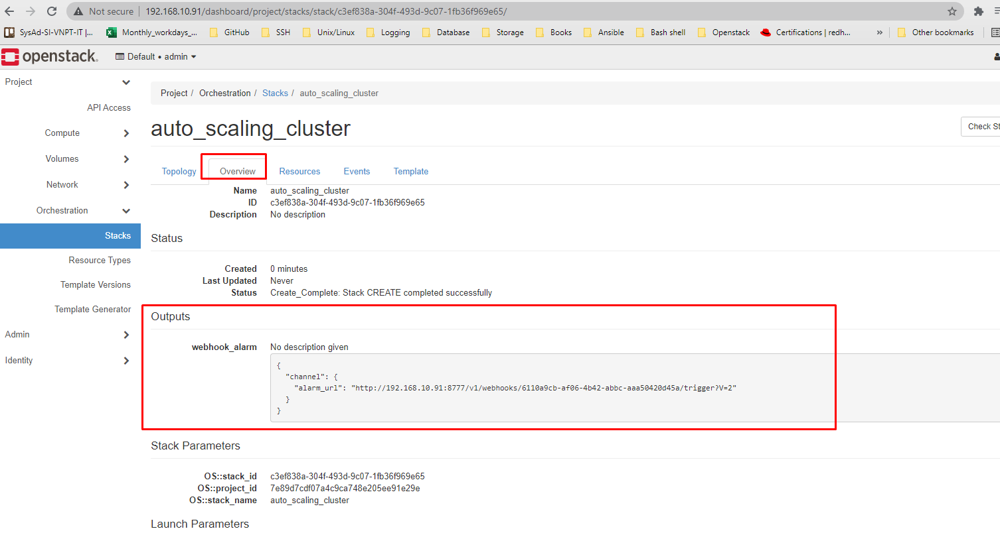
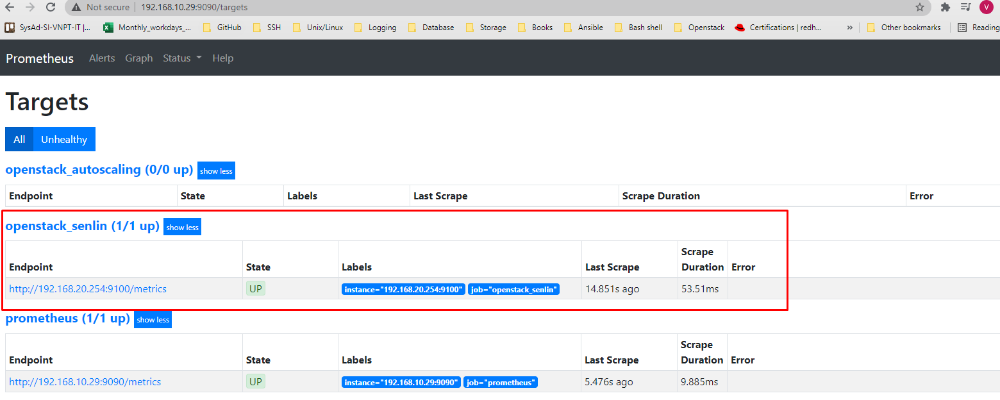
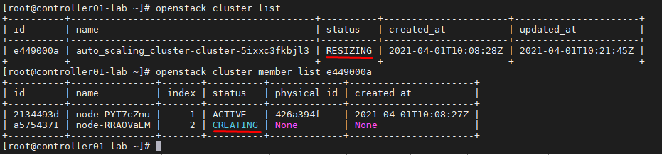
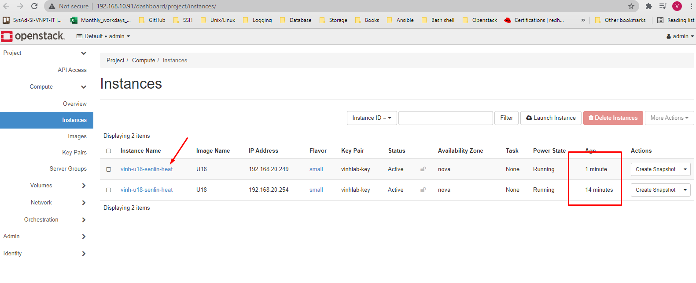

# Auto scale Senlin Cluster with Heat and Prometheus


## Khởi tạo Heat Stack

- Bước 1: Tạo HOT
```sh
cat << EOF > senlin-autoscale.yaml
heat_template_version: 2018-08-31
resources:
  profile:
    type: OS::Senlin::Profile
    properties:
      type: os.nova.server-1.0
      properties:
        name: vinh-u18-senlin-heat
        flavor: small
        image: U18
        key_name: vinhlab-key
        networks:
          - network: external1
        user_data: |
            #cloud-config
            package_update: true
            user: root
            password: a
            chpasswd: {expire: False}
            ssh_pwauth: True
            packages:
            - wget
            - openssh-server

            write_files:
            - content: |
                [Unit]
                Description=Node Exporter
                Wants=network-online.target
                After=network-online.target

                [Service]
                User=prometheus
                Type=simple
                ExecStart=/opt/prometheus/node_exporter

                [Install]
                WantedBy=multi-user.target
              path: /lib/systemd/system/node_exporter.service
              owner: root:root
            runcmd:
            - grep prometheus /etc/passwd > /dev/null || useradd -d /opt/prometheus -m prometheus
            - cd /opt/prometheus
            - wget https://github.com/prometheus/node_exporter/releases/download/v0.18.1/node_exporter-0.18.1.linux-amd64.tar.gz
            - tar xf node_exporter-0.18.1.linux-amd64.tar.gz --strip 1
            - systemctl daemon-reload
            - systemctl enable node_exporter
            - systemctl start node_exporter

  cluster:
    type: OS::Senlin::Cluster
    properties:
      desired_capacity: 1
      min_size: 1
      profile: {get_resource: profile}

  receiver_scale_out:
    type: OS::Senlin::Receiver
    properties:
      cluster: {get_resource: cluster}
      action: CLUSTER_SCALE_OUT
      type: webhook


outputs:
   webhook_alarm:
       value: { get_attr: [receiver_scale_out] }
EOF
```

- Bước 2: Khởi chạy Stack
```sh
openstack stack create -t senlin-autoscale.yaml auto_scaling_cluster
```

*Kết quả* 








- Bước 3: Chọn phần `Overview` để lấy thông tin `alarm_url`:
```json
{
  "channel": {
    "alarm_url": "http://192.168.10.91:8777/v1/webhooks/6110a9cb-af06-4b42-abbc-aaa50420d45a/trigger?V=2"
  }
}
```


## Khai báo trên Prometheus
- Bước 1: Khai báo Webhook tại `alert manager` để thực hiện cảnh báo tại file `/etc/alertmanager/alertmanager.yml`:
```yml
global:
  resolve_timeout: 1m

route:
  group_by: ['alertname']
  group_wait: 10s
  group_interval: 10s
  repeat_interval: 10m
  receiver: 'scale-out-senlin'

receivers:
- name: 'scale-out-senlin'
  webhook_configs:
  - url: 'http://192.168.10.91:8777/v1/webhooks/6110a9cb-af06-4b42-abbc-aaa50420d45a/trigger?V=2'
    send_resolved: false
inhibit_rules:
  - source_match:
      severity: 'critical'
    target_match:
      severity: 'warning'
    equal: ['alertname', 'dev', 'instance']
```

- Bước 2: Restart dịch vụ
```sh
 systemctl restart prometheus alertmanager
```

*Kiểm tra trên Prometheus*




## Test

- SSH vào VM được tạo
```sh
apt-get -y install iperf3

iperf3 -s -f m -p 3000
```

- Đứng tại controller
```sh
iperf3 -c 192.168.20.254 -f m -t 600 -p 3000
```

*Khi status của alert thay đổi*


*Senlin sẽ scale ra thêm 1 member nữa*



*Một VM nữa đã được tạo*




---
## Special Thanks to:

[1] https://github.com/openstack/heat-templates/blob/master/hot/senlin/autoscaled_loadbalancer_cluster.yaml