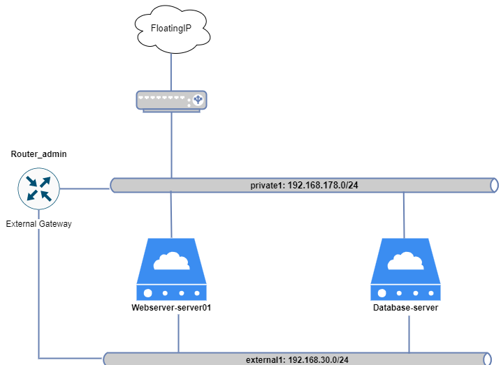
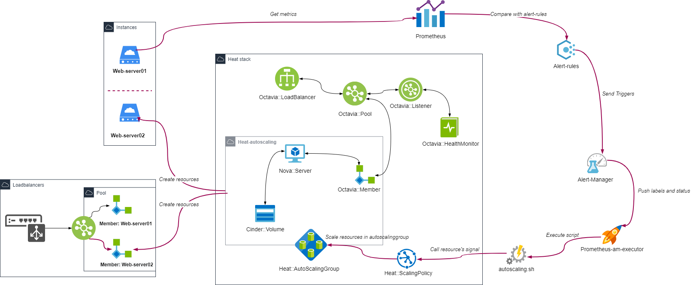
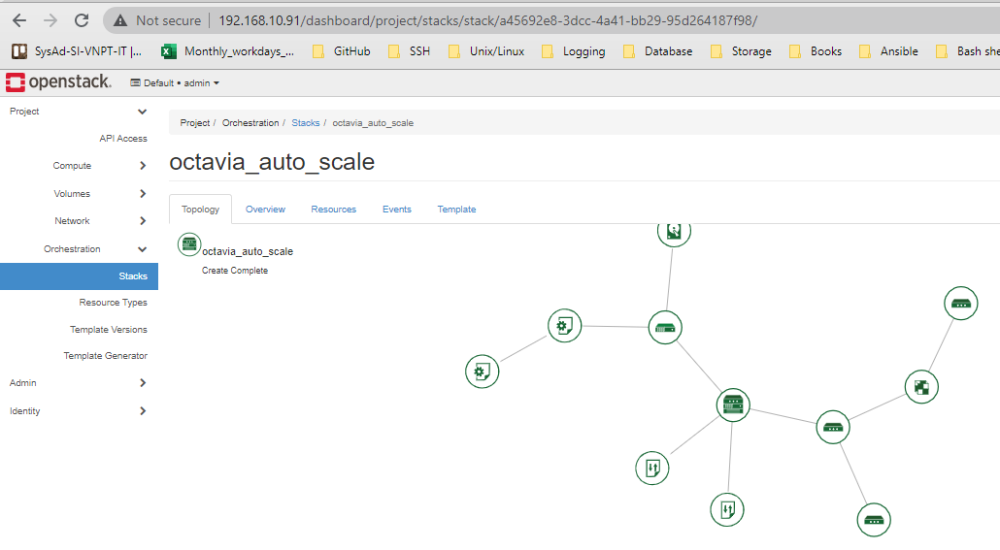

# Autoscaling with Octavia

*Thực hiện trên phiên bản Openstack Ussuri*

Khi khách hàng có nhu cầu sử dụng đòng thời tính năng auto scaling và loadbalancer. Thì khi scale-up hoặc scale-down, việc tự động thêm hoặc bớt các member (các node được thêm hoặc xóa đi) cho loadbalancer của octavia là cần thiết.

Kỹ thuật này rất đơn giản, là do cách viết Heat template, sẽ đưa resource Octavia:Member vào resource Autoscaling group.

## Mô hình 

- Mô hình hệ thống:




- Thành phần và Workflow: 




## Thực hiện triển khai

- Bước 1: Tạo thư mục chứa templates
```sh
mkdir auto-scale-octavia/
```

- Bước 2: Tạo HOT main tại `auto-scale-octavia/auto-scale-octavia.yaml`
```yml
heat_template_version: 2018-08-31
description: Launch a Linux instance with Prometheus node exporter service.
             Dumb instance for testing prometheus monitoring purpose only.
             This all-in-one template without any depencies.

parameters:
  public_net:
    type: string
    default: external1
  public_subnet:
    type: string
    default: sub_external1
  internal_net:
    type: string
    default: private1
  internal_subnet:
    type: string
    default: sub_private1
  image:
    type: string
    default: U18
  flavor:
    type: string
    default: small
  webserver_volume_size:
    description: The size of volume
    label: The size of volume for Web Servers
    type: interger
    default: 6
  webserver_volume_type:
    description:
    label: Volume type for Web Servers
    type: string
    default: ceph_hdd
  dbserver_volume_size:
    description: The size of volume
    label: The size of volume for DB Servers
    type: interger
    default: 6
  dbserver_volume_type:
    description:
    label: Volume type for DB Servers
    type: string
    default: ceph_ssd
  db_server_pass:
    description: Root password for DB node
    hidden: true
    default: a
    type: string
  web_server_pass:
    description: Root password for Web node
    hidden: true
    default: a
    type: string
  wordpressdb_pass:
    description: Wordpress DB password
    hidden: true
    default: a
    type: string
  wordpressdb_name:
    description: Wordpress DB name
    type: string
    default: wpdb
  wordpressuser_name:
    description: Wordpress DB username
    type: string
    default: wpuser


resources:
  db_volume_boot:
    type: OS::Cinder::Volume
    properties:
      size: {get_param: dbserver_volume_size}
      volume_type: {get_param: dbserver_volume_type}
      description: "Boot Volume"
      image: {get_param: image}

  database_host:
    type: OS::Nova::Server
    properties:
      name: wp-db
      block_device_mapping:
        - device_name: vda
          volume_id: {get_resource: db_volume_boot}
          delete_on_termination: true
      key_name: vinhlab-key
      image: { get_param: image}
      flavor: { get_param: flavor}
      networks:
        - network: { get_param: public_net }
        - network: { get_param: internal_net }
      user_data_format: RAW
      user_data:
        get_resource: database_init

  database_init:
    type: OS::Heat::MultipartMime
    properties:
      parts:
      - config: {get_resource: db_boot_script}

  db_boot_script:
    type: OS::Heat::SoftwareConfig
    properties:
      group: ungrouped
      config:
        str_replace:
          template: |
            #cloud-config
            package_update: true
            user: root
            password: $dbserverpass
            chpasswd: {expire: False}
            ssh_pwauth: True
            packages:
              - wget
              - expect
              - mysql-server
            runcmd:
              - sudo sed -i "s/.*bind-address.*/bind-address = 0.0.0.0/" /etc/mysql/mysql.conf.d/mysqld.cnf
              - systemctl enable mysql
              - systemctl restart mysql
              - mysql -u root -e "CREATE DATABASE $wpdbname;"
              - mysql -u root -e "GRANT ALL PRIVILEGES ON $wpdbname.* TO '$wpusername'@'%' IDENTIFIED BY '$wpdbpass';"
              - mysql -u root -e "FLUSH PRIVILEGES;"
          params:
            $dbserverpass: { get_param: db_server_pass }
            $wpdbname: { get_param: wordpressdb_name }
            $wpusername: { get_param: wordpressuser_name }
            $wpdbpass: { get_param: wordpressdb_pass }


  scaleup_policy:
    type: OS::Heat::ScalingPolicy
    properties:
      adjustment_type: change_in_capacity
      auto_scaling_group_id: { get_resource: autoscaling_group }
      cooldown: 60
      scaling_adjustment: 1

  scaledown_policy:
    type: OS::Heat::ScalingPolicy
    properties:
      adjustment_type: change_in_capacity
      auto_scaling_group_id: { get_resource: autoscaling_group }
      cooldown: 60
      scaling_adjustment: -1

  autoscaling_group:
    type: OS::Heat::AutoScalingGroup
    properties:
      min_size: 1
      max_size: 3
      resource:
        type: client.yaml
        properties:
          public_net: { get_param: public_net }
          public_subnet: { get_param: public_subnet }
          internal_net: { get_param: internal_net }
          internal_subnet: { get_param: internal_subnet }
          image: { get_param: image }
          flavor: { get_param: flavor }
          db_server_pass: { get_param: db_server_pass }
          web_server_pass: { get_param: web_server_pass }
          wordpressdb_pass: { get_param: wordpressdb_pass}
          webserver_volume_size: { get_param: webserver_volume_size }
          webserver_volume_type: { get_param: webserver_volume_type }
          wordpressdb_name: { get_param: wordpressdb_name }
          wordpressuser_name: { get_param: wordpressuser_name }
          dbip: { get_attr: [ database_host, first_address ] }
          pool_id: { get_resource: pool }
          project_id: { get_param: "OS::project_id" }
          stack_id: { get_param: "OS::stack_id" }
          stack_name: { get_param: "OS::stack_name" }

  lb:
    type: OS::Octavia::LoadBalancer
    properties:
      vip_subnet: {get_param: internal_subnet}

  listener:
    type: OS::Octavia::Listener
    properties:
      loadbalancer: {get_resource: lb}
      protocol: HTTP
      protocol_port: 80

  pool:
    type: OS::Octavia::Pool
    properties:
      listener: {get_resource: listener}
      lb_algorithm: ROUND_ROBIN
      protocol: HTTP
      session_persistence:
        type: SOURCE_IP

  lb_monitor:
    type: OS::Octavia::HealthMonitor
    properties:
      pool: { get_resource: pool }
      type: TCP
      delay: 5
      max_retries: 5
      timeout: 5
```

- Bước 3: Tạo file HOT client tại `auto-scale-octavia/client.yaml`
```yml
heat_template_version: 2018-08-31
description: Launch a Debian instance with Prometheus node exporter service.
             Dumb instance for testing prometheus monitoring purpose only.
             This all-in-one template without any depencies.

parameters:
  public_net:
    type: string
    default: external1
  public_subnet:
    type: string
    default: sub_external1
  internal_net:
    type: string
    default: private1
  internal_subnet:
    type: string
    default: sub_private1
  image:
    type: string
    default: U18
  flavor:
    type: string
    default: small
  autoscaling:
    type: string
    default: 'true'
  project_id:
    type: string      
  stack_id:
    type: string      
  stack_name:
    type: string      
  db_server_pass:
    description: Root password for DB node
    hidden: true
    type: string
    default: a
  webserver_volume_size:
    description: The size of volume
    label: The size of volume for Web Servers
    type: interger
    default: 6
  webserver_volume_type:
    description:
    label: Volume type for Web Servers
    type: string
    default: ceph_hdd
  web_server_pass:
    description: Root password for Web node
    hidden: true
    type: string
    default: a
  wordpressdb_pass:
    description: Wordpress DB password
    hidden: true
    type: string
    default: a
  wordpressdb_name:
    description: Wordpress DB name
    type: string
  pool_id:
    type: string
    description: Pool to contact
  wordpressuser_name:
    description: Wordpress DB username
    type: string
    default: wpuser
  dbip:
    type: string
  

resources:

  member:
    type: OS::Octavia::PoolMember
    properties:
      pool: { get_param: pool_id }
      address: { get_attr: [ web_host, first_address ] }
      protocol_port: 80
      subnet: { get_param: internal_subnet }

  my_volume_boot:
    type: OS::Cinder::Volume
    properties:
      size: {get_param: webserver_volume_size}
      volume_type: {get_param: webserver_volume_type}
      description: "Boot Volume"
      image: {get_param: image}

  web_host:
    type: OS::Nova::Server
    properties:
      block_device_mapping:
        - device_name: vda
          volume_id: {get_resource: my_volume_boot}
          delete_on_termination: true
      flavor: { get_param: flavor}
      metadata: { "prometheus_autoscaling": { get_param: autoscaling},
                  "stack_id": { get_param: "stack_id" },
                  "project_id": { get_param: "project_id" },
                  "stack_name": { get_param: "stack_name" } }
      networks:
        - network: { get_param: public_net }
        - network: { get_param: internal_net }
      user_data_format: RAW
      user_data:
        str_replace:
          template: |
            #cloud-config
            user: root
            password: $webserverpass
            chpasswd: {expire: False}
            ssh_pwauth: True
            write_files:
            - path: /opt/000-default.conf
              owner: root:root
              content: |
                <VirtualHost *:80>
                    ServerAdmin webmaster@localhost
                    ErrorLog ${APACHE_LOG_DIR}/error.log
                    CustomLog ${APACHE_LOG_DIR}/access.log combined
                <Directory /var/www/html>
                    AllowOverride All
                </Directory>
                </VirtualHost>
            - path: /opt/dir.conf
              owner: root:root
              content: |
                <IfModule mod_dir.c>
                    DirectoryIndex index.php index.html index.cgi index.pl index.xhtml index.htm
                </IfModule>
            - owner: root:root
              path: /lib/systemd/system/node_exporter.service
              content: |
                [Unit]
                Description=Node Exporter
                Wants=network-online.target
                After=network-online.target
                [Service]
                User=prometheus
                Type=simple
                ExecStart=/opt/prometheus/node_exporter
                [Install]
                WantedBy=multi-user.target
            package_update: true
            packages:
              - wget
              - openssh-server
              - php
              - apache2
              - libapache2-mod-php
              - php-cli
              - unzip
              - php-fpm
              - php-json
              - php-pdo
              - php-mysql
              - php-zip
              - php-gd
              - php-mbstring
              - php-curl
              - php-xml
              - php-pear
              - php-bcmath
            runcmd:
              - cp /opt/000-default.conf /etc/apache2/sites-available/000-default.conf
              - cp /opt/dir.conf /etc/apache2/mods-enabled/dir.conf
              - sudo a2enmod rewrite
              - chown -R www-data:www-data /var/www/html/
              - sudo find /var/www/html/ -type d -exec chmod 750 {} \;
              - sudo find /var/www/html/ -type f -exec chmod 640 {} \;
              - systemctl restart apache2
              - cd /var/www/html
              - wget http://wordpress.org/latest.zip
              - unzip /var/www/html/latest.zip
              - mv /var/www/html/wordpress/* /var/www/html/
              - mv /var/www/html/wp-config-sample.php /var/www/html/wp-config.php
              - sed -i 's/database_name_here/$wpdbname/' /var/www/html/wp-config.php
              - sed -i 's/username_here/$wpusername/' /var/www/html/wp-config.php
              - sed -i 's/password_here/$wpdbpass/' /var/www/html/wp-config.php
              - sed -i 's/localhost/$dbipadd/' /var/www/html/wp-config.php
              - systemctl enable apache2
              - systemctl reload apache2
              - systemctl restart apache2
              - grep prometheus /etc/passwd > /dev/null || useradd -d /opt/prometheus -m prometheus
              - cd /opt/prometheus
              - wget https://github.com/prometheus/node_exporter/releases/download/v0.18.1/node_exporter-0.18.1.linux-amd64.tar.gz
              - tar xf node_exporter-0.18.1.linux-amd64.tar.gz --strip 1
              - systemctl daemon-reload
              - systemctl enable node_exporter
              - systemctl start node_exporter
          params:
            $webserverpass: { get_param: web_server_pass }
            $wpdbname: { get_param: wordpressdb_name }
            $wpusername: { get_param: wordpressuser_name }
            $wpdbpass: { get_param: wordpressdb_pass }
            $dbipadd: { get_param: dbip }
outputs:
  server_ip:
    description: IP Address of the load-balanced server.
    value: { get_attr: [web_host, first_address] }
  lb_member:
    description: LB member details.
    value: { get_attr: [member, show] }
```

- Bước 4: Thực hiện Launch stack:
```sh
cd auto-scale-octavia/
source /root/admin-openrc
openstack stack create -t auto-scale-octavia.yaml octavia_auto_scale 
```

*Kết quả khi khởi tạo stack thành công:*



## Tích hợp cảnh báo

Thực hiện theo tài liệu [tại đây](https://github.com/vinhducnguyen1708/Tim-hieu-OpenStack/blob/master/docs/Heat/04-Autoscaling-with-Prometheus.md)


---
