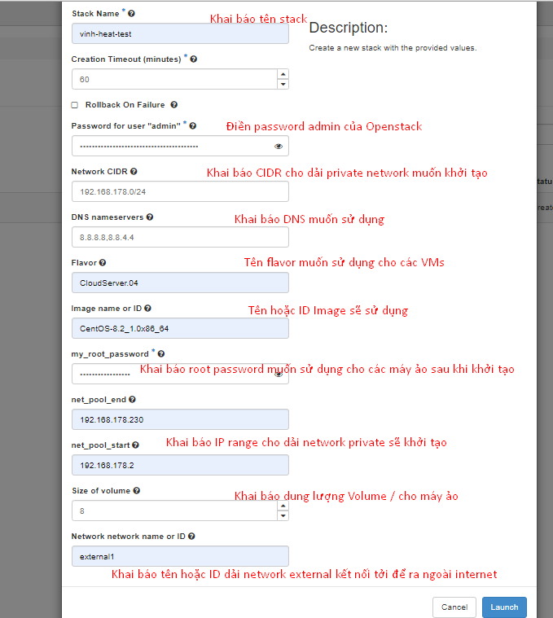
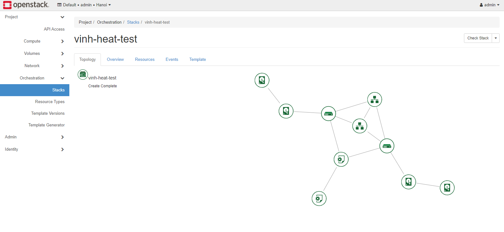

# Template Create VMs, Network-private, Volume, Config Cloud-init

**Template này sẽ khởi tạo**
-  1 dải network private
- 2 Volume bootable
- 2 Vm sẽ được gắn vào Volume tương ứng ở trên, gắn vào dải network private được tạo và dải public có sẫn
- Có thể tùy chỉnh: Dung lượng volume, dải network-private, flavor, Root password.

```yml
heat_template_version: 2018-08-31

description: Create a instance

parameters:
  my_root_password:
    description: Root password for all nodes
    hidden: true
    type: string
  cidr:
    type: string
    label: Network CIDR
    description: The CIDR of the private network.
    default: "192.168.178.0/24"
  dns:
    type: comma_delimited_list
    label: DNS nameservers
    description: Comma separated list of DNS nameservers for the private network.
    default: "8.8.8.8,8.8.4.4"
  net_pool_start:
    type: string
    description: network pool start. typically .10 of whatever /24 is defined
    default: ""
  net_pool_end:
    type: string
    description: network pool end. typically .10 of whatever /24 is defined
    default: ""
  image:
    type: string
    label: Image name or ID
    description: Image to be used for compute instance
    default: "cirros"
  flavor:
    type: string
    label: Flavor
    description: Type of instance (flavor) to be used
    default: "medium"
  vm_network:
    type: string
    label: Network network name or ID
    description: Network to attach instance to.
    default: "private"
  size:
    type: number
    label: Size of volume
    description: The size of volume
    default: 2


resources:
  cloud_init_userdata:
      type: OS::Heat::MultipartMime
      properties:
        parts:
        - config: { get_resource: my_cloud_config }

  my_cloud_config:
    type: OS::Heat::CloudConfig
    properties:
      cloud_config:
        ssh_pwauth: true
        disable_root: false
        package_update: yes
        package_upgrade: yes
        chpasswd: 
          expire: False
          list:
            str_replace:
              template: "root:PASSWORD"
              params:
                PASSWORD: {get_param: my_root_password}

  volume1:
    type: OS::Cinder::Volume
    properties:
      size: {get_param: size}
      description: "Volume"

  instance1:
    type: OS::Nova::Server
    properties:
      name: vinh-heat-vm1
      flavor: {get_param: flavor}
      image: {get_param: image}
      networks: 
        - "network": {get_param: vm_network}
        - "network": { get_resource: my_private_network }
      user_data_format: SOFTWARE_CONFIG
      user_data:
        get_resource: cloud_init_userdata
      

  volume_attachment1:
    type: OS::Cinder::VolumeAttachment
    properties:
      volume_id: { get_resource: volume1 }
      instance_uuid: {get_resource: instance1}

  volume2:
    type: OS::Cinder::Volume
    properties:
      size: {get_param: size}
      description: "Volume"

  instance2:
    type: OS::Nova::Server
    properties:
      name: vinh-heat-vm2
      flavor: {get_param: flavor}
      image: {get_param: image}
      networks: 
        - "network": {get_param: vm_network}
        - "network": { get_resource: my_private_network }
      user_data_format: SOFTWARE_CONFIG
      user_data:
        get_resource: cloud_init_userdata

  volume_attachment2:
    type: OS::Cinder::VolumeAttachment
    properties:
      volume_id: { get_resource: volume2 }
      instance_uuid: {get_resource: instance2}

  my_private_network:
    type: OS::Neutron::Net
    properties:
       name: heat_private_network
  my_private_subnet:
    type: OS::Neutron::Subnet 
    properties:
      name: heat_private_subnet
      network: {get_resource: my_private_network}
      cidr: {get_param: cidr}
      dns_nameservers: {get_param: dns}
      allocation_pools: 
        - start: { get_param: net_pool_start }
          end: { get_param: net_pool_end }
      ip_version: 4

outputs:
  my_network_show:
    description: Info network
    value: {get_attr: [my_private_network , show]}
  my_subnet_show:
    description: Info subnet
    value: {get_attr: [my_private_subnet , show]}
  # instance_ip:
  #   description: Ip of instance
  #   value: {get_attr: [instance , networks, {get_param: vm_network}, 0]}
  # volume_name:
  #   description: Name of volume
  #   value: {get_attr: [volume, display_name]}
  ```


### Thông Tin cần khai báo khi chạy Stack




### Kết quả 

