# Multiqueue

*Môi trường Openstack Ussuri*

## I. Vì sao nên sử dụng Multiqueue

- Khi nhiều đơn vị yêu cầu tài nguyên máy ảo trên Openstack lớn, nhưng ứng dụng chạy trên các máy ảo vẫn không đạt được hiệu năng tốt.

- Do không sử dụng multiqueue cho VMs, vì VMs được tạo ra trên Openstack mặc định chỉ sử dụng 1 Queue(Tức là có nhiều vCPU nhưng việc xử lý đẩy các packets lại chỉ đẩy đúng vào 1 queue dưới NIC)

- Vậy nên muốn tăng tốc độ xử lý Queue trên network thì ta cần phân làn dồn đều queue vào vCPU (có bao nhiêu core thì bây nhiêu Queue)

- Có thể việc sử dụng multiqueue có thể ảnh hưởng đến latency của ứng dụng chạy trên VMs nên cần test performance

## II. Để bật tính năng này có 2 cách:

- Set trong flavor:

```sh
openstack flavor set <id_flavor> --property vif_multiqueue_enabled='true'
```

- Set trong image:

```sh
openstack image set --property hw_vif_multiqueue_enabled='true'  <id_image>
```


## III. Kiểm tra VMs

- VM khi chưa phân luồng Queue:

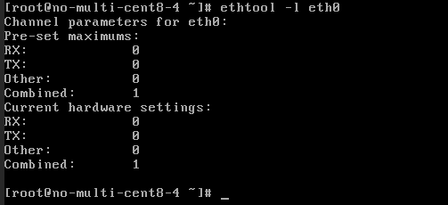

- VM khi đã phân luồng Queue:


## IV. Kiểm tra hiệu năng

### Non-multiqueue

1. Yêu cầu:
- Số lượng VM: 5
- Hệ điều hành: Ubuntu20.04
- Thông số: 4 vCPU, 4GB RAM
- Network: private network 192.168.1.0/24
- Phần mềm test: iperf3, nload :
```sh
apt-get -y install iperf3 nload
```
2. Cách thức thực hiện
- Chọn 1 server (incoming) được tạo trên node compute khác với 4 server còn lại. Tạo 4 phiên ssh, trên mỗi phiên SSH chạy 1 tiến trình iperf3 để listen trên 1 port ví dụ :
```sh
iperf3 -s -f m -p 3000
```
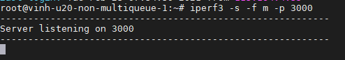

- 4 server(outgoing) còn lại sẽ đẩy vào 4 port tương ứng ở server 1
ví dụ:
```sh
iperf3 -c 192.168.1.165 -f m -t 600 -p 3000
```
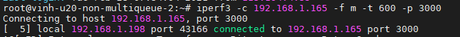

- Kết quả các server đẩy vào:

` inh-u20-non-multiqueue-2:`

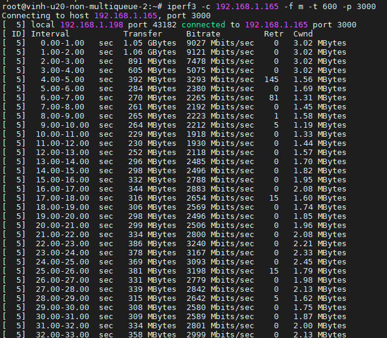

`vinh-u20-non-multiqueue-3:`

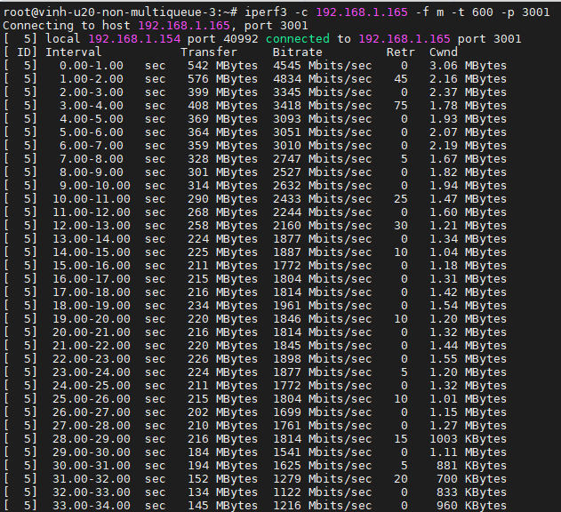

`vinh-u20-non-multiqueue-4:`

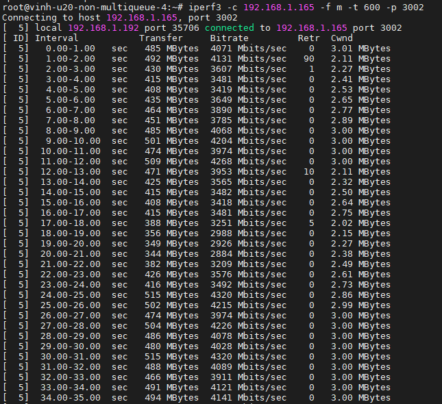

`vinh-u20-non-multiqueue-5:`

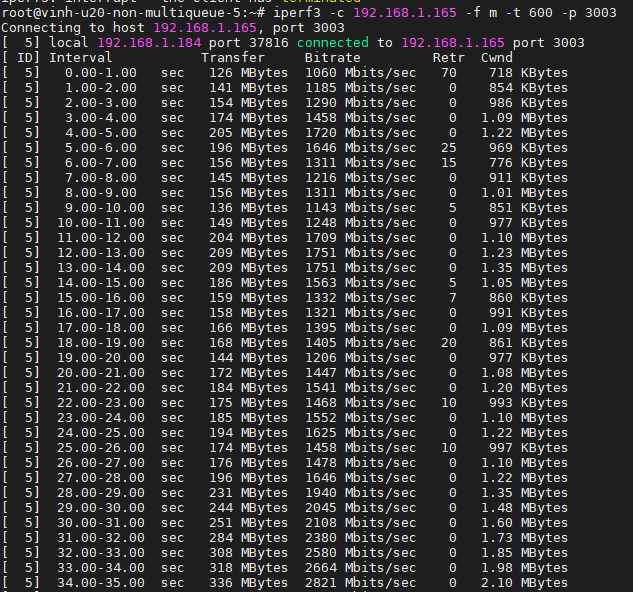

- Kết quả nload trên `vinh-u20-non-multiqueue-1`:

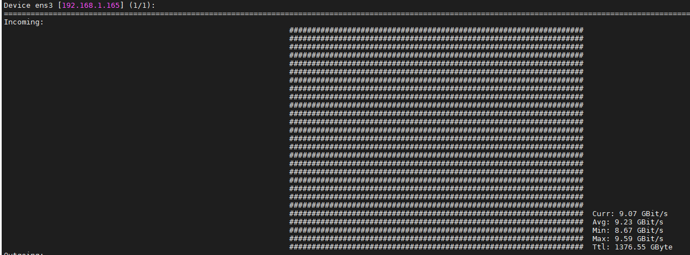


### Multiqueue

Yêu cầu và các thực hiện giống như trên

- Kết quả các server đẩy vào:

`vinh-u20-multiqueue-2:`

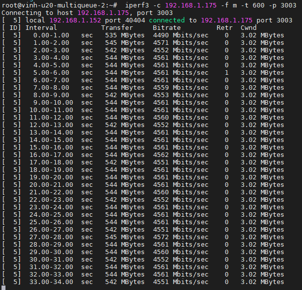

`vinh-u20-multiqueue-3:`

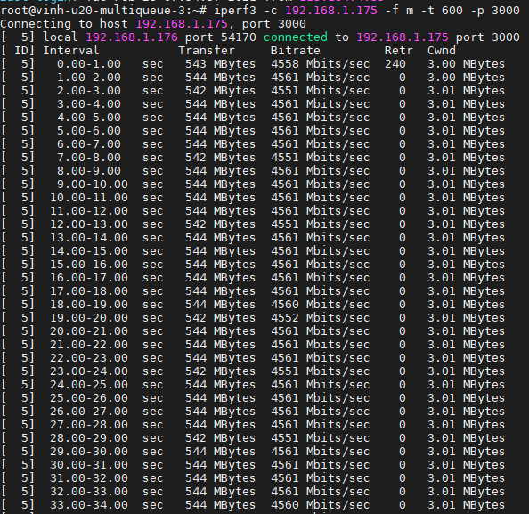

`vinh-u20-multiqueue-4:`

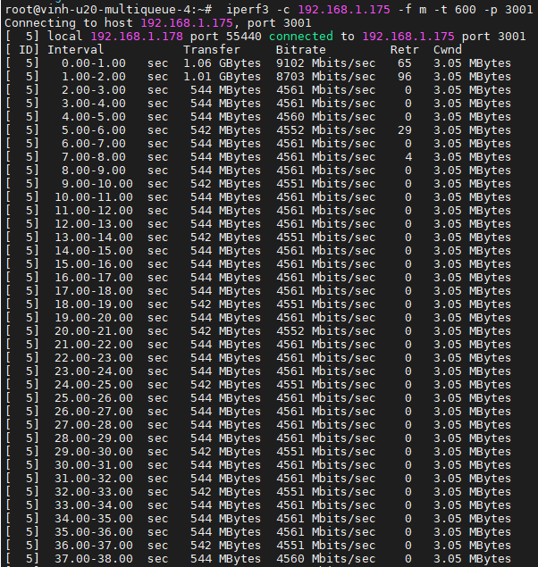

`vinh-u20-multiqueue-5:`

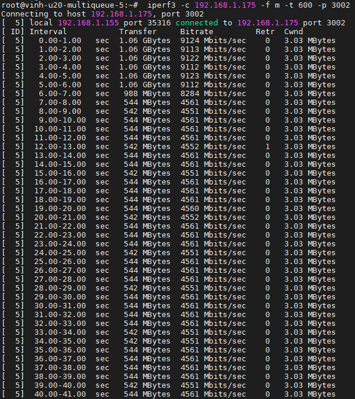

- Kết quả nload trên `vinh-u20-multiqueue-1`:

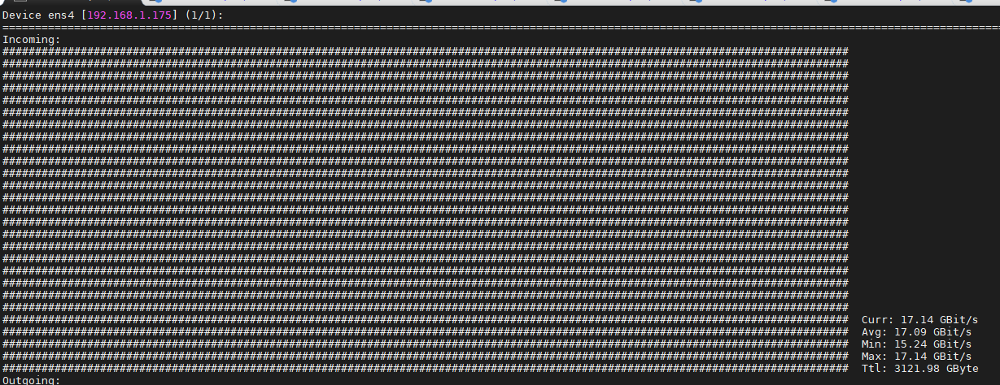


## Kết luận
- Có thể dễ dàng nhận thấy khi sử dụng multiqueue tốc độ xử lý trên các NICs tăng đáng kể!

- Nhưng khi sử dụng multiqueue đôi khi sẽ xảy ra hiện tượng các gói tin phải gửi lại:

`Retransmitted TCP packets`

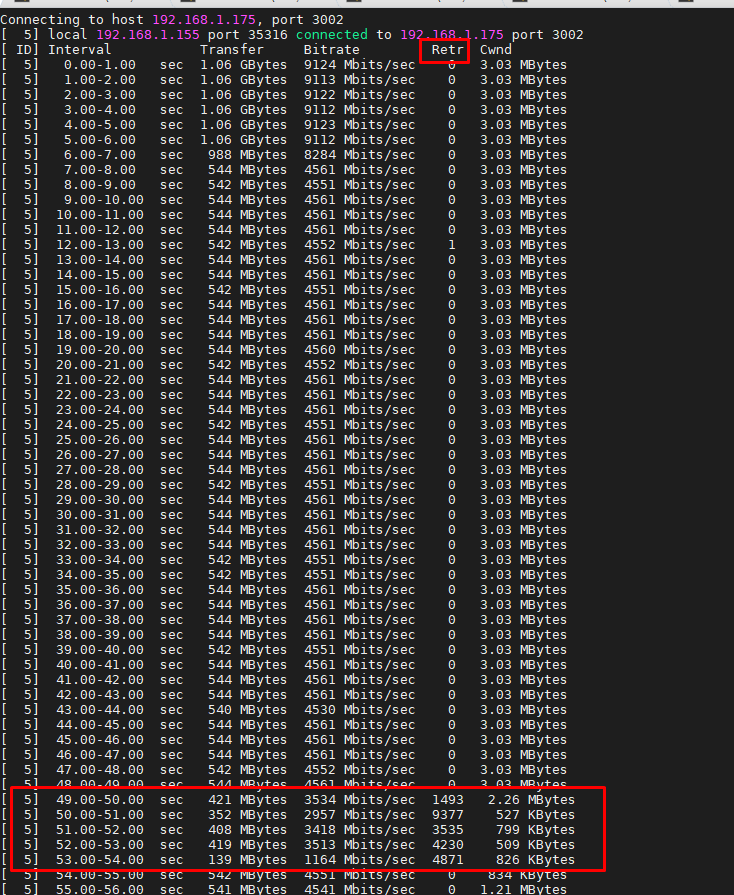


---
## Tham khảo: 

[1] https://www.slideshare.net/vietstack/meetup-23-01-the-things-i-wish-i-would-have-known-before-doing-openstack-cloud-transformation

[2] https://blog.cloudflare.com/how-to-receive-a-million-packets/

[3] https://www.tecmint.com/test-network-throughput-in-linux/