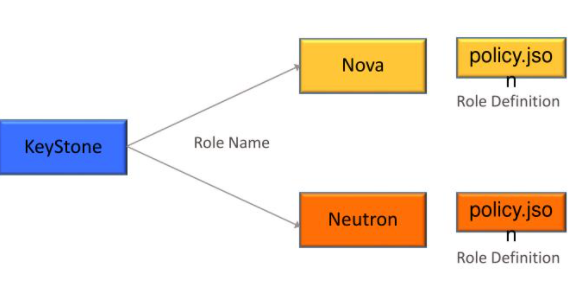
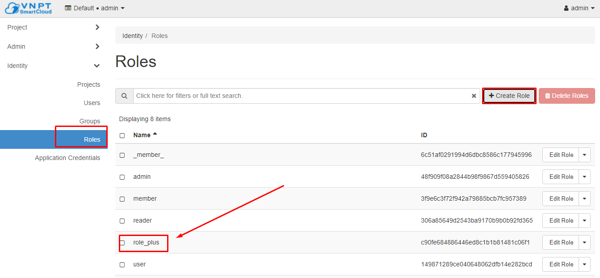
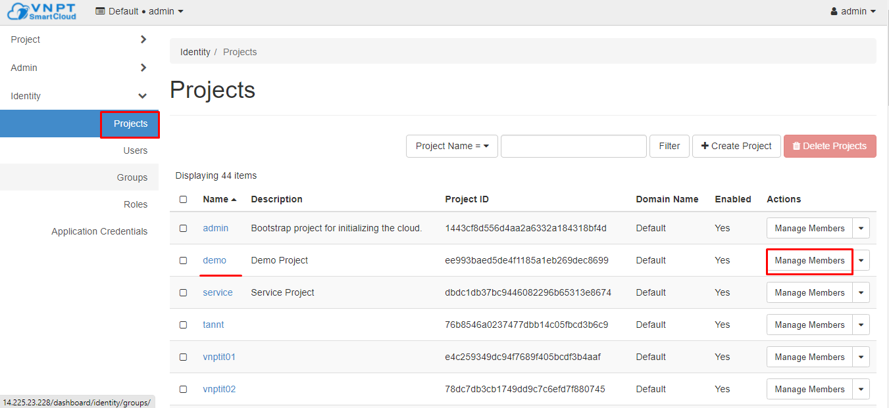
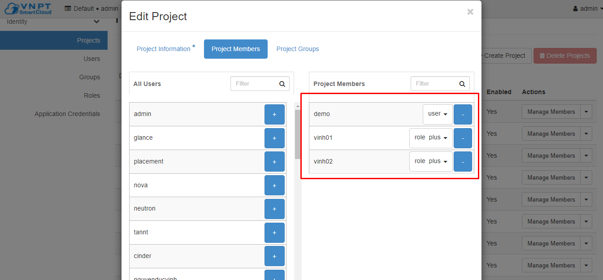
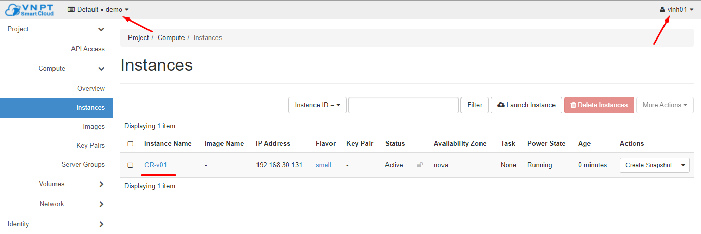
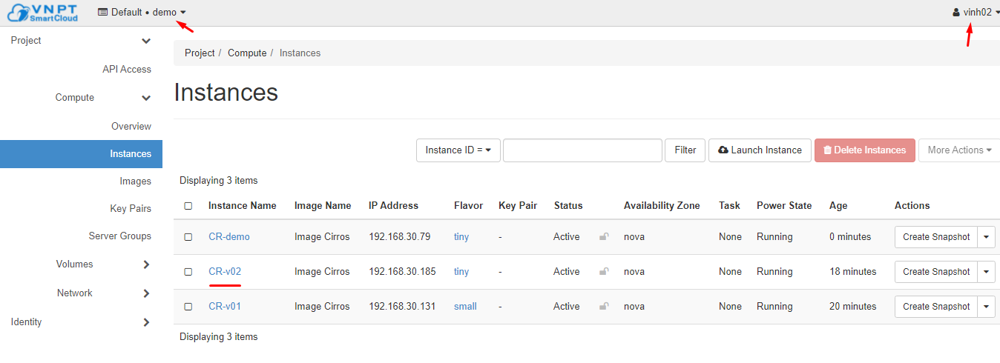
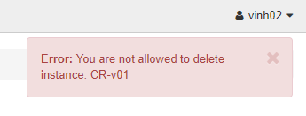
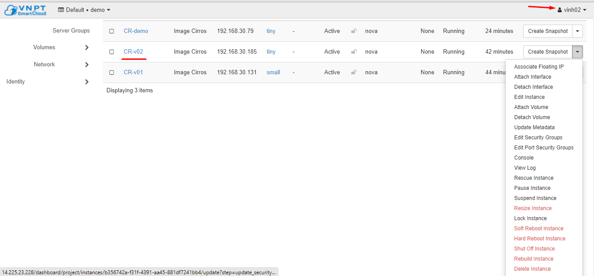

# Policy.json file 

## Khái niệm

Mỗi một dịch vụ Openstack như Keystone, Nova, Neutron,... đều có chính sách RBAC riêng. Cơ chế này quyết định user nào có thể truy cập các đối tượng trong mỗi service. và việc xác định đó được thông qua file policy.json của mỗi service.




Khi gọi API vào mỗi service được thiết lập, các policy engine của các service sử dụng các định nghĩa policy phù hợp để quyết định lời yêu cầu này được chấp nhận. Bất kỳ thay đổi nào ở file policy.json đều được xác nhận ngay lập tức, điều này cho phép các policy mới sẽ được thực hiện ngay cả khi service đang chạy.

File policy.json là file có dạng cấu trúc JSON (Javascript Object Notation). Mỗi policy được định nghĩa bằng 1 dòng khai báo.
```js
<target>" : "<rule>"
```

Policy "target" cũng có thể gọi là "action", và được đại diện cho việc gọi API như "start an instance" hoặc "attach a volume"

Các tên "action" thường đã được phê duyệt. Ví dụ, dịch vụ Compute hỗ trợ việc gọi API để xem danh sách các instances, volumes, networks. Trong file `/etc/nova/policy.json`, các APIs vừa rồi được đại diện bằng `compute:get_all, volume:get_all, network:get_all` 

Policy rule sẽ quyết định những thực hiện gọi API nào sẽ được cho phép, Thông thường sẽ liên quan đến việc các user thực hiện gọi API và đối tượng mà API gọi khi hoạt động. Đây là quy tắc điển hình cho việc kiểm tra user có phải chủ sở hữu của đối tượng hay không.

Việc khai báo các policy có thể định nghĩa ở `/etc/<service_name>/policy.json` hoặc `/etc/openstack-dashboard/<service_name>_policy.json`


## Syntax
File policy.json bao gồm các policies và aliases như mẫu `target:rule` hoặc `alias:definition` 
```json
{
       "alias 1" : "definition 1",
       "alias 2" : "definition 2",
       ...
       "target 1" : "rule 1",
       "target 2" : "rule 2",
       ....
}
```
Target là các APIs và được viết dưới dạng `"service:API"` hoặc chỉ "API". Ví dụ: `"compute:create" or "add_image"`


## Ví dụ
Quy tắc đơn giản nhất:
```json
{
"compute:get_all" : ""
}
```
Target (action) là `"compute:get_all"`, thực hiện gọi API xem danh sách các instances tới Nova. Rule được khai báo là rỗng `""` tức là "always". Policy này sẽ cho phép tất cả mọi người xem được danh sách các instances.

Từ chối gọi tới API:
```json
{
"compute:shelve": "!"
}
```
Dấu `"!"` là viết tắt của "never" hoặc "nobody", dòng trên sẽ thực hiện vô hiệu hóa việc shelve an instance.

Thông thường nhiều APIs sẽ được gọi bởi admin. Việc này có thể thể hiện bằng rule "role:admin". Policy dưới đây sẽ đảm bảo việc admin có thể thực hiện tạo các user mới trong Keystone database:
```json
{
"identity:create_user" : "role:admin"
}
```
*admin là role được bult-in mặc định trong Keystone*

Có thể giới hạn APIs kết nối tới bất kỳ role nào. Ví dụ không cho phép role `heat_stack_user` tạo các stacks:

   - Đầu tiên ta khai báo aliases cho rule:
        ```json
        {
        "deny_stack_user": "not role:heat_stack_user"
        }
        ```   
   - Policy engine sẽ hiểu `"deny_stack_user"` không phải là API nên sẽ coi nó là một alias. Khởi tạo policy sẽ được thể hiện bằng:
        ```json
        {
        "stacks:create": "rule:deny_stack_user"
        }
        ```
    
Rule có thể chạy so sánh thuộc tính API với thuộc tính đối tượng:
```json
{
"os_compute_api:servers:start" : "project_id:%(project_id)s"
}
```
Khai báo được hiểu chỉ các project owner của máy ảo mới có thể khởi động máy ảo đó lên. `project_id` phía đầu là thuộc tính của API (sẽ đưa ra project ID của user gọi API) và được so sánh với Projec ID (trong trường hợp này là của instance). Chính xác hơn thì nó so sánh với trường project_id của đối tượng trong database. Nếu 2 giá trị giống nhau thì được gán quyền.

Rule phức tạp:
```json
{
...
"admin_required": "role:admin or is_admin:1",
"owner" : "user_id:%(user_id)s",
"identity:ec2_delete_credential": "rule:admin_required or
             (rule:owner and user_id:%(target.credential.user_id)s)"
}
```
Rule này quyết định ai có thể sử dụng API keystone xóa EC2 credential


## Demo
**Đề bài**: Các user trong cùng 1 project không được xóa, resize, restart máy ảo của nhau

- Bước 1: Tạo role từ Dashboard



- Bước 2: Gán các role ấy cho các user trong project






- Bước 3: Đăng nhập vào từng user và tạo máy ảo






- Bước 4: Sửa file `/etc/openstack-dashboard/nova_policy.json`

Khai báo alias

File cũ 
```json
{
    "context_is_admin": "role:admin",
    "admin_or_owner": "is_admin:True or project_id:%(project_id)s",
    "admin_api": "is_admin:True",
...
}
```

Sửa thành:
```json
{
    "context_is_admin": "role:admin",
    "is_plus": "role:role_plus",
    "is_owner": "user_id:%(user_id)s",
    "admin_or_owner": "is_admin:True or rule:is_owner",
    "admin_api": "is_admin:True",
    ...

}
```
Ở đây thay vì để xác thực project id ta sẽ xác thực đến mức user_id để cho các user trong một project sẽ không xâm phạm tài nguyên của nhau.

### *Kiểm tra*

Đứng tại user `vinh02` thực hiện xóa và reboot vm được tạo bởi user `vinh01`



Chỉ có thể tương tác với các VM được tạo bởi chính mình




**Add thêm rule cho role**
```json
{
    "os_compute_api:servers:delete": "rule:admin_or_owner or rule:is_plus",
    "os_compute_api:servers:update": "rule:admin_or_owner or rule:is_plus",
    "os_compute_api:servers:confirm_resize": "rule:admin_or_owner or rule:is_plus",
    "os_compute_api:servers:revert_resize": "rule:admin_or_owner or rule:is_plus",
    "os_compute_api:servers:reboot": "rule:admin_or_owner or rule:is_plus",
    "os_compute_api:servers:resize": "rule:admin_or_owner or rule:is_plus",
    "os_compute_api:servers:rebuild": "rule:admin_or_owner or rule:is_plus",
    "os_compute_api:servers:rebuild:trusted_certs": "rule:admin_or_owner or rule:is_plus",
}
```


---
https://docs.openstack.org/oslo.policy/ussuri/admin/policy-json-file.html