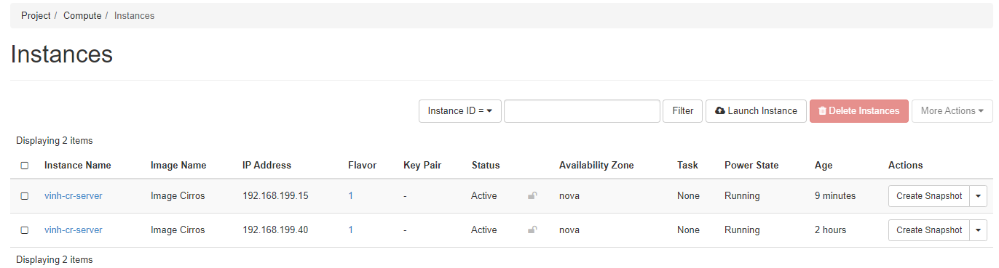
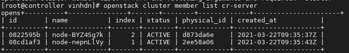

# Khởi tạo một cụm Cluster đơn giản với Senlin

*Thực hiện trên phiên bản Ussuri*

*Khởi tạo cụm cluster gồm các máy ảo*

- Bước 1: Tạo Profile template chứa nội dung như sau: 
```sh
#Tại đây khai báo các thông tin cho máy ảo (định dạng như HOT)
cat << EOF > cr_basic.yml
type: os.nova.server
version: 1.0
properties:
  name: vinh-cr-server
  flavor: 2c6b5311-a87c-451f-a95f-eddc10d05fe9
  image: b169bce4-63ea-4520-8224-670089af4330
  networks:
   - network: 9cfe6194-5c95-4579-8b8d-3436d28127ed
  user_data: |
    #!/bin/sh
    echo 'hello, world from Vinh Duc Nguyen' > /tmp/test_file
EOF
```

- Bước 3: thực hiện khởi tạo cluster
```sh
openstack cluster profile create --spec-file cr_basic.yml cr-server
```

*Kết quả*
```
+------------+-----------------------------------------------------------------------------------------------------------------------------------------------------------------------------------+
| Field      | Value                                                                                                                                                                             |
+------------+-----------------------------------------------------------------------------------------------------------------------------------------------------------------------------------+
| created_at | 2021-03-22T09:31:54Z                                                                                                                                                              |
| domain_id  | None                                                                                                                                                                              |
| id         | cea187bb-b80f-4372-889b-c079bffc9296                                                                                                                                              |
| location   | Munch({'cloud': '', 'region_name': '', 'zone': None, 'project': Munch({'id': '56a32d5cfbd64945a3ad1099bba01d0d', 'name': 'admin', 'domain_id': None, 'domain_name': 'Default'})}) |
| metadata   | {}                                                                                                                                                                                |
| name       | cr-server                                                                                                                                                                         |
| project_id | 56a32d5cfbd64945a3ad1099bba01d0d                                                                                                                                                  |
| spec       | +------------+-----------------------------------------------------------------------------------------+                                                                          |
|            | | property   | value                                                                                   |                                                                          |
|            | +------------+-----------------------------------------------------------------------------------------+                                                                          |
|            | | properties | {                                                                                       |                                                                          |
|            | |            |   "flavor": "2c6b5311-a87c-451f-a95f-eddc10d05fe9",                                     |                                                                          |
|            | |            |   "image": "b169bce4-63ea-4520-8224-670089af4330",                                      |                                                                          |
|            | |            |   "name": "vinh-cr-server",                                                             |                                                                          |
|            | |            |   "networks": [                                                                         |                                                                          |
|            | |            |     {                                                                                   |                                                                          |
|            | |            |       "network": "9cfe6194-5c95-4579-8b8d-3436d28127ed"                                 |                                                                          |
|            | |            |     }                                                                                   |                                                                          |
|            | |            |   ],                                                                                    |                                                                          |
|            | |            |   "user_data": "#!/bin/sh\necho 'hello, world from Vinh Duc Nguyen' > /tmp/test_file\n" |                                                                          |
|            | |            | }                                                                                       |                                                                          |
|            | | type       | os.nova.server                                                                          |                                                                          |
|            | | version    | 1.0                                                                                     |                                                                          |
|            | +------------+-----------------------------------------------------------------------------------------+                                                                          |
| type       | os.nova.server-1.0                                                                                                                                                                |
| updated_at | None                                                                                                                                                                              |
| user_id    | 65b0bdcdfec748d5ab99b4195e01399a                                                                                                                                                  |
+------------+-----------------------------------------------------------------------------------------------------------------------------------------------------------------------------------+
```

- Bước 4: Thực hiện khai báo capacity mong muốn cho cụm cluster. Nếu không khai báo Senlin sẽ không khởi tạo bất kỳ resource nào.
```sh
openstack cluster create --profile cr-server --desired-capacity 2 cr-server
```

*Kết quả:*
```
+------------------+-----------------------------------------------------------------------------------------------------------------------------------------------------------------------------------+
| Field            | Value                                                                                                                                                                             |
+------------------+-----------------------------------------------------------------------------------------------------------------------------------------------------------------------------------+
| config           | {}                                                                                                                                                                                |
| created_at       | None                                                                                                                                                                              |
| data             | {}                                                                                                                                                                                |
| dependents       | {}                                                                                                                                                                                |
| desired_capacity | 2                                                                                                                                                                                 |
| domain_id        | None                                                                                                                                                                              |
| id               | 67111b31-19bf-4c60-ab74-db776bbb966a                                                                                                                                              |
| init_at          | 2021-03-22T09:35:10Z                                                                                                                                                              |
| location         | Munch({'cloud': '', 'region_name': '', 'zone': None, 'project': Munch({'id': '56a32d5cfbd64945a3ad1099bba01d0d', 'name': 'admin', 'domain_id': None, 'domain_name': 'Default'})}) |
| max_size         | -1                                                                                                                                                                                |
| metadata         | {}                                                                                                                                                                                |
| min_size         | 0                                                                                                                                                                                 |
| name             | cr-server                                                                                                                                                                         |
| node_ids         |                                                                                                                                                                                   |
| profile_id       | cea187bb-b80f-4372-889b-c079bffc9296                                                                                                                                              |
| profile_name     | cr-server                                                                                                                                                                         |
| project_id       | 56a32d5cfbd64945a3ad1099bba01d0d                                                                                                                                                  |
| status           | INIT                                                                                                                                                                              |
| status_reason    | Initializing                                                                                                                                                                      |
| timeout          | 3600                                                                                                                                                                              |
| updated_at       | None                                                                                                                                                                              |
| user_id          | 65b0bdcdfec748d5ab99b4195e01399a                                                                                                                                                  |
+------------------+-----------------------------------------------------------------------------------------------------------------------------------------------------------------------------------+
```

- Bước 5: Xem thông tin cụm Cluster
```sh
openstack cluster show cr-server
```
*Kết quả:*
```sh
+------------------+-----------------------------------------------------------------------------------------------------------------------------------------------------------------------------------+
| Field            | Value                                                                                                                                                                             |
+------------------+-----------------------------------------------------------------------------------------------------------------------------------------------------------------------------------+
| config           | {}                                                                                                                                                                                |
| created_at       | 2021-03-22T09:35:45Z                                                                                                                                                              |
| data             | {}                                                                                                                                                                                |
| dependents       | {}                                                                                                                                                                                |
| desired_capacity | 2                                                                                                                                                                                 |
| domain_id        | None                                                                                                                                                                              |
| id               | 67111b31-19bf-4c60-ab74-db776bbb966a                                                                                                                                              |
| init_at          | 2021-03-22T09:35:10Z                                                                                                                                                              |
| location         | Munch({'cloud': '', 'region_name': '', 'zone': None, 'project': Munch({'id': '56a32d5cfbd64945a3ad1099bba01d0d', 'name': 'admin', 'domain_id': None, 'domain_name': 'Default'})}) |
| max_size         | -1                                                                                                                                                                                |
| metadata         | {}                                                                                                                                                                                |
| min_size         | 0                                                                                                                                                                                 |
| name             | cr-server                                                                                                                                                                         |
| node_ids         | 0822595b-7cc5-445c-a408-9dee8fdf37b1                                                                                                                                              |
|                  | 08cd1af3-ed7e-4b4d-a375-bdaf9cc7c334                                                                                                                                              |
| profile_id       | cea187bb-b80f-4372-889b-c079bffc9296                                                                                                                                              |
| profile_name     | cr-server                                                                                                                                                                         |
| project_id       | 56a32d5cfbd64945a3ad1099bba01d0d                                                                                                                                                  |
| status           | ACTIVE                                                                                                                                                                            |
| status_reason    | CLUSTER_CREATE: number of active nodes is equal or above desired_capacity (2).                                                                                                    |
| timeout          | 3600                                                                                                                                                                              |
| updated_at       | 2021-03-22T09:35:45Z                                                                                                                                                              |
| user_id          | 65b0bdcdfec748d5ab99b4195e01399a                                                                                                                                                  |
+------------------+-----------------------------------------------------------------------------------------------------------------------------------------------------------------------------------+
```
- Bước 6: Thiết lập policy cho cụm cluster

    - Policy khi thực hiện delete node khỏi cluster:
        - Tạo file policy `deletion_policy.yml`:    
        ```yml   
        type: senlin.policy.deletion
        version: 1.0
        description: A policy for choosing victim node(s) from a cluster for deletion.
        properties:
        # The valid values include:
        # OLDEST_FIRST, OLDEST_PROFILE_FIRST, YOUNGEST_FIRST, RANDOM
        criteria: OLDEST_FIRST

        # Whether deleted node should be destroyed
        destroy_after_deletion: True

        # Length in number of seconds before the actual deletion happens
        # This param buys an instance some time before deletion
        grace_period: 60

        # Whether the deletion will reduce the desired capacity of
        # the cluster as well
        reduce_desired_capacity: False
        ```
    - Policy thực hiện health check:
        - Tạo file policy `health_policy.yml`:
        ```yml
        type: senlin.policy.health
        version: 1.1
        description: A policy for maintaining node health from a cluster.
        properties:
        detection:
            # Number of seconds between two adjacent checking
            interval: 60

            detection_modes:
            # Type for health checking, valid values include:
            # NODE_STATUS_POLLING, NODE_STATUS_POLL_URL, LIFECYCLE_EVENTS
            - type: NODE_STATUS_POLLING

        recovery:
            # Action that can be retried on a failed node, will improve to
            # support multiple actions in the future. Valid values include:
            # REBOOT, REBUILD, RECREATE
            actions:
            - name: RECREATE
        ```
    - Thực hiện tạo policy từ file:
    ```sh
    openstack cluster policy create --spec-file deletion_policy.yml delete_policy
    openstack cluster policy create --spec-file health_policy.yml health_policy
    ```

    - List các policy hiện có:
    ```sh
    openstack cluster policy list
    ```

    - Thực hiện attach policy vào cluster
    ```sh
    openstack cluster policy attach --policy delete_policy cr-server
    openstack cluster policy attach --policy health_policy cr-server
    ```

    - List các policy được gán vào cluster
    ```sh
    openstack cluster policy binding list cr-server
    ```

## Kiểm tra hệ thống





- Một vài lệnh khác:

    - Expand cluster, mỗi lần expand thì capacity sẽ tăng thêm một trong cluster
    ```sh
    openstack cluster expand cr-server
    ```
    - Shrink cluster, shrink cluster thì capacity sẽ giảm đi một
    ```sh
    openstack cluster shrink cr-server
    ```
    - Resize cluster, khai báo lại capacity cho cluster.
    ```sh
    openstack cluster resize --capacity 4 cr-server
    ```

---
## TK
[1] https://blog.csdn.net/albertjone/article/details/107362333