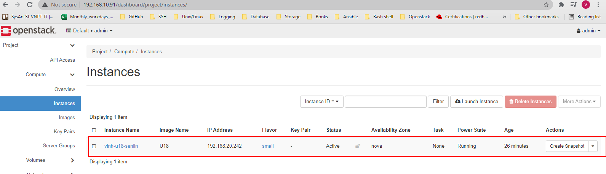
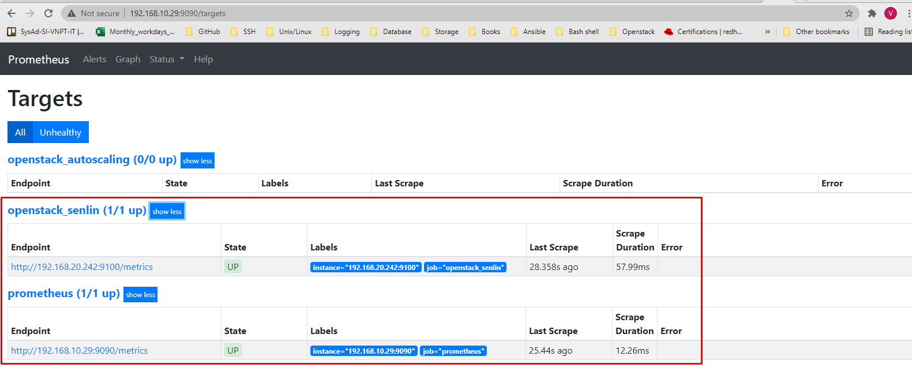
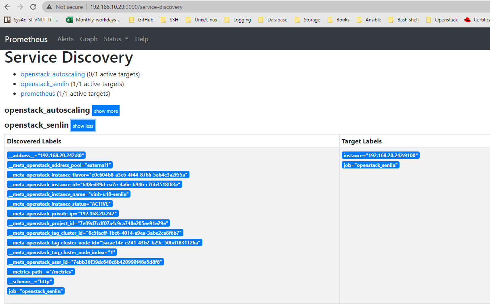
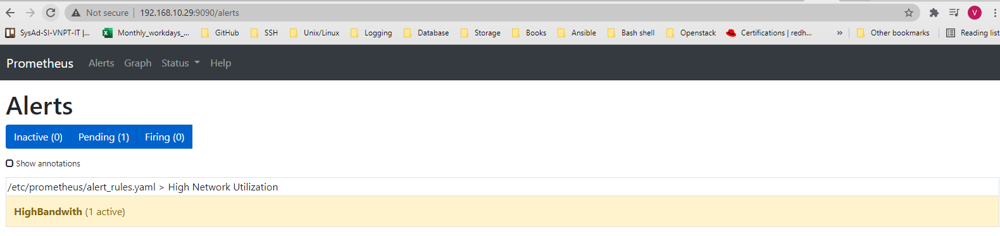
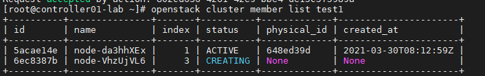
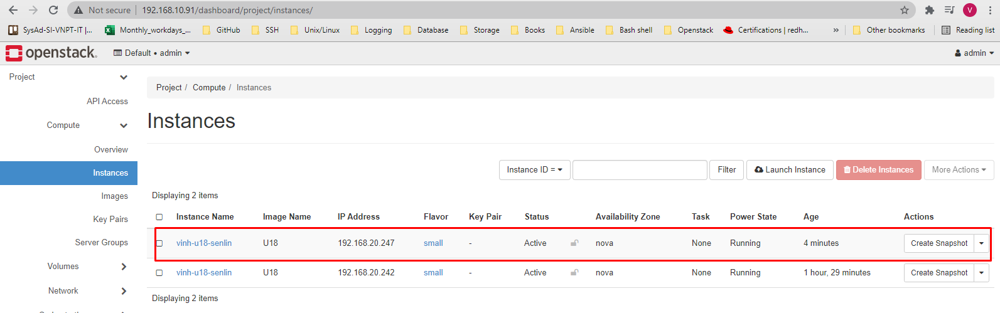

# Auto scale Cluster with Prometheus

*Phiên bản Openstack Victoria*


## Khởi tạo cluster

*Thực hiện trên controller*

- Bước 1: Tạo profile cho cluster

*Custom các parameters phù hợp với môi trường của bạn*
`name`: tên của VM
`flavor`: Tên hoặc id của flavor
`image`: Tên hoặc id của image
`network`: Tên hoặc id của network external
`password`: Password cho VM

```sh
cat << EOF > node_exporter_profile.yaml 
type: os.nova.server
version: 1.0
properties:
   name: vinh-u18-senlin
   flavor: small
   image: U18
   networks:
    - network: external1
   user_data: |
        #cloud-config
        package_update: true
        user: root
        password: a
        chpasswd: {expire: False}
        ssh_pwauth: True
        packages:
        - wget
        - openssh-server

        write_files:
        - content: |
            [Unit]
            Description=Node Exporter
            Wants=network-online.target
            After=network-online.target

            [Service]
            User=prometheus
            Type=simple
            ExecStart=/opt/prometheus/node_exporter

            [Install]
            WantedBy=multi-user.target
          path: /lib/systemd/system/node_exporter.service
          owner: root:root

        runcmd:
        - grep prometheus /etc/passwd > /dev/null || useradd -d /opt/prometheus -m prometheus
        - cd /opt/prometheus
        - wget https://github.com/prometheus/node_exporter/releases/download/v0.18.1/node_exporter-0.18.1.linux-amd64.tar.gz
        - tar xf node_exporter-0.18.1.linux-amd64.tar.gz --strip 1
        - systemctl daemon-reload
        - systemctl enable node_exporter
        - systemctl start node_exporter
EOF
```

- Bước 2: Đẩy profile lên Openstack
```sh
openstack cluster profile create --spec-file node_exporter_profile.yaml node_exporter
```

*Kết quả*
```sh
+----------+---------------+--------------------+----------------------+
| id       | name          | type               | created_at           |
+----------+---------------+--------------------+----------------------+
| 4bb59c8e | node_exporter | os.nova.server-1.0 | 2021-03-30T08:11:02Z |
+----------+---------------+--------------------+----------------------+
```

- Bước 3: Khởi tạo cluster
```sh
openstack cluster create --profile node_exporter --desired-capacity 1 test1
```

*Kết quả*
```sh
+------------------+----------------------------------------------------------------------------------------------------------------------------------------------------
| Field            | Value
+------------------+----------------------------------------------------------------------------------------------------------------------------------------------------
| config           | {}
| created_at       | None
| data             | {}
| dependents       | {}
| desired_capacity | 1
| domain_id        | None
| id               | 0c5facff-1bc6-4014-a9ea-3abe2ca8f6b7
| init_at          | 2021-03-30T08:12:38Z
| location         | Munch({'cloud': '', 'region_name': 'Hanoi', 'zone': None, 'project': Munch({'id': '7e89d7cdf07a4c9ca748e205ee91e29e', 'name': 'admin', 'domain_id':
| max_size         | -1
| metadata         | {}
| min_size         | 0
| name             | test1
| node_ids         |
| profile_id       | 4bb59c8e-11aa-4366-a064-8da42a371a0e
| profile_name     | node_exporter
| project_id       | 7e89d7cdf07a4c9ca748e205ee91e29e
| status           | INIT
| status_reason    | Initializing
| timeout          | 3600
| updated_at       | None
| user_id          | 7ebb36f39dc640c8b420999f48e5d8f8
+------------------+----------------------------------------------------------------------------------------------------------------------------------------------------
```
*Một VM đã được tạo ra*


*Trạng thái cluster*
```sh
[root@controller01-lab senlin-profile]# openstack cluster list
+----------+-------+--------+----------------------+----------------------+
| id       | name  | status | created_at           | updated_at           |
+----------+-------+--------+----------------------+----------------------+
| 0c5facff | test1 | ACTIVE | 2021-03-30T08:13:00Z | 2021-03-30T08:38:48Z |
+----------+-------+--------+----------------------+----------------------+
```

*Members trong cluster*
```sh
[root@controller01-lab senlin-profile]# openstack cluster member list test1
+----------+---------------+-------+--------+-------------+----------------------+
| id       | name          | index | status | physical_id | created_at           |
+----------+---------------+-------+--------+-------------+----------------------+
| 5acae14e | node-da3hhXEx |     1 | ACTIVE | 648ed39d    | 2021-03-30T08:12:59Z |
+----------+---------------+-------+--------+-------------+----------------------+
```


- Bước 4: Tạo receiver cluster 
```sh
openstack cluster receiver create --cluster test1 --action CLUSTER_SCALE_OUT scaleout
```

*Kết quả*
```sh
+------------+----------------------------------------------------------------------------------------------------------------------------------------------------------
| Field      | Value
+------------+----------------------------------------------------------------------------------------------------------------------------------------------------------
| action     | CLUSTER_SCALE_OUT
| actor      | {
|            |   "trust_id": "33527915314745ac84c44d210d399180"
|            | }
| channel    | {
|            |   "alarm_url": "http://192.168.10.91:8777/v1/webhooks/5118cc88-b9b2-450e-b1e6-ec8423ba1070/trigger?V=2"
|            | }
| cluster_id | 0c5facff-1bc6-4014-a9ea-3abe2ca8f6b7
| created_at | 2021-03-30T08:12:59Z
| domain_id  | None
| id         | 5118cc88-b9b2-450e-b1e6-ec8423ba1070
| location   | Munch({'cloud': '', 'region_name': 'Hanoi', 'zone': None, 'project': Munch({'id': '7e89d7cdf07a4c9ca748e205ee91e29e', 'name': 'admin', 'domain_id': None,
| name       | scaleout
| params     | {}
| project_id | 7e89d7cdf07a4c9ca748e205ee91e29e
| type       | webhook
| updated_at | None
| user_id    | 7ebb36f39dc640c8b420999f48e5d8f8
+------------+----------------------------------------------------------------------------------------------------------------------------------------------------------
```

## Cấu hình Prometheus

- Bước 1: Cấu hình target trong `/etc/prometheus/prometheus.yml` 
```yml
global:
  scrape_interval:     30s
  evaluation_interval: 30s


# Alertmanager configuration
alerting:
  alertmanagers:
  - static_configs:
    - targets:
      - 192.168.10.29:9093


rule_files:
  - "alert_rules.yaml"


scrape_configs:
  - job_name: 'prometheus'
    static_configs:
    - targets: ['192.168.10.29:9090']

  - job_name: 'openstack_senlin'
    openstack_sd_configs:
      - identity_endpoint: http://192.168.10.91:5000/v3
        username: admin
        password: Welcome123
        project_name: admin
        domain_name: default
        region: Hanoi
        role: instance
    relabel_configs:
      # Keep only active instances
      - source_labels: [__meta_openstack_instance_status]
        action: keep
        regex: ACTIVE
      # Keep Senlin instances that have cluster_id
      - source_labels: [__meta_openstack_tag_cluster_id]
        action: keep
      # Update the scraping port if required
      - source_labels:
        - __address__
        action: replace
        regex: ([^:]+)(?::\d+)
        replacement: $1:9100
        target_label: __address__
```

- Bước 2: Cấu hình rule cảnh báo trong file `/etc/prometheus/alert_rules.yaml`
```yml
groups:
  - name: High Network Utilization
    rules:
    - alert: HighBandwith
      expr: rate(node_network_receive_bytes_total{device="ens3"}[1m])/1024/1024 > 1.0
      for: 1m
      labels:
        severity: upscale
        tenant_stack_id: "{{ $labels.tenant_stack_id }}"
        tenant_project_id: "{{ $labels.tenant_project_id }}"
        tenant_stack_name: "{{ $labels.tenant_stack_name }}"
      annotations:
        summary: High instance network utilization alert to trigger Heat upscaling
```

- Bước 3: Cấu hình AlertManager trong file `/etc/alertmanager/alertmanager.yml`
```yml
global:
  resolve_timeout: 1m

route:
  group_by: ['alertname']
  group_wait: 10s
  group_interval: 10s
  repeat_interval: 10m
  receiver: 'scale-out-senlin'

receivers:
- name: 'scale-out-senlin'
  webhook_configs:
  - url: 'http://192.168.10.91:8777/v1/webhooks/5118cc88-b9b2-450e-b1e6-ec8423ba1070/trigger?V=2'
    send_resolved: false
inhibit_rules:
  - source_match:
      severity: 'critical'
    target_match:
      severity: 'warning'
    equal: ['alertname', 'dev', 'instance']
```

- Bước 5: Restart lại dịch vụ
```sh
systemctl restart prometheus 

systemctl restart alertmanager
```

*Kiểm tra*




*Các labels*




## TEST
*Vậy đã giám sát thành công, giờ ta sẽ đẩy tốc độ của network trong VM lên để tạo cảnh báo*

- SSH vào VM trong cluster
```sh
apt-get -y install iperf3

iperf3 -s -f m -p 3000
```


- Đứng từ controller:
```sh
iperf3 -c 192.168.20.242 -f m -t 600 -p 3000
```

*Sẽ  mất một lúc để thay đổi trạng thái cảnh báo*



||
\/


*Cluster được expand, add thêm 1 member*



*VM được tạo ra*




---
Special thanks to:

[1] https://medium.com/@dkt26111/auto-scaling-openstack-instances-with-senlin-and-prometheus-46100a9a14e1