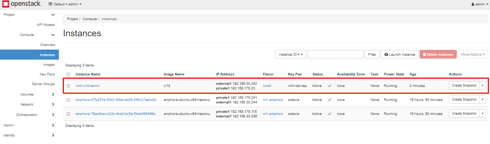
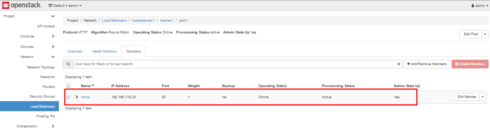
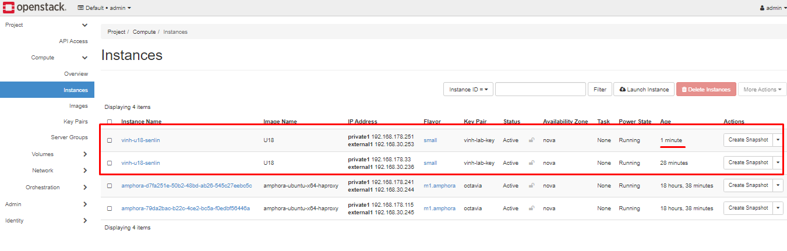
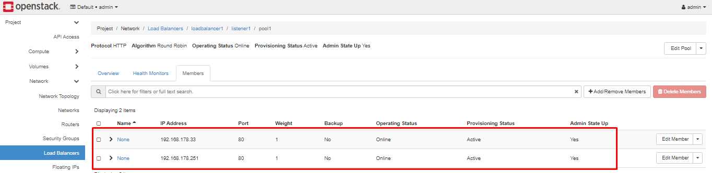

# Auto add member in Octavia Loadbalancer when expand Senlin Cluster

*Bài viết hướng dẫn kỹ thuật tự động add các node được expand trong Senlin cluster vào Member của Octavia*

*Tính năng này cho dịch vụ Autoscaling*

*Thực hiện trên phiên bản Openstack Ussuri*

## Thực hiện khởi tạo profile

- Bước 1: Tạo thư mục chứa project
```sh
mkdir senlin-projects && cd senlin-projects/
```
- Bước 2: Tạo tệp khai báo profile
```sh
cat << EOF > node_exporter_profile.yaml
type: os.nova.server
version: 1.0
properties:
   name: vinh-u18-senlin
   flavor: small
   key_name: vinh-lab-key
   #image: U18
   block_device_mapping_v2:
       - boot_index: 0
         delete_on_termination: true
         destination_type: volume
         #guest_format: ephemeral
         source_type: image
         uuid: 1b9d8a3f-e7f1-412d-adb6-767c4d6906d2
         volume_size: 6
   networks:
    - network: external1
    - network: private1
   user_data: |
        #!/bin/bash
        apt-get -y update
        apt-get -y install apache2
        wget https://bitbucket.org/alexey_smovzh/openstack_from_source/raw/5c3afbcdf6136f63d5db063d8c3eeb43ddcf4cff/modules/openstack/files/heat_templates/lake.jpg -O /var/www/html/lake.jpg
        cat << EOF > /var/www/html/index.html
        <html><head>
        <meta http-equiv="Cache-Control" content="no-cache, no-store, must-revalidate" />
        <meta http-equiv="Pragma" content="no-cache" />
        <meta http-equiv="Expires" content="0" />
        <style>
            body {
                background-image: url('lake.jpg');
                background-size: cover;
            }
            .container {
                color: #f5f5f5;
                font-size: 70px;
                font-weight: bold;
                position: absolute;
                top: 50%;
                left: 50%;
                -moz-transform: translateX(-50%) translateY(-50%);
                -webkit-transform: translateX(-50%) translateY(-50%);
                transform: translateX(-50%) translateY(-50%);
            }
            </style></head><body>
            <div class="container">
            Response from: hellovinh
            </div></body></html>
        EOF
        systemctl enable apache2
        systemctl start apache2
        echo "done"       
EOF
```
- Bước 3: Khởi tạo Profile 
```sh
openstack cluster profile create --spec-file node_exporter_profile.yaml node_exporter
```

- Kiểm tra :
```sh
[root@controller01-lab senlin-projects]# openstack cluster profile list
+----------+---------------+--------------------+----------------------+
| id       | name          | type               | created_at           |
+----------+---------------+--------------------+----------------------+
| a8153b21 | node_exporter | os.nova.server-1.0 | 2021-05-11T03:47:42Z |
+----------+---------------+--------------------+----------------------+
```

## Khởi tạo Loadbalancer policy

- Bước 1: Tạo file nội dung Policy
    - Khai báo thông tin về ID của pool, name Subnet, id health-monitor, id loadbalancer của loadnbalancer đã tạo sẵn
```sh
cat << EOF > loadbalancer_policy.yaml
type: senlin.policy.loadbalance
version: 1.1
description: A policy for load-balancing the nodes in a cluster.
properties:
  pool:
    subnet: sub_private1
    # ID of pool for the cluster on which nodes can be connected.
    id: 3a20a385-7f83-46e6-a863-44691765c59e

  vip:
    # Name or ID of Subnet on which VIP address will be allocated
    subnet: sub_private1

    # IP address of the VIP
    # address: <ADDRESS>

    # Max #connections per second allowed for this VIP
    # connection_limit: 500

    # Protocol used for VIP
    # protocol: HTTP

    # TCP port to listen on
    # protocol_port: 80

  health_monitor:
    # The type of probe sent by the load balancer to verify the member state,
    # can be PING, TCP, HTTP, or HTTPS.
    # type: 'HTTP'

    # The amount of time, in milliseconds, between sending probes to members.

    # The maximum time in milliseconds that a monitor waits to connect before
    # it times out. This value must be less than the delay value.

    # The number of allowed connection failures before changing the status
    # of the member to INACTIVE. A valid value is from 1 to 10.

    # The HTTP method that the monitor uses for requests.
    # http_method: 'GET'

    # The HTTP path of the request sent by the monitor to test the health of
    # a member. A string value that must begin with the forward slash '/'.

    # Expected HTTP codes for a passing HTTP(S) monitor.
    # expected_codes: '200, 202'

    # ID of the health manager for the loadbalancer.
    id: ed2d3c98-f74b-49ee-b02d-25a03f2d1256

  # Time in second to wait for loadbalancer to become ready before and after
  # senlin requests lbaas V2 service for lb operations.

  # Name or ID of loadbalancer for the cluster on which nodes can be connected.
  loadbalancer: c29b1f90-92da-49ca-a43a-13c7954e6ed2
EOF
```
- Bước 2: Khởi tạo senlin policy
```sh
openstack cluster policy create lb-policy --spec-file loadbalancer_policy.yaml
```

## Khởi tạo Senlin Cluster
- Bước 1: Khởi tạo Senlin Cluster
```sh
openstack cluster create --profile node_exporter --desired-capacity 1 test1
```
*Kết quả*
```sh
[root@controller01-lab senlin-projects]# openstack cluster list
+----------+-------+--------+----------------------+----------------------+
| id       | name  | status | created_at           | updated_at           |
+----------+-------+--------+----------------------+----------------------+
| 9104e7ed | test1 | ACTIVE | 2021-05-11T03:59:30Z | 2021-05-11T03:59:30Z |
+----------+-------+--------+----------------------+----------------------+
```
Máy ảo trong cluster được tạo ra


- Bước 2: Attach policy vào cluster
```sh
openstack cluster policy attach --policy  lb-policy test1
```

*Kết quả*
```sh
[root@controller01-lab senlin-projects]# openstack cluster policy attach --policy  lb-policy test1
Request accepted by action: 9b138fe2-411d-444f-8fe5-a4ced8fe2ab1
```

- Bước 3: Verify lại bằng lệnh
```sh
openstack cluster policy binding list test1
```

*Kết quả*
```sh
[root@controller01-lab senlin-projects]# openstack cluster policy binding list test1
+-----------+-------------+-------------------------------+------------+
| policy_id | policy_name | policy_type                   | is_enabled |
+-----------+-------------+-------------------------------+------------+
| 90cd25c6  | lb-policy   | senlin.policy.loadbalance-1.1 | True       |
+-----------+-------------+-------------------------------+------------+
```
Sau khi apply policy


## Thực hiện Expand cluster

- Sử dụng lệnh để expand cluster:
```sh
openstack cluster expand test1
```
*Kết quả*
```sh
[root@controller01-lab senlin-projects]# openstack cluster expand test1
Request accepted by action: 64e818c0-757a-4078-9b12-37df13036235

[root@controller01-lab senlin-projects]# openstack cluster member list test1
+----------+---------------+-------+--------+-------------+----------------------+
| id       | name          | index | status | physical_id | created_at           |
+----------+---------------+-------+--------+-------------+----------------------+
| e22cebf7 | node-USDCIllF |     1 | ACTIVE | 10d84edf    | 2021-05-11T06:51:34Z |
| 7e7fb987 | node-l7edC40s |     2 | ACTIVE | 5a630a7c    | 2021-05-11T07:18:34Z |
+----------+---------------+-------+--------+-------------+----------------------+
```
Một máy ảo nữa được tạo ra sau khi expand


Máy ảo tạo mới tự động add và member của loadbalancer




---
## TK

[1] https://github.com/openstack/senlin/commit/f206a579eea2531b5a1940dcad224d34ab81aaa2#diff-8d01909ae87f0143a5607c9c6cca6cbebe864d04d5642c7943f7810680390cf6

[2] https://blog.csdn.net/albertjone/article/details/107362333?ops_request_misc=%257B%2522request%255Fid%2522%253A%2522162065085716780265424407%2522%252C%2522scm%2522%253A%252220140713.130102334..%2522%257D&request_id=162065085716780265424407&biz_id=0&utm_medium=distribute.pc_search_result.none-task-blog-2~all~baidu_landing_v2~default-5-107362333.first_rank_v2_pc_rank_v29&utm_term=senlin

[3] http://huyue.xn--6qq986b3xl/2019/09/25/OpenStack-Senlin%E9%9B%86%E7%BE%A4%E5%8D%B3%E6%9C%8D%E5%8A%A1/

[4] https://docs.openstack.org/senlin/latest/user/profile_types/nova.html

[5] https://docs.openstack.org/senlin/latest/user/policy_types/load_balancing.html