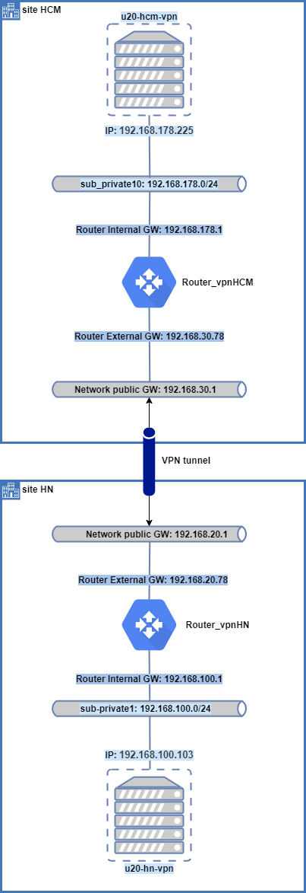
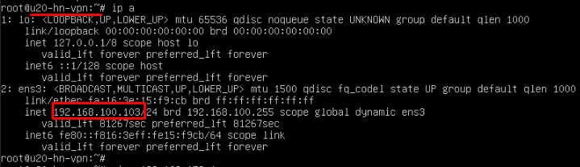
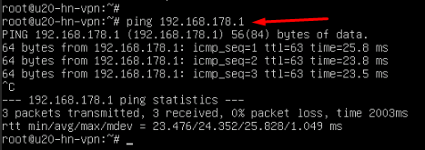
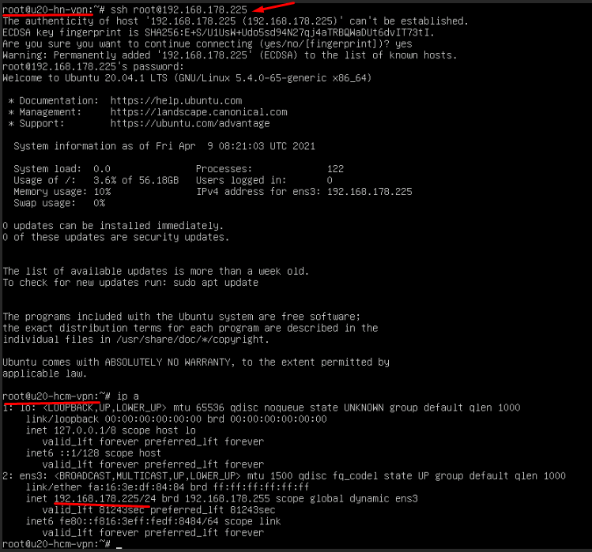

# Test tính năng VPNaaS
*Sử dụng Phiên bản Openstack Ussuri*

## 1. Tính năng Openstack Site to Site
### 1.1 Mô hình hệ thống

*router mode: centralized, enabled_HA*



### 1.2 Mục tiêu
Có thể ping và SSH dải private từ 2 site Openstack

`u20-hn-vpn` <----> `u20-hcm-vpn`

### 1.3 Thực hiện cấu hình

*Khởi tạo hệ thống như topology ở trên*

#### ***Thực hiện trên site HN***
- Bước 1: Khởi tạo ike, ipsec policy
```sh
openstack vpn ike policy create ikepolicy-for-hcm

openstack vpn ipsec policy create ipsecpolicy-for-hcm
```
*Kết quả:*
```sh
# openstack vpn ike policy create ikepolicy-for-hcm
+-------------------------------+--------------------------------------+
| Field                         | Value                                |
+-------------------------------+--------------------------------------+
| Authentication Algorithm      | sha1                                 |
| Description                   |                                      |
| Encryption Algorithm          | aes-128                              |
| ID                            | 4d7a1a7e-d61e-475f-ad66-25c75318ac71 |
| IKE Version                   | v1                                   |
| Lifetime                      | {'units': 'seconds', 'value': 3600}  |
| Name                          | ikepolicy-for-hcm                    |
| Perfect Forward Secrecy (PFS) | group5                               |
| Phase1 Negotiation Mode       | main                                 |
| Project                       | e7b4618916794ed58226047d8ce424ea     |
| project_id                    | e7b4618916794ed58226047d8ce424ea     |
+-------------------------------+--------------------------------------+
# openstack vpn ipsec policy create ipsecpolicy-for-hcm
+-------------------------------+--------------------------------------+
| Field                         | Value                                |
+-------------------------------+--------------------------------------+
| Authentication Algorithm      | sha1                                 |
| Description                   |                                      |
| Encapsulation Mode            | tunnel                               |
| Encryption Algorithm          | aes-128                              |
| ID                            | 50739d33-bdde-44fe-acb4-76a0b4d993d7 |
| Lifetime                      | {'units': 'seconds', 'value': 3600}  |
| Name                          | ipsecpolicy-for-hcm                  |
| Perfect Forward Secrecy (PFS) | group5                               |
| Project                       | e7b4618916794ed58226047d8ce424ea     |
| Transform Protocol            | esp                                  |
| project_id                    | e7b4618916794ed58226047d8ce424ea     |
+-------------------------------+--------------------------------------+
```

- Bước 2: Khởi tạo dịch vụ VPN
```sh
openstack vpn service create --description "My VPN service" \
--router Router_vpnHN vpntoHCM
```
*Kết quả:*
```sh
# openstack vpn service create --description "My VPN service" \
> --router Router_vpnHN vpntoHCM
+----------------+--------------------------------------+
| Field          | Value                                |
+----------------+--------------------------------------+
| Description    | My VPN service                       |
| Flavor         | None                                 |
| ID             | 17d45893-e11c-4da4-9793-5f81ce9127a2 |
| Name           | vpntoHCM                             |
| Project        | e7b4618916794ed58226047d8ce424ea     |
| Router         | 6830c1e2-e1f7-4328-8f41-242709be2460 |
| State          | True                                 |
| Status         | PENDING_CREATE                       |
| Subnet         | None                                 |
| external_v4_ip | 192.168.20.1                       |
| external_v6_ip | None                                 |
| project_id     | e7b4618916794ed58226047d8ce424ea     |
+----------------+--------------------------------------+
```

- Bước 3: Khởi tạo Endpoint
```sh
openstack vpn endpoint group create --type subnet --value 	sub-private1  my-HN-local

openstack vpn endpoint group create --type cidr --value 192.168.178.0/24 my-HCM-peer
```
*Kết quả:*
```sh
# openstack vpn endpoint group create --type subnet --value sub-private1  my-HN-local
+-------------+------------------------------------------+
| Field       | Value                                    |
+-------------+------------------------------------------+
| Description |                                          |
| Endpoints   | ['8762ac3d-1e62-480d-959e-df6852a67092'] |
| ID          | 30b64a29-6c2a-493b-8da5-b3e00867066a     |
| Name        | my-HN-local                              |
| Project     | e7b4618916794ed58226047d8ce424ea         |
| Type        | subnet                                   |
| project_id  | e7b4618916794ed58226047d8ce424ea         |
+-------------+------------------------------------------+
# openstack vpn endpoint group create --type cidr --value 192.168.178.0/24 my-HCM-peer
+-------------+--------------------------------------+
| Field       | Value                                |
+-------------+--------------------------------------+
| Description |                                      |
| Endpoints   | ['192.168.178.0/24']                 |
| ID          | 14f9a91b-4969-450f-b972-63790d65e078 |
| Name        | my-HCM-peer                          |
| Project     | e7b4618916794ed58226047d8ce424ea     |
| Type        | cidr                                 |
| project_id  | e7b4618916794ed58226047d8ce424ea     |
+-------------+--------------------------------------+
```

- Bước 4: Khởi tạo kết nối site
```sh
openstack vpn ipsec site connection create --vpnservice myvpn01 \
--ikepolicy ikepolicy-for-hcm --ipsecpolicy ipsecpolicy-for-hcm \
--peer-address 192.168.30.78 --peer-id 192.168.30.78 \
--local-endpoint-group my-HN-local --peer-endpoint-group my-HCM-peer \
--psk secret vpnconnectiontoHCM
```
*Kết quả:*
```sh
# openstack vpn ipsec site connection create --vpnservice vpntoHCM \
> --ikepolicy ikepolicy-for-hcm --ipsecpolicy ipsecpolicy-for-hcm \
> --peer-address 192.168.30.78 --peer-id 192.168.30.78 \
> --local-endpoint-group my-HN-local --peer-endpoint-group my-HCM-peer \
> --psk secret vpnconnectiontoHCM
+--------------------------+----------------------------------------------------+
| Field                    | Value                                              |
+--------------------------+----------------------------------------------------+
| Authentication Algorithm | psk                                                |
| Description              |                                                    |
| ID                       | 18fbf14c-f246-4b8c-85f6-4b6a8949ed81               |
| IKE Policy               | 4d7a1a7e-d61e-475f-ad66-25c75318ac71               |
| IPSec Policy             | 50739d33-bdde-44fe-acb4-76a0b4d993d7               |
| Initiator                | bi-directional                                     |
| Local Endpoint Group ID  | 30b64a29-6c2a-493b-8da5-b3e00867066a               |
| Local ID                 |                                                    |
| MTU                      | 1500                                               |
| Name                     | vpnconnectiontoHCM                                 |
| Peer Address             | 192.168.30.78                                      |
| Peer CIDRs               |                                                    |
| Peer Endpoint Group ID   | 14f9a91b-4969-450f-b972-63790d65e078               |
| Peer ID                  | 192.168.30.78                                      |
| Pre-shared Key           | secret                                             |
| Project                  | e7b4618916794ed58226047d8ce424ea                   |
| Route Mode               | static                                             |
| State                    | True                                               |
| Status                   | PENDING_CREATE                                     |
| VPN Service              | 17d45893-e11c-4da4-9793-5f81ce9127a2               |
| dpd                      | {'action': 'hold', 'interval': 30, 'timeout': 120} |
| project_id               | e7b4618916794ed58226047d8ce424ea                   |
```

#### ***Thực hiện trên site HCM***
- Bước 1: Khởi tạo ike, ipsec policy

```sh
openstack vpn ike policy create ikepolicy-for-hn
openstack vpn ipsec policy create ipsecpolicy-for-hn
```

- Bước 2: Khởi tạo dịch vụ VPN
```sh
openstack vpn service create --description "My VPN service" \
--router Router_vpnHCM vpntoHN
```

- Bước 3: Khởi tạo Endpoint

```sh
openstack vpn endpoint group create --type subnet --value 	sub-private10  my-HCM-local

openstack vpn endpoint group create --type cidr --value 192.168.100.0/24 my-HN-peer
```

- Bước 4: Khởi tạo kết nối site

```sh
openstack vpn ipsec site connection create --vpnservice vpntoHN \
--ikepolicy ikepolicy-for-hn --ipsecpolicy ipsecpolicy-for-hn \
--peer-address 192.168.20.78 --peer-id 192.168.20.78 \
--local-endpoint-group my-HCM-local --peer-endpoint-group my-HN-peer \
--psk secret vpnconnectiontoHN
```

***Lưu ý***: tại phiên bản này khi tạo xong cả 2 connection xảy ra hiện tượng: Connection tạo trước sẽ trả về status DOWN, vì vậy phải xóa connection ấy đi tạo lại thì status sẽ thành ACTIVE

### 1.4 Kết quả

#### ***VPN connection***
***Tại site HN:***
```sh
# openstack vpn ipsec site connection list
+--------------------------------------+--------------------+---------------+--------------------------+--------+
| ID                                   | Name               | Peer Address  | Authentication Algorithm | Status |
+--------------------------------------+--------------------+---------------+--------------------------+--------+
| 18fbf14c-f246-4b8c-85f6-4b6a8949ed81 | vpnconnectiontoHCM | 192.168.30.78 | psk                      | ACTIVE |
+--------------------------------------+--------------------+---------------+--------------------------+--------+
```
***Tại site HCM:***
```sh
# openstack vpn ipsec site connection list
+--------------------------------------+-------------------+--------------+--------------------------+----------------+
| ID                                   | Name              | Peer Address | Authentication Algorithm | Status         |
+--------------------------------------+-------------------+--------------+--------------------------+----------------+
| 5e3f2fbd-2f9a-4a34-a7ef-d7b04d387d2b | vpnconnectiontoHN | 192.168.20.78 | psk                      | ACTIVE |
+--------------------------------------+-------------------+--------------+--------------------------+----------------+
```

*Đứng tại VM `u20-hn-vpn`*



- Ping gateway dải private tại site HCM:



- Ping IP VM `u20-hcm-vpn`:


- SSH VM `u20-hcm-vpn`:




----
## TLTK

[1] https://docs.openstack.org/neutron/latest/admin/vpnaas-scenario.html

[2] https://www.bbsmax.com/A/Ae5RLg02zQ/

[3] https://docs.openstack.org/neutron-vpnaas/latest/
