# VPN site to site Openstack VPNaaS - Pfsense

### *Mục đích*: 
Thiết lập cấu hình VPN site to site giữa VPC trên Openstack và cụm Lab sử dụng Pfsense.

Các VM kết nối với dải private VPC trên Openstack có thể kết nối được đến các VM trên cụm Pfsense, cũng như máy cá nhân kết nối VPN cụm Pfsense.

*Thực hiện trên môi trường Openstack Ussuri*


## Mô hình hệ thống

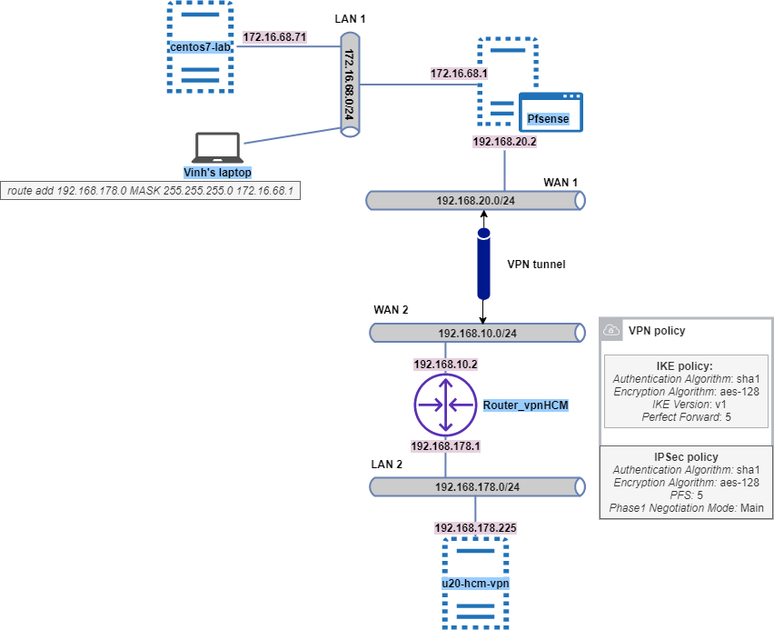

## Khởi tạo VPN Gateway trên Openstack

- Bước 1: Khởi tạo IKE policy
```sh
openstack vpn ike policy create ikepolicy-pfsense
```

- Bước 2: Khởi tạo IPsec policy
```sh
openstack vpn ipsec policy create ipsecpolicy-pfsense
```

- Bước 3: Khởi tạo service VPN
```sh
openstack vpn service create --description "My VPN service" \
--router Router_vpnHCM vnptoPfsense
```

- Bước 4: Khởi tạo endpoint `subnet` của dải local trên Openstack:
```sh
openstack vpn endpoint group create --type subnet --value sub-private10  my-HCM-local
```

- Bước 5: Khởi tạo endpoint type `cidr` với giá trị là dải network sẽ kết nối tới ở site Pfsense
```sh
openstack vpn endpoint group create --type cidr --value 172.16.68.0/24 my-pfsense
```

## Khởi tạo VPN Gateway trên Pfsense

- Bước 1: Khởi tạo IPsec Tunnel

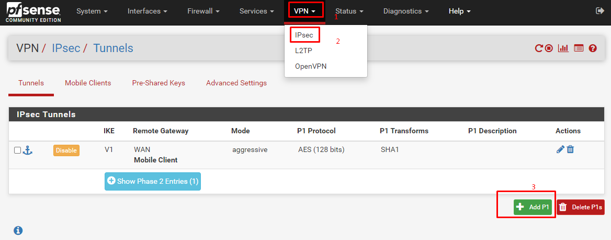

- Bước 2: Khai báo Phase 1

    - `Key Exchange version: IKEv1`

    - `Internet Protocol: IPv4`

    - `Interface: WAN`
    
    - `Remote Gateway: 192.168.10.2` - Địa chỉ Gateway của Openstack router
    
    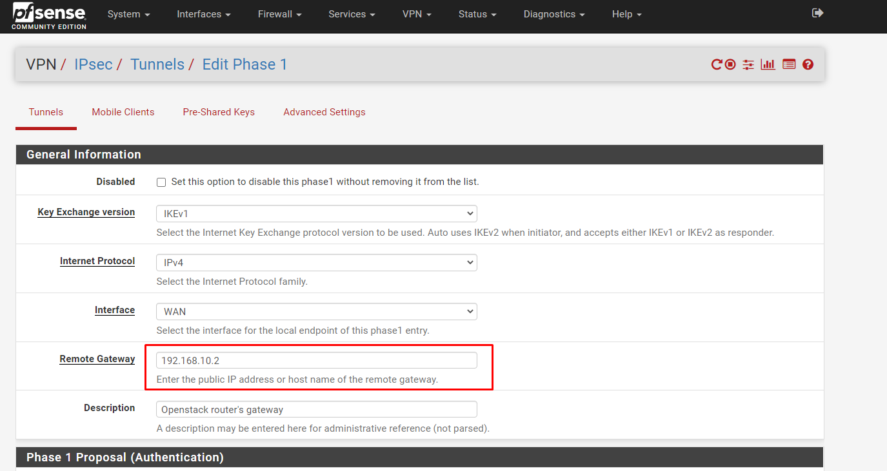

    Tại mục Phase 1 Proposal (Authentication)

    - `Authentication Method: Mutual PSK`

    - `Negotiation mode: Main`

    - `My identifier: My IP address`

    - `Peer identifier: Peer IP address`

    - `Pre-Shared Key: secret`

    Tại mục Phase 1 Proposal (Algorithms)

    - `Encryption Algorithm: AES 123 bits`

    - `Hash Algorithm: SHA1`

    - `DH Group: 5 (1536 bit)`


    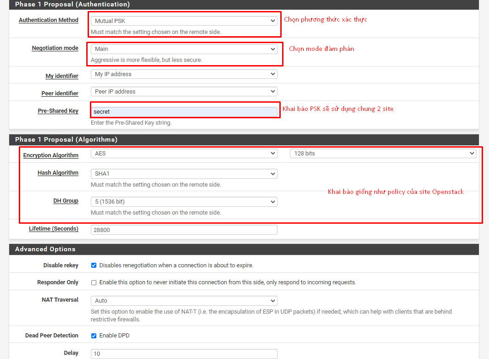

    Sau đó `save` lại

- Bước 3: Cấu hình phase2 

    - Tạo phase 2

    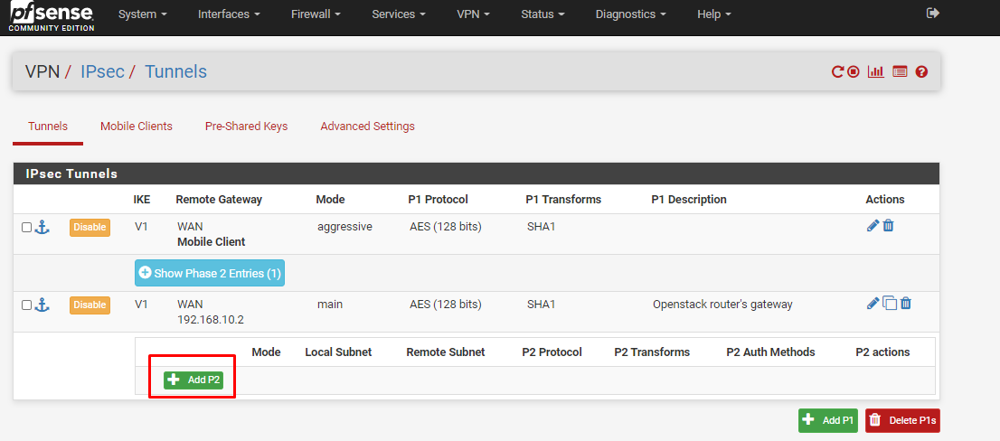

    Tại mục `General Information`
    
    - `Mode: Tunnel IPv4`
    
    - `Chọn local Network là dải 172.16.68.0/24 đã được khai báo trước là LAN subnet`
    - `NAT/BINAT translation: None`
    - `Remote Network: Network - 192.168.178.0 / 24` - Dải địa chỉ private10 của Openstack

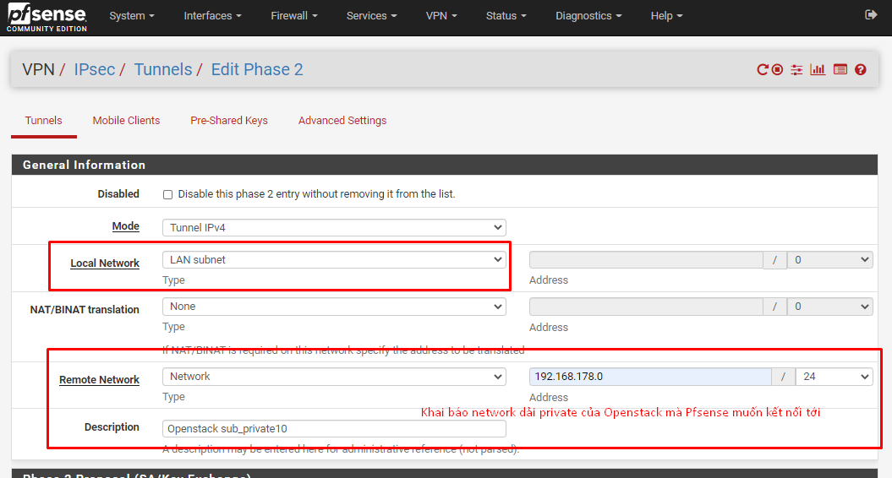

Tại mục `Phase 2 Proposal (SA/Key Exchange)`
- `Protocol: ESP`
- `Encryption Algorithms: AES - 128 bits`
- `Hash Algorithms: SHA1`
- `PFS key group: 5 (1536 bit)`

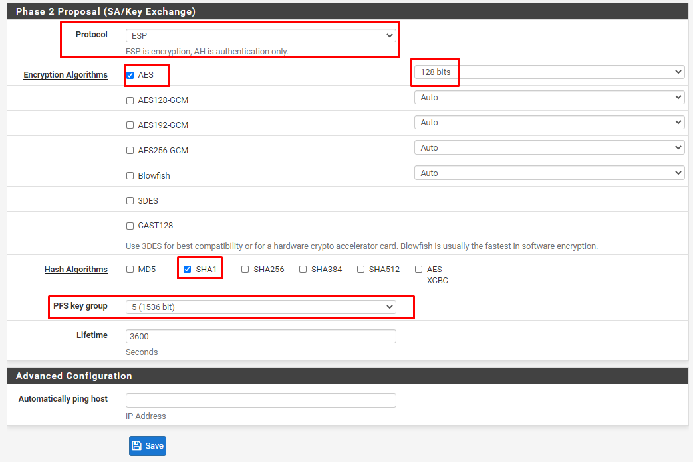


- `Apply changes`

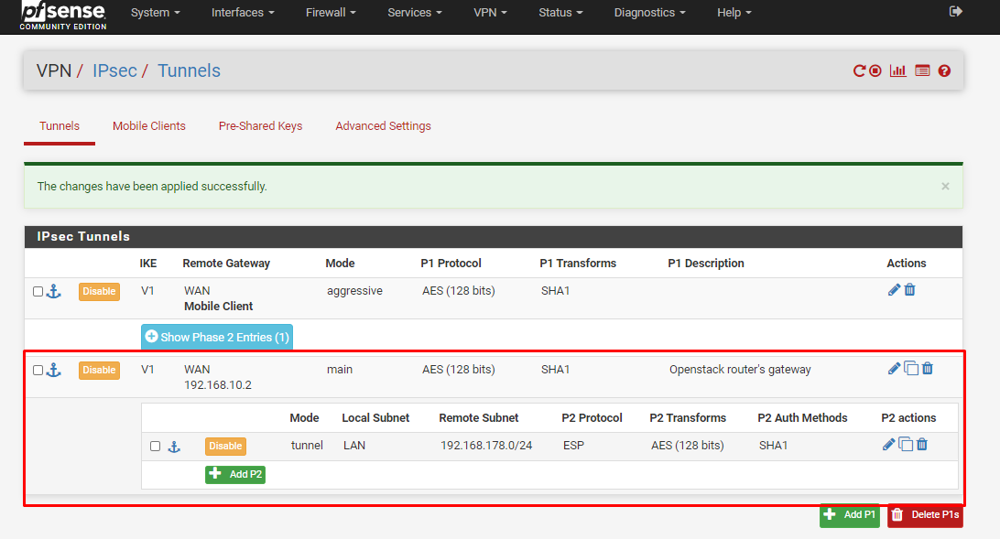


## Khởi tạo VPN connection trên Openstack

- `--peer-address 192.168.20.2` - Địa chỉ WAN của Pfsense
- `--peer-id 192.168.20.2` - Địa chỉ WAN của Pfsense
- `--psk secret` - PSK đã khai báo ở Pfsense

```sh
openstack vpn ipsec site connection create --vpnservice vpntoHN --ikepolicy ikepolicy-pfsense --ipsecpolicy ipsecpolicy-pfsense --peer-address 192.168.20.2 --peer-id 192.168.20.2 --local-endpoint-group my-HCM-local --peer-endpoint-group my-pfsense --psk secret vpnconnectiontopfsense
```

*Kết quả:*
```sh
+--------------------------+----------------------------------------------------+
| Field                    | Value                                              |
+--------------------------+----------------------------------------------------+
| Authentication Algorithm | psk                                                |
| Description              |                                                    |
| ID                       | 330b697e-5b85-4607-b16b-1b446ed20e47               |
| IKE Policy               | dc967458-0744-4c7b-b6f7-3a810da958fa               |
| IPSec Policy             | b395c2cb-951b-4254-9ad2-0c6a9258eac1               |
| Initiator                | bi-directional                                     |
| Local Endpoint Group ID  | eeabf65c-d011-4eab-8aff-4d03f302b448               |
| Local ID                 |                                                    |
| MTU                      | 1500                                               |
| Name                     | vpnconnectiontopfsense                             |
| Peer Address             | 192.168.20.2                                       |
| Peer CIDRs               |                                                    |
| Peer Endpoint Group ID   | a480cb53-103d-41c2-bbd1-f563355e084f               |
| Peer ID                  | 192.168.20.2                                       |
| Pre-shared Key           | secret                                             |
| Project                  | e7b4618916794ed58226047d8ce424ea                   |
| Route Mode               | static                                             |
| State                    | True                                               |
| Status                   | PENDING_CREATE                                     |
| VPN Service              | ce58acd7-6d5e-4622-a5d1-7127c563ab6d               |
| dpd                      | {'action': 'hold', 'interval': 30, 'timeout': 120} |
| project_id               | e7b4618916794ed58226047d8ce424ea                   |
+--------------------------+----------------------------------------------------+


[root@controller01-tt2 ~]# openstack vpn ipsec site connection list
+--------------------------------------+------------------------+----------------+--------------------------+--------+
| ID                                   | Name                   | Peer Address   | Authentication Algorithm | Status |
+--------------------------------------+------------------------+----------------+--------------------------+--------+
| 330b697e-5b85-4607-b16b-1b446ed20e47 | vpnconnectiontopfsense | 192.168.20.2 | psk                      | ACTIVE   |
+--------------------------------------+------------------------+----------------+--------------------------+--------+
```

## Kiểm tra

*Thực hiện ping và ssh từ VM trên Openstack đến dải 172.16.68.0/24 của Pfsense*

- Thực hiện ping:
    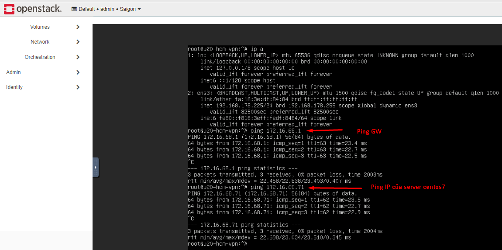


- Thực hiện SSH đến server centos trên Pfsense

    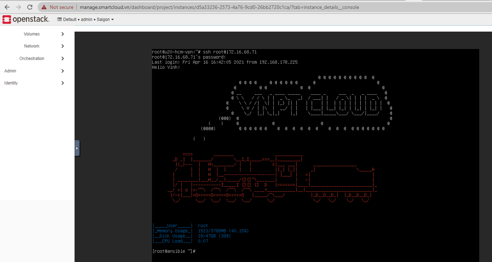


*Thực hiện ping và ssh từ VM trên Pfsense đến VM trên dải 192.168.178.0/24 của Openstack*

- Thực hiện ping:

    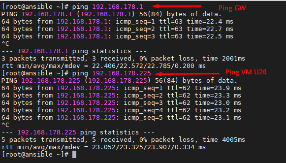

- Thực hiện SSH đến server u20 trên Openstack:

    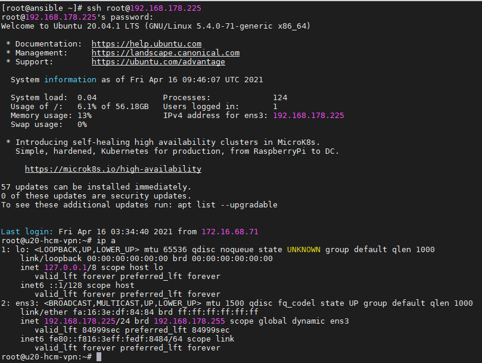


*Thực hiện kết nối từ máy cá nhân (có kết nối VPN đến Pfsense) đến Openstack*

- Mở CMD:

    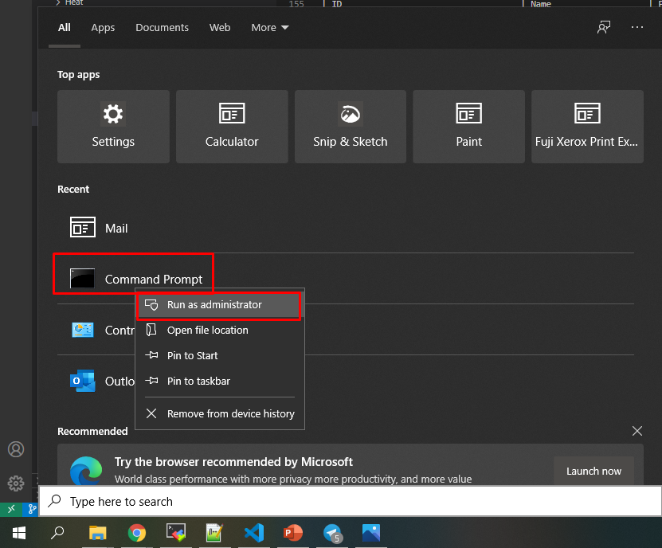

- Sử dụng lệnh sau để thêm vào bảng route 

    ```sh
    route add 192.168.178.0 MASK 255.255.255.0 172.16.68.1
    ```
    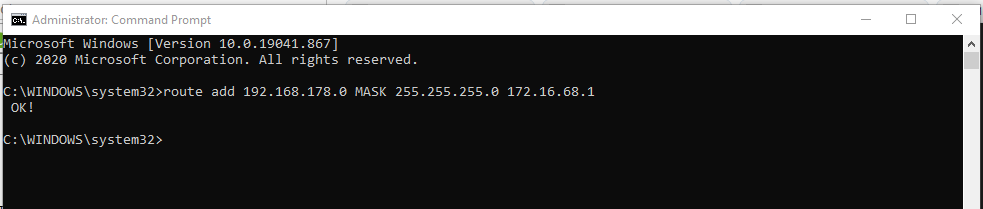

- Ping từ laptop
    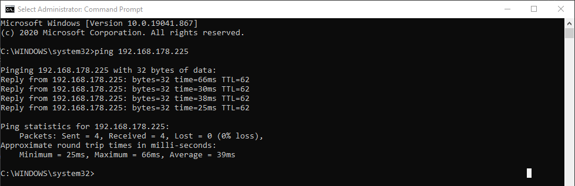


----
## TK

[1] http://www.panticz.de/openstack/vpnaas

[2] https://www.howtogeek.com/howto/windows/adding-a-tcpip-route-to-the-windows-routing-table/